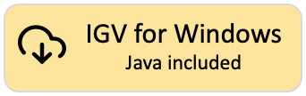

 IGV 3.0 Beta 

**What's New:** See the [Release Notes](ReleaseNotes/3.0.x.md).

**NOTE:** This is the download page for the **IGV 3.0 Beta** version of IGV. This version of IGV may contain features and code that have not been thoroughly tested.

[{height=80}](https://data.broadinstitute.org/igv/projects/downloads/3.0/IGV_Win_3.0.0-beta.1-WithJava-installer.exe)
[{height=80}](https://data.broadinstitute.org/igv/projects/downloads/3.0/IGV_Win_3.0.0-beta.1-installer.exe)
 
[{height=80}](https://data.broadinstitute.org/igv/projects/downloads/3.0/IGV_Linux_3.0.0-beta.1_WithJava.zip)
 
[{height=80}](https://data.broadinstitute.org/igv/projects/downloads/3.0/IGV_3.0.0-beta.1.zip)

!!! Tip "For Linux users:"
The *"IGV for Linux"* download includes AdoptOpenJDK (now Eclipse Temurin) version 21 for x64 Linux. See their list of supported platforms [here](https://adoptium.net/supported-platforms/). If your platform is not on the "x64 Linux" list, or the packaged Java does not work on your version of Linux, download the *"Command line IGV for all platforms"* and use it with your own Java installation.
 

!!! Tip "For Mac users:"
Mac apps are not provided for the IGV 3.0 Beta. To **run IGV 3.0 Beta on a Mac**: 

1. Make sure you have Java 21 or greater installed. You can download Java from [Adoptium](https://adoptium.net/) or [Oracle](https://www.oracle.com/java/technologies/javase/jdk21-archive-downloads.html).

2. Download the *"Command line IGV for all platforms"* version and unzip the downloaded distribution file to a directory of your choice. You will see that several launcher scripts are provided in the distribution. The Mac version is named *igv.sh*.

2. Open a *Terminal* window and enter `<Full path to the IGV 3.0 Beta directory>/igv.sh`.
 For example, if the IGV 3.0 Beta files are in */Users/jane/IGV_3.0_Beta*, enter `/Users/jane/IGV_3.0_Beta/igv.sh`. 
  Alternatively, enter `cd /Users/jane/IGV_3.0_Beta` to go to that directory, and then `./igv.sh`.

