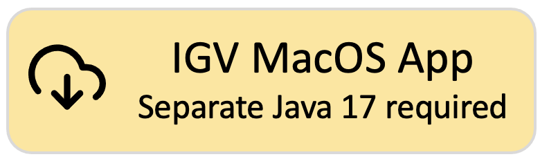
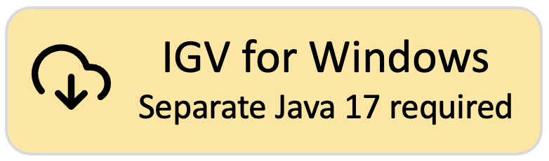
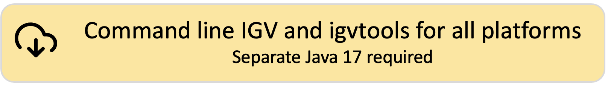

<!---
The page title should not go in the menu
-->

 Download IGV

!!! tip " "
Did you know that there is also an **IGV web application** that runs only in a web browser, does not use Java, and
requires no downloads? See **[https://igv.org/app](https://igv.org/app)**. Click on the Help link in the app for more
information about using IGV-Web.

# Latest release of IGV Desktop: 2.17.1

!!! Danger "As of version 2.17.0, IGV requires **Java 17 or greater**. If you download one of the IGV versions that does not include Java, make sure you have Java 17 installed and in your path."

!!! note "M1/M2 Mac Users:"
Apple's Rosetta software is required to run the IGV MacOS App that includes Java. If you run IGV with your own Java
installation, Rosetta may not be required if your version of Java runs natively on M1/M2.

!!! note "Linux users:"
The 'IGV for Linux' download includes AdoptOpenJDK (now Eclipse Temurin) version 17 for x64 Linux. See their list of
supported platforms [here](https://adoptium.net/supported-platforms/). If your platform is not on the "x64 Linux" list,
or the packaged Java does not work on your version of Linux, download the 'Command line IGV for all platforms' and use
it with your own Java installation.

**What's New:** See the [Release Notes](ReleaseNotes/2.17.x.md) for what's new in each IGV release.  
[{height=80}](https://data.broadinstitute.org/igv/projects/downloads/2.17/IGV_MacApp_2.71.1_WithJava.zip)
[{height=80}](https://data.broadinstitute.org/igv/projects/downloads/2.17/IGV_MacApp_2.71.1.zip)
 
[{height=80}](https://data.broadinstitute.org/igv/projects/downloads/2.17/IGV_Win_2.71.1-WithJava-installer.exe) [{height=80}](https://data.broadinstitute.org/igv/projects/downloads/2.17/IGV_Win_2.71.1-installer.exe)
 
[{height=80}](https://data.broadinstitute.org/igv/projects/downloads/2.17/IGV_Linux_2.71.1_WithJava.zip)
 
[{height=80}](https://data.broadinstitute.org/igv/projects/downloads/2.17/IGV_2.71.1.zip)

# Other releases of IGV Desktop

**[Development snapshot build.](DownloadSnapshot.md)** Latest development snapshot; built at least nightly

**[Archived releases.](https://data.broadinstitute.org/igv/projects/downloads/)** Old releases going back to IGV 2.0

# Other versions of IGV

This Downloads page is for the IGV desktop version. See also:

- If you are looking for the IGV-Web application, see [https://igv.org/app](https://igv.org/app)
- If you are a developer looking for information about the embeddable igv.js component,
  see [https://github.com/igvteam/igv.js](https://github.com/igvteam/igv.js)
- If you are developer wanting to use igv.js in a notebook (Jupyter or Colab),
  see [https://github.com/igvteam/igv-notebook](https://github.com/igvteam/igv-notebook)
- To generate self-contained HTML reports that consist of a table of genomic sites and associated IGV views,
  see [https://github.com/igvteam/igv-reports](https://github.com/igvteam/igv-reports)
