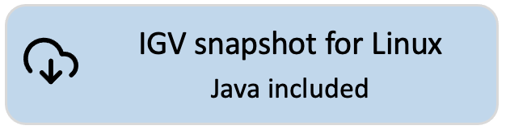

<!---
The page title should not go in the menu
-->

 Download IGV snapshot build

**NOTE:** This is the download page for the **development version** of IGV. This version of IGV:

* will contain features and code that have not been thoroughly tested;
* is updated frequently;
* is intended for advanced users only

[{height=80}](https://data.broadinstitute.org/igv/projects/downloads/snapshot/IGV_Win_snapshot-WithJava-installer.exe) 
[{height=80}](https://data.broadinstitute.org/igv/projects/downloads/snapshot/IGV_Win_snapshot-installer.exe) 
 
[{height=80}](https://data.broadinstitute.org/igv/projects/downloads/snapshot/IGV_Linux_snapshot_WithJava.zip)
 
[{height=80}](https://data.broadinstitute.org/igv/projects/downloads/snapshot/IGV_snapshot.zip)

!!! Note "For Linux users:"
The *"IGV snapshot for Linux"* download includes AdoptOpenJDK (now Eclipse Temurin) version 21 for x64 Linux. See their list of supported platforms [here](https://adoptium.net/supported-platforms/). If your platform is not on the "x64 Linux" list, or the packaged Java does not work on your version of Linux, download the *"IGV snapshot for command line use"* and use it with your own Java installation.
 

!!! Note "For Mac users:"
Mac apps are not provided for the IGV snapshot build. To **run the snapshot build on a Mac**: 

1. Make sure you have Java 21 or greater installed. You can download Java from [Adoptium](https://adoptium.net/) or [Oracle](https://www.oracle.com/java/technologies/javase/jdk21-archive-downloads.html).

2. Download the *"IGV snapshot for command line use"* version and unzip the downloaded distribution file to a directory of your choice. You will see that several launcher scripts are provided in the distribution. The Mac version is named *igv.sh*.

2. Open a *Terminal* window and enter `<Full path to the IGV snapshot directory>/igv.sh`.
 For example, if the IGV snapshot files are in */Users/jane/IGV_snapshot*, enter `/Users/jane/IGV_snapshot/igv.sh`. 
  Alternatively, enter `cd /Users/jane/IGV_snapshot` to go to that directory, and then `./igv.sh`.

