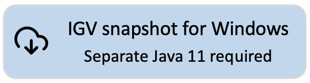

<!---
The page title should not go in the menu
-->

 Download IGV snapshot build

**NOTE:** This is the download page for the **development version** of IGV. This version of IGV:

* will contain features and code that have not been thoroughly tested;
* is updated frequently;
* is intended for advanced users only

[{height=90}](https://data.broadinstitute.org/igv/projects/downloads/snapshot/IGV_Win_snapshot-WithJava-installer.exe) 
[{height=90}](https://data.broadinstitute.org/igv/projects/downloads/snapshot/IGV_Win_snapshot-installer.exe) 
 [{height=90}](https://data.broadinstitute.org/igv/projects/downloads/snapshot/IGV_Linux_snapshot_WithJava.zip)
 [{height=90}](https://data.broadinstitute.org/igv/projects/downloads/snapshot/IGV_snapshot.zip)

