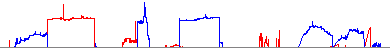

<!---
The page title should not go in the menu
-->
<p class="page-title">File Formats: Data Tracks</p>

## BAM

To load a set of BAM files merged into a single track see [Merged BAM File](#merged-bam-file).

A BAM file (.bam) is the binary version of a SAM file.  A SAM file (.sam) is a tab-delimited text file that contains sequence alignment data.   These formats are described on the SAM Tools web site: [http://samtools.github.io/hts-specs/](http://samtools.github.io/hts-specs/). 

BAM, rather than SAM, is the recommended format for IGV. Starting with IGV 2.0.11, IUPAC ambiguity codes in BAM files are supported.

**Indexing:**  IGV requires that both SAM and BAM files be sorted by position and indexed, and that the index files follow a specific naming convention. Specifically,  a BAM index file should be named by appending .BAI to the bam file name. A SAM index filename is created by appending .SAI.  

*   The index files must have the same base file name and must reside in the same directory as the file that it indexes.
    *   For example, the index file for test-xyz.bam would be named test-xyz.bam.bai or test-xyz.bai. 

*   Multiple tools are available for sorting and indexing BAM files, including [igvtools](../UserGuide/tools/igvtools_ui.md), the [samtools](http://www.htslib.org) package, and in [GenePattern](http://www.broadinstitute.org/cancer/software/genepattern/).  The GenePattern module for sorting and indexing is [Picard.SortSam](http://www.broadinstitute.org/cancer/software/genepattern/modules/docs/Picard.SortSam/4).
*   SAM files can be sorted and indexed using [igvtools](../UserGuide/tools/igvtools_ui.md). _**Note: The .SAI index is an IGV format, and it does not work with samtools or any other application.**_

**Chromosome names:** Chromosome names must be consistent between the selected reference genome and the SAM/BAM data files. For convenience, IGV equates chromosome numbers and names of the form chr# (e.g., 1 and chr1 are equivalent).

**One-based index:** Start and end positions are identified using a one-based index. The end position is included. For example, setting start-end to 1-2 describes two bases, the first and second in the sequence.

## BED

A BED file (.bed) is a tab-delimited text file that defines a feature track. It can have any file extension, but .bed is recommended. The BED file format is described on the UCSC Genome Bioinformatics web site: [http://genome.ucsc.edu/FAQ/FAQformat](http://genome.ucsc.edu/FAQ/FAQformat). Tracks in the UCSC Genome Browser ([http://genome.ucsc.edu/](http://genome.ucsc.edu/)) can be downloaded to BED files and loaded into IGV.

**Notes:** 

IGV does not currently support multiple track lines in a single BED file  

**Zero-based index:** Start and end positions are identified using a zero-based index. The end position is excluded. For example, setting start-end to 1-2 describes exactly one base, the second base in the sequence.

**Display settings:** To modify IGV's default display settings for the BED data, include a [track line](#track-lines) in the file.

**GFF tag option:** By adding a #gffTags line to the beginning of a .bed file, you can add GFF3-style attributes to the _Name_ field (column 4) of a BED file which are displayed in the popup text. 

*   The GFF _Name_ property will become the display name of the feature.
*   You must URL encode spaces and other whitespace (e.g. replace space with %20).  This is not a requirement of gff3, rather required because bed files are whitespace delimited.

See the [GFF3 specification, column 9](http://www.sequenceontology.org/gff3.shtml) for more details.

## BedGraph

The BedGraph format allows display of continuous-valued data in track format. This display type is useful for probability scores and transcriptome data.  This track type is similar to the wiggle (WIG) format, but unlike the wiggle format, data exported in the bedGraph format are preserved in their original state.  For more information on this file format, see the UCSC Genome Bioinformatics web site description at [http://genome.ucsc.edu/goldenPath/help/bedgraph.html](http://genome.ucsc.edu/goldenPath/help/bedgraph.html).

Recognized Extension: .bedgraph

## bigBed

The bigBed format stores annotation items that can either be simple, or a linked collection of exons, much as [BED](#bed) files do. BigBed files are created initially from BED type files, using the UCSC program bedToBigBed. The resulting bigBed files are in an indexed binary format. The main advantage of the bigBed files is that only the portions of the files needed to display a particular region are transferred, so for large data sets bigBed is considerably faster than regular BED files.

Go [here](http://genome.ucsc.edu/goldenPath/help/bigBed.html) for more information on bigBed format.

## bigWig

The bigWig format is for display of dense, continuous data that will be displayed as a graph. BigWig files are created initially from [WIG](#wig) type files, using the UCSC program wigToBigWig. Alternatively, bigWig files can be created from [bedGraph](#bedgraph) files, using the UCSC program bedGraphToBigWig. In either case, the resulting bigWig files are in an indexed binary format. The main advantage of the bigWig files is that only the portions of the files needed to display a particular region are transferred, so for large data sets bigWig is considerably faster than regular WIG files.

See [here](http://genome.ucsc.edu/goldenPath/help/bigWig.html) for more information on the bigWig format.

## Birdsuite Files

**Birdseye Canary Calls**

The file extension must be .birdseye\_canary\_calls an example file being named:

mycalls.birdseye\_canary\_calls

The expected file format looks like this:
<table border="0" cellpadding="0" cellspacing="0" width="371">
	<tbody>
		<tr height="14">
			<td height="14" width="53">
				sample</td>
			<td width="53">
				sample_index</td>
			<td width="53">
				copy_number</td>
			<td width="53">
				chr</td>
			<td width="53">
				start</td>
			<td width="53">
				end</td>
			<td width="53">
				confidence</td>
		</tr>
		<tr height="14">
			<td height="14">
				1234.CEL</td>
			<td align="right" num="1.0">
				1</td>
			<td align="right" num="2.0">
				2</td>
			<td align="right" num="1.0">
				1</td>
			<td align="right" num="51598.0">
				51598</td>
			<td align="right" num="4.639285E6">
				4639285</td>
			<td align="right" num="1685.0">
				1685</td>
		</tr>
		<tr height="14">
			<td height="14">
				1235.CEL</td>
			<td align="right" num="1.0">
				1</td>
			<td align="right" num="3.0">
				3</td>
			<td align="right" num="1.0">
				1</td>
			<td align="right" num="4.641859E6">
				4641859</td>
			<td align="right" num="4.649979E6">
				4649979</td>
			<td align="right" num="0.37">
				0.37</td>
		</tr>
		<tr height="14">
			<td height="14">
				1236.CEL</td>
			<td align="right" num="1.0">
				1</td>
			<td align="right" num="2.0">
				2</td>
			<td align="right" num="1.0">
				1</td>
			<td align="right" num="4.653917E6">
				4653917</td>
			<td align="right" num="1.5359041E7">
				15359041</td>
			<td align="right" num="6038.0">
				6038</td>
		</tr>
		<tr height="14">
			<td height="14">
				1237.CEL</td>
			<td align="right" num="1.0">
				1</td>
			<td align="right" num="3.0">
				3</td>
			<td align="right" num="1.0">
				1</td>
			<td align="right" num="1.5361772E7">
				15361772</td>
			<td align="right" num="1.5362873E7">
				15362873</td>
			<td align="right" num="0.0">
				0</td>
		</tr>
		<tr height="14">
			<td height="14">
				1238.CEL</td>
			<td align="right" num="1.0">
				1</td>
			<td align="right" num="2.0">
				2</td>
			<td align="right" num="1.0">
				1</td>
			<td align="right" num="1.5366497E7">
				15366497</td>
			<td align="right" num="1.6743865E7">
				16743865</td>
			<td align="right" num="403.13">
				403.13</td>
		</tr>
		<tr height="14">
			<td height="14">
				1239.CEL</td>
			<td align="right" num="1.0">
				1</td>
			<td align="right" num="3.0">
				3</td>
			<td align="right" num="1.0">
				1</td>
			<td align="right" num="1.6758722E7">
				16758722</td>
			<td align="right" num="1.6808594E7">
				16808594</td>
			<td align="right" num="0.4">
				0.4</td>
		</tr>
	</tbody>
</table>

These files are output when Birdsuite is run so there are no additional steps required for these files to load.

## broadPeak

A broadPeak (.broadPeak) file is used by the ENCODE project to provide called regions of signal enrichment based on pooled, normalized (interpreted) data. It is a BED 6+3 format. See the [UCSC web site for more details](http://genome.ucsc.edu/FAQ/FAQformat.html#format13) on this format.

## CBS

A SEG file (segmented data; .seg or .cbs) is a tab-delimited text file that lists loci and associated numeric values.

See [SEG](#seg) for details.

## Chemical Reactivity Probing Profiles

IGV supports importing chemical reactivity probing profiles from SHAPE or MAP files. After choosing a file to import, the user will be prompted to select the applicable chromosome and optional strand and starting position. IGV will then create a .wig file ([WIG format](#wig)) and load it.

### SHAPE format

The SHAPE format (.shape) is a tab-deliminated text file with two columns and no header.

*   1st column: 1-based nucleotide position
*   2nd column: chemical reactivity value, or -999 to indicate positions with no data

**Example file:** 
```
1	-999.000000
2	-999.000000
3	-999.000000
4	-999.000000
5	-999.000000
6	0.051832
7	-0.668888
8	0.177740
9	-0.136181
10	0.083320
11	-999.000000
12	-999.000000
13	-0.102030
14	-0.056842
15	0.170690
16	0.203813
```

### MAP format

The MAP format (.map) is output by the SHAPE-MaP software pipeline _[ShapeMapper](http://www.chem.unc.edu/rna/software.html)_. The .map format is identical to the .shape format, with the addition of a third column containing standard error estimates and a fourth column containing the nucleotide sequence. These additional columns are currently ignored by IGV.

**Example file:** 
```
1	-999.000000	0.000000	G
2	-999.000000	0.000000	G
3	-999.000000	0.000000	T
4	-999.000000	0.000000	C
5	-999.000000	0.000000	T
6	0.051832	0.056355	C
7	-0.668888	0.886105	T
8	0.177740	0.202396	C
9	-0.136181	0.192588	T
10	0.083320	0.079208	G
11	-999.000000	0.000000	G
12	-999.000000	0.000000	T
13	-0.102030	0.144292	T
14	-0.056842	0.210304	A
15	0.170690	0.067038	G
16	0.203813	0.111248	A
```


## CN

A CN file (.cn) is a tab-delimited text file that contains copy number data. The CN file format is described on the [GenePattern web site](https://www.genepattern.org/file-formats-guide#CN).

**Zero-based index:** Physical positions are identified using a zero-based index.

**Display settings:** To modify IGV's default display settings for the CN data, include a [track line](<?php echo base_path(); ?>TrackLine) in the file.

Example: [mynah.sorted.cn](https://www.genepattern.org/tutorial/linkedFiles/mynah.sorted.cn)

**Does IGV assume log2(ratio) or absolute values for copy number?**
 IGV looks for the presence of negative numbers.  If it finds them, it assumes that the data is log2(tumor/normal).  If it does not find negative numbers, it assumes that the values are absolute, with 2 as the center.  These assumptions are used to set the heatmap legend; the legend can, however, be changed manually under the _View_\> _Color Legends_. 

 For data with negative numbers, IGV defaults to a blue-to-red scale that corresponds to copy numbers from -1.5 to 1.5. Both deletions and amplifications can have continuous valued numbers represented by shading.

## CRAM

CRAM files are used to store aligned sequence data. The specification can be found at [http://samtools.github.io/hts-specs/CRAMv3.pdf](http://samtools.github.io/hts-specs/CRAMv3.pdf). 

A corresponding index file is required. By convention, the index file name should be the same as the data file name, with “.crai” appended. For example, if the data file is named example_xyz.cram, the index file should be named example_xyz.cram.crai or example_xyz.crai.

## GCT

A GCT file (.gct) is a tab-delimited text file that contains gene expression data. The GCT file format is described on the [GenePattern web site](https://www.genepattern.org/file-formats-guide#GCT).

The GCT format is used for gene expression and RNAi data.

Example: [allaml.dataset.gct](https://www.genepattern.org/tutorial/linkedFiles/allaml.dataset.gct)

### Gene Expression Data 

Before IGV can display gene expression data, it must map the probes named in the file to genomic locations. 

To specify loci for a probe in the GCT file, enter the data into the second column as follows:

<table class="general" width="100%">
	<tbody>
		<tr>
			<td>
				&nbsp;Name</td>
			<td>
				&nbsp;Description</td>
			<td>
				&nbsp;Sample 1</td>
			<td>
				&nbsp;Sample 2</td>
		</tr>
		<tr>
			<td>
				&nbsp; 100_g_at</td>
			<td>
				na|@chr6:1950428-1950681,chr6:2304548-2304574,<br />
				chr7:18296715-18296752,chr7:41423955-41423981,<br />
				chr7:48906172-48906198|</td>
			<td>
				&nbsp;215.37</td>
			<td>
				&nbsp;132.94</td>
		</tr>
		<tr>
			<td>
				&nbsp; 101_g_at</td>
			<td>
				na |@RABGGTA|</td>
			<td>
				211.3</td>
			<td>
				90.56</td>
		</tr>
	</tbody>
</table>

Unless you specify loci for a probe in the file, IGV uses annotations and mapping files to look up the locations. Data is displayed for all of the probes that can be mapped to genomic locations. If none of the probes in the file can be mapped, an error message is displayed.

IGV determines the genomic locations for probes as follows:

1.  If you use the delimiters |@ and | to specify the probe loci in the GCT file as described above, IGV uses the specified loci. Otherwise, it goes to the next step.
2.  IGV searches all loaded annotation tracks for each probe. (This is the same as entering the ID in the first column \[the Name column\] of the file into the search box on the IGV tool bar and clicking _Go_.) If a probe is found, IGV displays the data at that location. Otherwise, it goes to the next step.
3.  IGV searches its probe mapping files for each probe. If a probe is found, IGV determines the probe locus and displays the data at that location. Otherwise, it goes to the next step.
4.  IGV uses its gene mapping files] to map each probe ID to a gene symbol, determines the gene locus, and displays the data at that location.

**Probe Mapping Files:**

Probe mapping files map probe identifiers to chromosomal locations. They are compiled from source files provided by Affymetrix, Agilent, and Illumina. The Affymetrix and Agilent mapping files are split by species due to their large size. Separate mapping files are provided for human, mouse, and other (non-mouse, non-human) species. Human probe identifiers are mapped to hg18. Depending on the vendor, mouse probe identifiers are mapped to mm9 (Affymetrix), mm5 (Agilent) or mm8 (Illumina).

Following are links to the probe mapping files:

*   [http://data.broadinstitute.org/igvdata/probes/affy/affy\_human\_mappings.txt.gz](http://data.broadinstitute.org/igvdata/probes/affy/affy_human_mappings.txt.gz)
*   [http://data.broadinstitute.org/igvdata/probes/affy/affy\_mouse\_mappings.txt.gz](http://data.broadinstitute.org/igvdata/probes/affy/affy_mouse_mappings.txt.gz)
*   [http://data.broadinstitute.org/igvdata/probes/affy/affy\_other\_mappings.txt.gz](http://data.broadinstitute.org/igvdata/probes/affy/affy_other_mappings.txt.gz)
*   [http://data.broadinstitute.org/igvdata/probes/agilent/agilent\_human\_mappings.txt.gz](http://data.broadinstitute.org/igvdata/probes/agilent/agilent_human_mappings.txt.gz)
*   [http://data.broadinstitute.org/igvdata/probes/agilent/agilent\_mouse\_mappings.txt.gz](http://data.broadinstitute.org/igvdata/probes/agilent/agilent_mouse_mappings.txt.gz)
*   [http://data.broadinstitute.org/igvdata/probes/agilent/agilent\_other\_mappings.txt.gz](http://data.broadinstitute.org/igvdata/probes/agilent/agilent_other_mappings.txt.gz)
*   [http://data.broadinstitute.org/igvdata/probes/illumina/illumina\_allMappings.txt.gz](http://data.broadinstitute.org/igvdata/probes/illumina/illumina_allMappings.txt.gz)

**Gene Mapping Files:**

Gene mapping files map probe identifiers to gene identifiers. Following are links to the gene mapping files:

*   [http://data.broadinstitute.org/igvdata/probes/affy/affy\_probe\_gene\_mapping.txt.gz](http://data.broadinstitute.org/igvdata/probes/affy/affy_probe_gene_mapping.txt.gz)
*   [http://data.broadinstitute.org/igvdata/probes/agilent/agilent\_probe\_gene\_mapping.txt.gz](http://data.broadinstitute.org/igvdata/probes/agilent/agilent_probe_gene_mapping.txt.gz)
*   [http://data.broadinstitute.org/igvdata/probes/illumina/illumina\_probe\_gene\_mapping.txt.gz](http://data.broadinstitute.org/igvdata/probes/illumina/illumina_probe_gene_mapping.txt.gz)

**Sources for the Mapping Files:**

The probe and gene mapping files are compiled from source files provided by Affymetrix, Agilent, and Illumina. A list of the source files is available at [http://data.broadinstitute.org/igvdata/probes/data\_sources\_for\_mapping.txt](http://data.broadinstitute.org/igvdata/probes/data_sources_for_mapping.txt).

### RNAi Data

GCT files for RNAi data must use the .rnai.gct extension.

To display the RNAi data, IGV maps the hairpin names to gene names, determines the gene locus, and displays the data at that location. The hairpin-to-gene mappings used by IGV are based on work published by Luo, Cheung, Subramanian et al. (PNAS, 2008, 105:51:20380-20385). The mappings used by IGV are different only where a gene name has been modified to match one used in a genome on the genome server.

## genePred

The genePred table formats can be used to specify the gene track annotations for an imported genome.

Several variations of the genePred table format are described in the FAQ titled “genePred table format” on the UCSC Genome Browser web site: [http://genome.ucsc.edu/FAQ/FAQformat#format9](http://genome.ucsc.edu/FAQ/FAQformat#format9). Downloading gene information from any of these tables creates a tab-delimited text file where the columns in the file match the columns in the table. Downloaded files may be zipped with a .txt.gz extension. Such a zipped file can be used to specify the gene track annotations for an imported genome. IGV looks for specific string in the filename  (case insensitive) to identify the file format:
<table class="general" width="100%">
	<thead>
		<tr>
			<th scope="col">
				File Name&nbsp;Contains</th>
			<th scope="col">
				Description</th>
		</tr>
	</thead>
	<tbody>
		<tr>
			<td>
				ucscGene</td>
			<td>
				Columns in the file match the columns in the table, as described in the &ldquo;Gene Predictions&rdquo; section of the genePred table format FAQ.</td>
		</tr>
		<tr>
			<td>
				genePredExt<br />
				refGene<br />
				ensGene</td>
			<td>
				These files have the same format. Columns in the file match the columns in the table, as described in the &ldquo;Gene Predictions (Extended)&rdquo; section of the genePred table format FAQ. Note: The first column of this file holds an integer, which is not documented in the FAQ and is ignored by IGV.</td>
		</tr>
		<tr>
			<td>
				refFlat</td>
			<td>
				Columns in the file match the columns in the table, as described in the &ldquo;Gene Predictions and RefSeq Genes with Gene Names&rdquo; section of the genePred table format UCSC FAQ.</td>
		</tr>
	</tbody>
</table>

## GFF/GTF

A General Feature Format (GFF) file is a simple tab-delimited text file for describing genomic features. There are several slightly but significantly different GFF file formats. IGV supports the GFF2, GFF3 and GTF file formats.

*   GFF2 files must have a .gff file extension for IGV. See the Wellcome Trust Sanger Institute web site ([https://ensembl.org/info/website/upload/gff.html](https://ensembl.org/info/website/upload/gff.html)) for a description of the GFF2 file format.
*   GFF3 files must have a .gff3 file extension for IGV. See the Sequence Ontology Project (SO) web site ([http://www.sequenceontology.org/gff3.shtml](http://www.sequenceontology.org/gff3.shtml)) for a description of the GFF3 file format.
*   GTF files must have a .gtf file extension for IGV. See the Computational Genomics Laboratory web site ([http://mblab.wustl.edu/GTF2.html](http://mblab.wustl.edu/GTF2.html)) for a description of the GTF file format.

**One-based index:** Start and end positions are identified using a one-based index. The end position is included. For example, setting start-end to 1-2 describes two bases, the first and second in the sequence.

**Display settings:** To modify IGV's default display settings for the .gff or .gff3 data, include a [track line](#track-lines) in the file.

**Feature display name:** To override the default setting for which field is used to label the features in the IGV track, add the following line to the file:

```##displayName=<field name>```

**Coloring features:** To specify a color for a given feature, you can add this to the file as shown in the following example. Color values can be in either hexadecimal or RGB (r, g, b) format.  
  
```
##gff-version 3  
chr1 varclass variants\_454HCDiffs 59133 59133 33 . . Var=A->G;AA=S->S;depth=9;frame=+1;gene=OR4F5;ref=novel;InRegion;color=#0000EE  
chr1 varclass variants\_454HCDiffs 59374 59374 67 . . Var=A->G;AA=T->A;depth=30;frame=+1;gene=OR4F5;ref=rs2691305;InRegion;color=#EE0000  
chr1 varclass variants\_454HCDiffs 731442 731442 100 . . Var=T->C;AA=->;depth=3;frame=;gene=;ref=rs3115865,rs61770168;OutOfRegion;color=#AAAAAA
```

## GISTIC

A GISTIC file (.gistic) is the Gistic Scores File output from the GenePattern GISTIC module. It is a tab-delimited text file that defines a feature track displaying the q-value for regions of amplification or deletion found using GISTIC (Beroukhim et al., 2007). The first row contains eight column headings, which must be identical to those listed in the following table. Each subsequent row defines a GISTIC feature.

IGV displays GISTIC deletion scores as a blue line and amplification scores as a red line:



Example: [scores.gistic](ExampleFiles/scores.gistic)

<table class="general" width="100%">
	<thead>
		<tr>
			<th scope="col">
				Column Heading</th>
			<th scope="col">
				Description</th>
		</tr>
	</thead>
	<tbody>
		<tr>
			<td>
				Type</td>
			<td>
				Aberration type, which is specified as Amp or Del (amplification or deletion)</td>
		</tr>
		<tr>
			<td>
				Chromosome(hg17)</td>
			<td>
				Chromosome</td>
		</tr>
		<tr>
			<td>
				Start</td>
			<td>
				Location of the first base pair in the aberrant region</td>
		</tr>
		<tr>
			<td>
				End</td>
			<td>
				Location of the last base pair in the aberrant region</td>
		</tr>
		<tr>
			<td>
				q-value</td>
			<td>
				False Discovery Rate q-values for the aberrant regions (q-values below a user-defined threshold are considered significant)</td>
		</tr>
		<tr>
			<td>
				score</td>
			<td>
				G-score that considers the amplitude of the aberration as well as the frequency of its occurrence across samples</td>
		</tr>
		<tr>
			<td>
				amplitude</td>
			<td>
				Average amplitudes among aberrant samples</td>
		</tr>
		<tr>
			<td>
				frequency</td>
			<td>
				Frequency of aberration across the genome for both amplifications and deletions</td>
		</tr>
	</tbody>
</table>

## GWAS

A GWAS file is a space- or tab-delimited result file from genome-wide association study (GWAS) analysis. These files include PLINK result files containing integrated map information (i.e., chromosomal location for each association).

File extensions for GWAS files are: **.linear**, **.logistic**, **.assoc**, **.qassoc**, **.gwas**

GWAS file must contain a header line and  four required  columns (case-insensitive):

*   **CHR**: chromosome (aliases chr, chromosome)
*   **BP**: nucleotide location (aliases bp, pos, position)
*   **SNP**: SNP identifier (aliases snp, rs, rsid, rsnum, id, marker, markername)
*   **P**: p-value for the association (aliases p, pval, p-value, pvalue, p.value)

Columns can be in any order.  Other columns besides the required ones are allowed and will be included in popup text.  The p-value will be transformed to -log10 scale for plotting.

## IGV

An IGV file (.igv) is a tab-delimited text file that defines tracks. The first row contains column headings for chromosome, start location, end location, and feature followed by the name of each track defined in the .igv file. Each subsequent row contains a locus and the associated numeric values for each track. IGV interprets the first four columns as chromosome, start location, end location, and feature name regardless of the column headings in the file. IGV uses the column headings for the fifth and subsequent columns as track names. Feature names are not displayed in IGV.

For example:
<table class="general" width="100%">
	<tbody>
		<tr>
			<td>
				Chromosome</td>
			<td>
				Start</td>
			<td>
				End</td>
			<td>
				Feature</td>
			<td>
				Patient-One</td>
			<td>
				Patient-Two</td>
			<td>
				Patient-Three</td>
		</tr>
		<tr>
			<td>
				chr1</td>
			<td>
				2150459</td>
			<td>
				2150460</td>
			<td>
				Test_one</td>
			<td>
				0.01</td>
			<td>
				0</td>
			<td>
				0.99</td>
		</tr>
		<tr>
			<td>
				chr1</td>
			<td>
				3558044</td>
			<td>
				3558045</td>
			<td>
				Test_two</td>
			<td>
				0.25</td>
			<td>
				0.71</td>
			<td>
				1.31</td>
		</tr>
	</tbody>
</table>
**Zero-based index:** Start and end positions are identified using a zero-based index. The end position is excluded. For example, setting start-end to 1-2 describes exactly one base, the second base in the sequence.

**Data must be grouped by chromosome and within each chromosome group sorted by start position:** [igvtools](../UserGuide/tools/igvtools_ui.md) can be used to sort .igv files.

Display settings**:** IGV displays IGV file data using default display settings. To modify the default display settings for the  data, you can:

*   Include a [type line](#type-lines) in the file to make IGV use the display settings for a different data type.
*   Include a [track line](#track-lines) in the file.

### Custom columns

IGV supports custom specification of columns for the ".igv" file format. To use this, include a column specifier directive at the head of the file. The column directive line starts with #columns, followed by one or more column specifiers of the form _key=value_. Valid keys are listed in the following table.  Columns are tab delimited.

<table border="1" cellpadding="1" cellspacing="1">
	<thead>
		<tr>
			<th scope="col">
				Key</th>
			<th scope="col">
				Value</th>
		</tr>
	</thead>
	<tbody>
		<tr>
			<td>
				chr</td>
			<td>
				index of the chromosome column (required)</td>
		</tr>
		<tr>
			<td>
				start</td>
			<td>
				index of the start position column (required)</td>
		</tr>
		<tr>
			<td>
				end</td>
			<td>
				index of the end position column (optional)</td>
		</tr>
		<tr>
			<td>
				probe</td>
			<td>
				index of a probe or description column (optional)</td>
		</tr>
		<tr>
			<td>
				data</td>
			<td>
				either a single index, or a range in the form of 5-10, of the data columns (required)</td>
		</tr>
	</tbody>
</table>

**Note:** If a single value is entered for the data column, it is interpreted as the "first" data column. All columns starting with this value are assumed to contain data. To specify exactly one column, use a range (e.g., 5-5) to specify the 5th column.

Example:

```
#columns chr=7 start=8 probe=2 data=4-5 #coords=1  
> Index TargetID ProbeID\_A sample\_1\_methylation sample\_2\_methylation genome\_build chromosome position  
> 60 cg00002593 25796427 0.7642099 0.7426524 37 1 1258656  
> 21 cg00000957 65648367 0.8172337 0.8323303 37 1 5859840  
> ....
```
## LOH

An LOH file (.loh) is a copy number file that contains "loss of heterozygosity" values. The format is identical to the CN format, but the numbers have the following meanings:

*   \-1: Conflict (homozygous in the normal and heterozygous in the tumor)
*   0: Retained
*   1: Loss of heterozygosity

Numbers that fall between these values represent the probability of LOH. IGV treats the values as a continuum and colors them according to the heatmap scale set for the LOH track.

**Display settings:** To modify IGV's default display settings for the LOH data, include a [track line](#track-lines) in the file.

## MAF (Multiple Alignment Format)

The Multiple Alignment Format stores a series of multiple alignments.   See the [UCSC web site](https://genome.ucsc.edu/FAQ/FAQformat.html#format5) for more details.  The extension must be ".maf".  

**NOTE:** .maf files must be in plain text (not gzipped). The alignment blocks in the file must be sorted by start position, and the file requires an accompanying index. If no index file is detected, IGV will create the index when the file is first loaded, which may result in a delay in loading, depending on the size of the file. Do not close IGV while indexing is in progress.

## MAF (Mutation Annotation Format)

A Mutation Annotation Format (MAF) file (.maf) is a tab-delimited text file that lists mutations. The format  is described in detail at the NCI's Genomic Data Commons documentation site [here](https://docs.gdc.cancer.gov/Data/File_Formats/MAF_Format/#introduction).

## Merged BAM File

A set of BAM files can now be loaded merged into a single track. 

Create a plain text file containing a list of the BAM files you want to load, listed by either file path or URL. The paths or URLs can be either absolute or relative to the location of the list file. . IGV will load all the BAM files as a single track.   **The filename must end with the compound extension ".bam.list".**

Example:

```
gs://genomics-public-data/platinum-genomes/bam/NA12889\_S1.bam
gs://genomics-public-data/platinum-genomes/bam/NA12877\_S1.bam
gs://genomics-public-data/platinum-genomes/bam/NA12878\_S1.bam
```

## narrowPeak

A narrowPeak (.narrowPeak) file is used by the ENCODE project to provide called peaks of signal enrichement based on pooled, normalized (interpreted) data. It is a BED 6+4 format. See the [UCSC web site for more detail](http://genome.ucsc.edu/FAQ/FAQformat.html#format12) on this format.

## PSL

A PSL file (.psl) is a tab-delimited text file that represents alignments, and are typically taken from files generated by BLAT or psLayout. The PSL file format is described on the UCSC Genome Bioinformatics web site: [http://genome.ucsc.edu/FAQ/FAQformat](http://genome.ucsc.edu/FAQ/FAQformat).

## RES

A RES file (.res) is a tab-delimited text file that contains gene expression data. The GCT and RES files are the same, except that the RES file format contains labels for each gene's absent (A) versus present (P) calls as generated by Affymetrix's GeneChip software. The RES file format is described on the [GenePattern web site](https://www.genepattern.org/file-formats-guide#RES). See GCT File Format for a discussion of how IGV determines the loci for the gene expression data.

## RNA Secondary Structure Formats

### BP (RNA base pairing)

A BP file (.bp) is text file format that describes connections between ranges of nucleotides, and is primarily used to indicate base pairing interactions or estimated pairing probabilities for RNA structures. BP files are rendered in IGV using colored semicircular arcs.

**File Header.** A file begins with any number of header lines listing all arc colors and associated labels. Each of these lines are tab-delimited, and must begin with "color", followed by the red, green, and blue color components 0-255, followed by an optional text label which will be shown in the track menu color legend. Arc colors will be rendered in listed order (i.e. the last listed color will be drawn on top). Track lines are not currently supported for this file type.

_Example header line:_  color: 51 114 38 High-probability basepairs

**Paired Ranges.** Each tab-delimited line in the rest of the file describes a single arc. The first field is the name of the associated IGV chromosome. The last field is a zero-based integer index indicating the arc color (from the colors listed in the header). The second through fifth fields are the 1-based inclusive nucleotide coordinates of paired ranges (a helix, if this is an RNA structure).

**Example BP file**: [example.bp](ExampleFiles/example.bp)

The following RNA secondary structure formats can be imported into IGV and converted to the .bp format. After choosing a file to import, the user will be prompted to select the applicable chromosome and optional strand and starting position. IGV will then create a .bp file and load it.

### DB (dot bracket)

DB (dot bracket) format (.db, .dbn) is a plain text format that can encode secondory structure. Lines beginning with **\>** or **#** are currently ignored. Nucleotide sequence is currently ignored.

**Secondary structure notation:**

*   Unpaired nucleotides are indicated with the **.** or **:** characters.
*   Matching pairs of parentheses indicate base pairs.
*   To indicate non-nested base pairs (pseudoknots), additional brackets may be used: **\[\]**, **{}**, or **<>**.

Files containing multiple sequences or structures are currently not supported.

**Example:**

`GGUGCAUGCCGAGGGGCGGUUGGCCUCGUAAAAAGCCGCAAAAAAUAGCAUGUAGUACC ((((((((((((((.[[[[[[..))))).....]]]]]]........)))))...))))`

### CT (connectivity table)  

The CT format (.ct) is used by software packages such as _[RNAstructure](http://rna.urmc.rochester.edu/Text/index.html)._ See the [_CT File Format_](http://rna.urmc.rochester.edu/Text/File_Formats.html#CT) on the Mathews Lab web page.

Only the first structure in a CT file will be imported by IGV. CT files with additional headers (often starting with the # character) are currently not supported.

**Example CT file:** [example.ct](ExampleFiles/example.ct)

### DP (dot plot or pairing probability) 

The DP file format (.dp) can be generated using the _[RNAstructure](http://rna.urmc.rochester.edu/Text/index.html)_ software package by running _partition_ followed by _ProbabilityPlot_ on the resulting .pfs file with the _\-t_ option for text file output. For modeling the structures of large mRNAs, the program _[Superfold](http://www.chem.unc.edu/rna/software.html)_ runs _partition_ on multiple overlapping windows, then heuristically merges the windows. _Superfold_ outputs a merged .dp file by default.

**File format:**

*   1st line is the number of entries in the file.
*   2nd line is column names.
*   Remaining lines describe pairing probabilities between 1-based nucleotide positions, given as tab-separated

<left> <right> <-log10(probability of pairing)>

Upon import, IGV colors pairs above 80% probability dark green. Pairs between 30 and 80% probability are colored blue. Pairs between 10 and 30% probability are colored light yellow.

### Other

IGV also supports [viewing RNA secondary structures in BED](../UserGuide/tracks/rna_structure.md) format.

## SAM

For detailed specifications, we refer you to the September 2014 article titled [_Sequence Alignment/Map Format Specification_](http://samtools.github.io/hts-specs/SAMv1.pdf) by the SAM/BAM Format Specification Working Group, and the [Samtools site.](http://www.htslib.org)

For information on the related binary version of SAM, see [BAM](#bam).

The citation for the 2009 Bioinformatics paper introducing the SAM format follows:

Li H.\*, Handsaker B.\*, Wysoker A., Fennell T., Ruan J., Homer N., Marth G., Abecasis G., Durbin R. and 1000 Genome Project Data Processing Subgroup (2009) The Sequence alignment/map (SAM) format and SAMtools. Bioinformatics, 25, 2078-9. \[PMID: [19505943](http://www.ncbi.nlm.nih.gov/pubmed/19505943)\]

## SEG

A SEG file (segmented data; .seg or .cbs) is a tab-delimited text file that lists loci and associated numeric values. The first row contains column headings and each subsequent row contains a locus and an associated numeric value. IGV ignores the column headings. It reads the first four columns as track name, chromosome, start location, and end location. It reads the last column as the numeric value for that locus (if the value is non-numeric, IGV ignores the row). IGV ignores all other columns.

The segmented data file format is the output of the Circular Binary Segmentation algorithm (Olshen et al., 2004).

Example: [example.seg](ExampleFiles/example.seg)

**Display settings:** SEG files can include a [type line](#type-lines) to set display settings.

## TDF

A tiled data file (TDF) file (.tdf) is a binary file that contains data that has been preprocessed for faster display in IGV.

Generate TDF files by using the [igvtools](../UserGuide/tools/igvtools_ui.md) **toTDF** command.

## Track Lines

When IGV loads a data file, it uses the file extension to determine the file format, the file format to determine the data type, and the data type to determine the default display options (see [Default Display](<?php echo base_path(); ?>DefaultDisplay)). Adding a track line to a data file modifies IGV's default display options. This can be particularly useful for file formats not associated with any particular type of data, such as the IGV file format.

The following file formats allow track lines:

*   BED, WIG, PSL
*   IGV, CN, SNP, GFF, LOH, GFF3, SEG -- in these file formats, the track line must begin with a # symbol; i.e. #track

IGV track lines are based on WIG track lines. See the UCSC site for the WIG track line syntax: [https://genome.ucsc.edu/goldenPath/help/wiggle.html](https://genome.ucsc.edu/goldenPath/help/wiggle.html). The following table describes the track line specifiers that IGV supports. IGV includes a few options that are not part of the UCSC specification.

_**Note: IGV does not currently support multiple track lines in a single file.**_
<table class="general" width="100%">
	<thead>
		<tr>
			<th scope="col">
				Specifier</th>
			<th scope="col">
				Value</th>
			<th scope="col">
				Description</th>
		</tr>
	</thead>
	<tbody>
		<tr>
			<td>
				name</td>
			<td>
				trackLabel</td>
			<td>
				Track name (ignored when used in the IGV file format)</td>
		</tr>
		<tr>
			<td>
				description</td>
			<td>
				centerlabel</td>
			<td>
				Currently ignored</td>
		</tr>
		<tr>
			<td>
				visibility</td>
			<td>
				full | dense | hide</td>
			<td>
				Currently ignored</td>
		</tr>
		<tr>
			<td>
				color</td>
			<td>
				RRR,GGG,BBB</td>
			<td>
				Color for positive values in all tracks</td>
		</tr>
		<tr>
			<td>
				<p>altColor</p>
			</td>
			<td>
				RRR,GGG,BBB</td>
			<td>
				Color for negative values in all tracks</td>
		</tr>
		<tr>
			<td>
				priority</td>
			<td>
				N</td>
			<td>
				Currently ignored</td>
		</tr>
		<tr>
			<td>
				autoScale</td>
			<td>
				on|off</td>
			<td>
				Currently ignored.&nbsp; All tracks autoscale unless an explicit data range is defined (e.g., by including the viewlimits specifier).</td>
		</tr>
		<tr>
			<td>
				gridDefault</td>
			<td>
				on | off</td>
			<td>
				Currently ignored</td>
		</tr>
		<tr>
			<td>
				maxHeightPixels</td>
			<td>
				max:default:min</td>
			<td>
				default and min are supported<br />
				max is currently ignored</td>
		</tr>
		<tr>
			<td>
				graphType</td>
			<td>
				bar | points | heatmap</td>
			<td>
				<p>Graph type to use: chart | scatter plot | heatmap.</p>
				<p><strong>(IGV only: </strong>The <em>heatmap </em>value is an IGV addition to the specification.)</p>
			</td>
		</tr>
		<tr>
			<td>
				midRange&nbsp; <em>(IGV extension)</em></td>
			<td>
				x:y</td>
			<td>
				<p>Defines the neutral range for a 3-color heatmap.&nbsp;&nbsp;&nbsp; Values in this range are rendered with the midColor value,&nbsp; which is white by default.</p>
				<p>Example:&nbsp; midRange=20:80</p>
			</td>
		</tr>
		<tr>
			<td>
				midColor&nbsp;<em> (IGV extension</em><strong>)</strong></td>
			<td>
				RRR,GGG,BBB</td>
			<td>
				<p>Color to use in the &quot;mid range&quot; of a heatmap.</p>
				<p>Example: midColor=0,0,150</p>
			</td>
		</tr>
		<tr>
			<td>
				viewLimits</td>
			<td>
				lower:upper</td>
			<td>
				Defines the data range</td>
		</tr>
		<tr>
			<td>
				yLineMark</td>
			<td>
				real-value</td>
			<td>
				Currently ignored</td>
		</tr>
		<tr>
			<td>
				yLineOnOff</td>
			<td>
				on | off</td>
			<td>
				Currently ignored</td>
		</tr>
		<tr>
			<td>
				windowingFunction</td>
			<td>
				maximum | minimum | mean | none</td>
			<td>
				Function that summarizes the values in a window of data represented by one pixel</td>
		</tr>
		<tr>
			<td>
				smoothingWindow</td>
			<td>
				off | [2-16]</td>
			<td>
				Currently ignored</td>
		</tr>
		<tr>
			<td>
				url</td>
			<td>
				&nbsp;</td>
			<td>
				Defines a URL for an external link associated with this track.&nbsp; Any &#39;$$&#39; in this string this will be substituted with the item <strong>ID</strong> if explicitly defined, or <strong>name</strong> if <strong>ID</strong><strong> </strong>is not specified..</td>
		</tr>
		<tr>
			<td>
				coords&nbsp; <em>(IGV extension)</em></td>
			<td>
				0 | 1</td>
			<td>
				<p>Indicate whether the file uses 0 or 1 based coordinates.&nbsp;The UCSC specification for WIG files uses 1 based coordinates and for BED files uses 0 based coordinates. If data looks off by one, check for a possible 0 vs 1 based coordinate issue.</p>
			</td>
		</tr>
		<tr>
			<td>
				scaleType&nbsp; <strong>(IGV&nbsp;only)</strong></td>
			<td>
				log |&nbsp;linear</td>
			<td>
				The Y-axis scale type for charts&nbsp;</td>
		</tr>
		<tr>
			<td>
				featureVisibilityWindow <strong>(IGV&nbsp;only)</strong></td>
			<td>
				<p>integer value</p>
			</td>
			<td>
				<p>The window size in bp below which features are loaded and displayed.&nbsp; When the viewing window is above this value a message is displayed &quot;Zoom in to view features&quot;.&nbsp; This parameter is useful for&nbsp; large indexed feature tracks.</p>
				<p><strong>A negative value indicate features should be loaded for an entire chromosome (but not the whole genome)</strong></p>
			</td>
		</tr>
		<tr>
			<td>
				gffTags&nbsp; <em>(IGV extension)</em></td>
			<td>
				off |&nbsp;on</td>
			<td>
				If &quot;on&quot;&nbsp;the name field is treated as a GFF3 style attribute list (column 9 of GFF3).&nbsp; The default is &quot;off&quot;.</td>
		</tr>
	</tbody>
</table>

## Type Lines

When IGV loads a data file, it uses the file extension to determine the file format, the file format to determine the data type, and the data type to determine the default display options. In the IGV and segmented (SEG, CBS) file formats, you can use a #type line to override the default data type and thus the default display options. For example, the IGV file format has a default data type of 'Other' and, therefore, the data in file is displayed using a blue bar chart with an autoscaled data range. By adding a #type line to the IGV file, you can indicate that the file contains gene expression data; in which case, the data will be displayed using a blue-to-red heatmap with the data range set from -1.5 to 1.5.

The ```#type``` must be the first line in the file. It has the following format:

```
#type=_data-type_
```

where _data-type_ is one of the following (these values are case-sensitive): COPY\_NUMBER, GENE\_EXPRESSION, CHIP, DNA\_METHYLATION, ALLELE\_SPECIFIC\_COPY\_NUMBER, LOH, RNAI

The selected data type determines the display settings.

## VCF

VCF stands for Variant Call Format, and it is used by the 1000 Genomes project to encode structural genetic variants. 

*   Variant calls include SNPs, indels, and genomic rearrangements.
*   Samples may also be annotated with attribute information, including pedigree and family information. IGV uses these annotatations to group, sort, and filter samples, e.g. to group samples by population group.

A consistent color scheme is used in the variant display row, which is the top row, for files with or without geneotypes.

*   **blue** - minor allele frequency/fraction is known from annotation or genotype data
    
*   **grey** - minor allele frequency is not known
    
*   **red** - height is proportional to minor allele frequency
    

Required Extensions: .vcf, .vcf.gz

If the file is gzipped (ends with .vcf.gz), it must have an accompanying Tabix index (see below).

**Requirements**

IGV supports VCF Version 4.

VCF data files must be indexed for viewing in IGV, either by using igvtools or by using Tabix. 

*   **igvtools** can be run from the command line or IGV itself (_Tools>Run igvtools..._)  After launching, choose the _Index_ command and browse to your .vcf file. The index file (.idx) will be created in the same directory as the .vcf file.
    *   _igvtools_ also sorts .vcf files.
*   **Tabix** creates a .tbi file.  Tabix, including [documentation](http://samtools.sourceforge.net/tabix.shtml), is available from the [SamTools](http://samtools.sourceforge.net/tabix.shtml) Web site.  
  
**VCF Specification**

*   The v4.0 specifications: [http://www.1000genomes.org/wiki/doku.php?id=1000\_genomes:analysis:vcf4.0](http://www.1000genomes.org/wiki/doku.php?id=1000_genomes:analysis:vcf4.0)
*   v4.1 specifications: [http://samtools.github.io/hts-specs/VCFv4.1.pdf](http://samtools.github.io/hts-specs/VCFv4.1.pdf)
*   v4.2 specifications: [http://samtools.github.io/hts-specs/VCFv4.2.pdf](http://samtools.github.io/hts-specs/VCFv4.2.pdf)  


Example V.4.0 File:

```
##fileformat=VCFv4.0  
##fileDate=20090805  
##source=myImputationProgramV3.1  
##reference=1000GenomesPilot-NCBI36  
##phasing=partial  
##INFO=<ID=NS,Number=1,Type=Integer,Description="Number of Samples With Data">  
##INFO=<ID=DP,Number=1,Type=Integer,Description="Total Depth">  
##INFO=<ID=AF,Number=.,Type=Float,Description="Allele Frequency">  
##INFO=<ID=AA,Number=1,Type=String,Description="Ancestral Allele">  
##INFO=<ID=DB,Number=0,Type=Flag,Description="dbSNP membership, build 129">  
##INFO=<ID=H2,Number=0,Type=Flag,Description="HapMap2 membership">  
##FILTER=<ID=q10,Description="Quality below 10">  
##FILTER=<ID=s50,Description="Less than 50% of samples have data">  
##FORMAT=<ID=GT,Number=1,Type=String,Description="Genotype">  
##FORMAT=<ID=GQ,Number=1,Type=Integer,Description="Genotype Quality">  
##FORMAT=<ID=DP,Number=1,Type=Integer,Description="Read Depth">  
##FORMAT=<ID=HQ,Number=2,Type=Integer,Description="Haplotype Quality">  
#CHROM POS ID REF ALT QUAL FILTER INFO FORMAT NA00001 NA00002 NA00003  
20 14370 rs6054257 G A 29 PASS NS=3;DP=14;AF=0.5;DB;H2 GT:GQ:DP:HQ 0|0:48:1:51,51 1|0:48:8:51,51 1/1:43:5:.,.  
20 17330 . T A 3 q10 NS=3;DP=11;AF=0.017 GT:GQ:DP:HQ 0|0:49:3:58,50 0|1:3:5:65,3 0/0:41:3  
20 1110696 rs6040355 A G,T 67 PASS NS=2;DP=10;AF=0.333,0.667;AA=T;DB GT:GQ:DP:HQ 1|2:21:6:23,27 2|1:2:0:18,2 2/2:35:4  
20 1230237 . T . 47 PASS NS=3;DP=13;AA=T GT:GQ:DP:HQ 0|0:54:7:56,60 0|0:48:4:51,51 0/0:61:2  
20 1234567 microsat1 GTCT G,GTACT 50 PASS NS=3;DP=9;AA=G GT:GQ:DP 0/1:35:4 0/2:17:2 1/1:40:3
```

**This example shows in order:**

*   A good, simple SNP
*   A possible SNP that has been filtered out because its quality is below 10
*   A site at which two alternate alleles are called, with one of them (T) being ancestral (possibly a reference sequencing error)
*   A site that is called monomorphic reference (i.e., with no alternate alleles),
*   A microsatellite with two alternative alleles, one a deletion of 3 bases (TCT), and the other an insertion of one base (A).

Genotype data are given for three samples, two of which are phased and the third unphased, with per sample genotype quality, depth, and haplotype qualities (the latter only for the phased samples) given as well as the genotypes. The microsatellite calls are unphased.

## WIG

A WIG file (.wig) is a text file that defines either a feature or data track. It must have a .wig file extension for IGV to read it as a wiggle file. The WIG file format is described on the UCSC Genome Bioinformatics web site: [http://genome.ucsc.edu/FAQ/FAQformat](http://genome.ucsc.edu/FAQ/FAQformat).

For faster loading, convert WIG files to [bigWig format](#bigwig). Alternatively, convert to [TDF format](#tdf) using [igvtools](../UserGuide/tools/igvtools_ui.md).

**Notes;**

IGV does not currently support multiple track lines in a single WIG file 

**One-based index:** Start and end positions (for "fixedStep" and "variableStep" formats) are identified using a one-based index. The end position is excluded. For example, setting start-end to 1-2 describes exactly one base, the first base in the sequence.

**Display settings:** To modify IGV's default display settings for the WIG file data, include a [track line](<?php echo base_path(); ?>TrackLine) in the file.