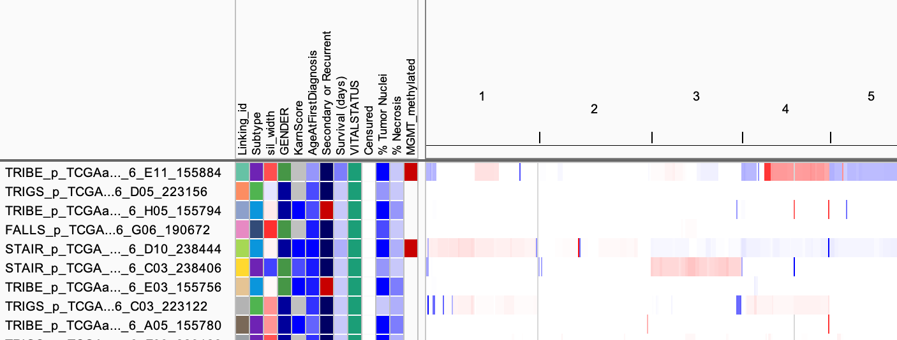

<!---
The page title should not go in the menu
-->
<p class="page-title">File Formats: Sample Info (Attributes)</p>

Sample information files are tab-delimited text files used to associate attributes with sample names.  The attributes
are displayed in the "Sample Information" panel and can be used to sort, group, and filter sample rows.

The file consists of up to three sections

* A tab delimited table specifying **attributes** and their values for each sample - Required.
* **Sample mapping** information - Optional, needed only if the sample names in the attribute information do not match the sample names in the data files.
* **Colors** Optional, used to explicitly specify colors.


## Attributes

The attributes section is denoted by the line `#sampleTable`.  It consists of a tab delimited header row defining the 
attribute names, followed by one row per sample containing attribute values.  The first column contains the sample names.  
If the attribute section is the first or only section in the file the `#sampleTable` line can be omitted.

An example attribute section for 2 samples follows.

```
#sampleTable
ID	Subtype	sil_width	GENDER	KarnScore	Censured	MGMT_methylated	% Tumor Nuclei	% Necrosis
TCGA-02-0001	Classical	-0.135526414	FEMALE	80	0		97.5	0
TCGA-02-0002	Neural	-0.069669747	MALE	NA	NA	No	NA	DEAD	0		97.5	5
```

## Sample mapping

The sample mapping section begins with the line `#sampleMapping`.  It is used to map sample names in the sample 
information file to corresponding names in the data files.  If the names match this section can be omitted.  
The format is two-column tab delimited. The first column is 
the sample name in the data file; the second column is the sample identifier in the attributes information.

Example: 
```
#sampleMapping
TRIBE_p_TCGAaffx_B1_2_GBM_Nsp_GenomeWideSNP_6_A01_155716	TCGA-02-0001
TRIBE_p_TCGAaffx_B1_2_GBM_Nsp_GenomeWideSNP_6_A03_155748	TCGA-02-0002
```

## Attribute colors

By default, IGV randomly assigns colors to the attribute values. You can optionally specify the colors for attribute 
values in RGB format for a specific attribute name, a specific value, or as a heatmap scale for numeric columns in 
monocolor or in two-color heatmap for specified ranges. 

The attribute colors file (or section in a combined file) begins with the line `#colors`. The file is tab delimited 
with three or four columns:

* 1: Attribute name. An asterisk `*` indicates the color specification applies to all attributes.
* 2: Attribute value or range of two values separated by a colon `:`. An asterisk `*` indicates the color specification applies to all attribute values.
* 3: Color in RGB format. If a color is also specified in column 4, this is the first color of a two color heatmap.
* 4: (Optional) Second color (RGB format) of a two-color heatmap.

```
#colors 	
  	  	  	 
# A value of  "MALE" for the "GENDER" column gets the color (0,0,155)
GENDER 	MALE 	0,0,155 
	  	
# A value of "Classical"  in any column gets the color  (80,180,80)
* 	Classical 	80,180,80 	
  	
# Numeric column example, monocolor heatmap
KarnScore 	* 	0,0,255 	
  	
# Another monocolor heatmap, this time with the range specified
% Tumor Nuclei 	90:100 	0,0,255 
	  	
# A two-color heatmap with the range specified
sil_width 	-0.1:0.5 	0,0,255 	255,0,0 	
```

<br>
The above example snippets are from all from [this sample info file](ExampleFiles/example_sampleinfo.txt), which has 
also been used in IGV in the following screenshot.
<br>
{height=300}
 
