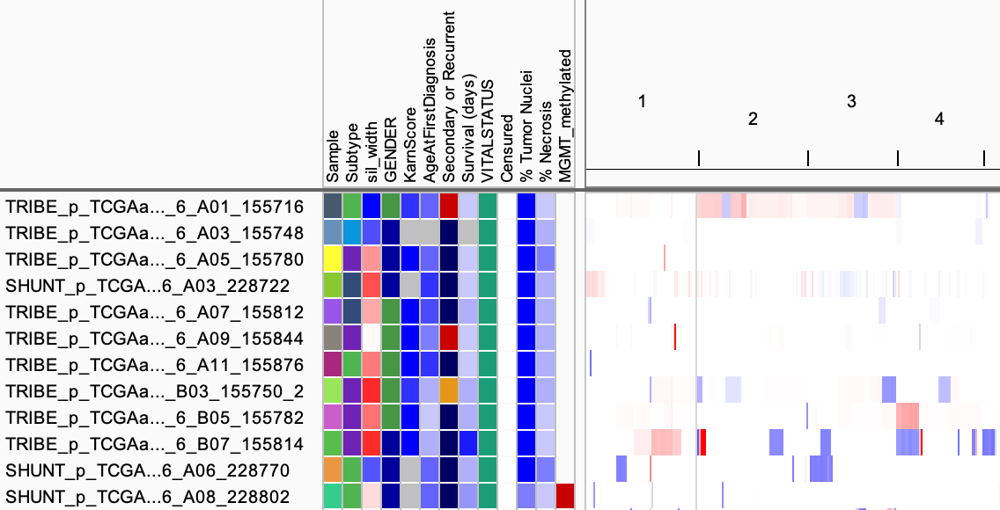

<!---
The page title should not go in the menu
-->
<p class="page-title">File Formats: Sample Info (Attributes)</p>

Sample information includes three types of information: 

* The **attributes** and their values for each sample - Required.
* **Sample mapping** information - Needed only if the sample names in the attribute information do not match the sample names in the data files.
* **Colors** to use in the attribute display - Needed only if the you wish to specify colors that are not the same as the defaults.

Attribute, mapping, and color information may be provided in **separate files** or together in a **single file**. These are tab-delimited text files with extension .txt. The required formats for the three different types of information are described below. Lines starting with `#` are ignored (except for the special section headers) and can be used for comments in the file.

You load sample information files as you would data files, via the _File_ menu. IGV can load multiple sample information files per session. When loaded into IGV, attributes display in a separate color-coded panel between sample names and tracks (see [Sample Attributes](../UserGuide/sample_attributes.md) in the User Guide). 

*   The attributes are applied to data tracks with names that match the sample identifiers in the attribute information. 
    *   Attribute rows without matching data tracks are ignored. 
    *   For data tracks without a matching attribute row, the corresponding IGV attributes panel rows remain blank.
*   Because you can load multiple sample information files per IGV session, you do not need to include the attributes for all the samples of interest in the same file.

## Attributes

The attributes file (or section in a combined file) lists sample identifiers in the first column and attributes in subsequent columns with a single header row that defines the names of the attributes. If an attributes section is not at the top of a file, the section should begin with the line `#sampleTable`

```
#sampleTable
ID	Subtype	sil_width	GENDER	KarnScore	Censured	MGMT_methylated	% Tumor Nuclei	% Necrosis
TCGA-02-0001	Classical	-0.135526414	FEMALE	80	0		97.5	0
TCGA-02-0002	Neural	-0.069669747	MALE	NA	NA	No	NA	DEAD	0		97.5	5
```

Example attributes file: [example_sampleinfo.txt](ExampleFiles/example_sampleinfo.txt)

## Sample mapping

The sample mapping file (or section in a combined file) begins with the line `#sampleMapping` and maps sample identifiers in the data files to sample identifiers in the attribute information.   The format is two-column tab delimited. The first column is the sample name in the data file; the second column is the sample identifier in the attributes information.

```
#sampleMapping
TRIBE_p_TCGAaffx_B1_2_GBM_Nsp_GenomeWideSNP_6_A01_155716	TCGA-02-0001
TRIBE_p_TCGAaffx_B1_2_GBM_Nsp_GenomeWideSNP_6_A03_155748	TCGA-02-0002
```

## Attribute colors

By default, IGV randomly assigns colors to the attribute values. You can optionally specify the colors for attribute values in RGB format for a specific attribute name, a specific value, or as a heatmap scale for numeric columns in monocolor or in two-color heatmap for specified ranges. 

The attribute colors file (or section in a combined file) begins with the line `#colors`. The file is tab delimited with three or four columns:

* 1: Attribute name. An asterisk `*` indicates the color specification applies to all attributes.
* 2: Attribute value or range of two values separated by a colon `:`. An asterisk `*` indicates the color specification applies to all attribute values.
* 3: Color in RGB format. If a color is also specified in column 4, this is the first color of a two color heatmap.
* 4: (Optional) Second color (RGB format) of a two-color heatmap.

```
#colors 	
  	  	  	 
# A value of  "MALE" for the "GENDER" column gets the color (0,0,155)
GENDER 	MALE 	0,0,155 
	  	
# A value of "Classical"  in any column gets the color  (80,180,80)
* 	Classical 	80,180,80 	
  	
# Numeric column example, monocolor heatmap
KarnScore 	* 	0,0,255 	
  	
# Another monocolor heatmap, this time with the range specified
% Tumor Nuclei 	90:100 	0,0,255 
	  	
# A two-color heatmap with the range specified
sil_width 	-0.1:0.5 	0,0,255 	255,0,0 	
```

{height=300}
 
