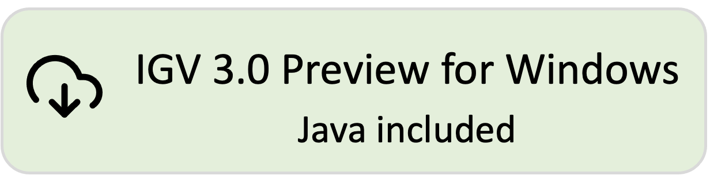
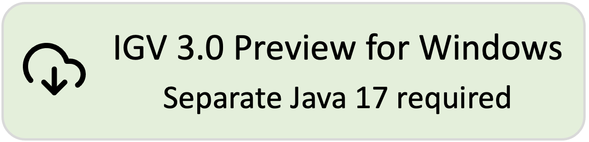

<!---
The page title should not go in the menu
-->

 IGV 3.0 Preview 

IGV 3.0 Preview is work in progress! Some features are still under development and testing has not been completed. 

We appreciate your feedback before we release. Please post bug reports and other feedback on GitHub at [https://github.com/igvteam/igv/issues](https://github.com/igvteam/igv/issues) and include *IGV 3.0 Preview* in the title.

# Download IGV 3.0 Preview

[{width=300}](https://data.broadinstitute.org/igv/projects/downloads/snapshot/IGV_Win_snapshot-WithJava-installer.exe) 
[{width=300}](https://data.broadinstitute.org/igv/projects/downloads/snapshot/IGV_Win_snapshot-installer.exe) 
 
[{width=300}](https://data.broadinstitute.org/igv/projects/downloads/snapshot/IGV_Linux_snapshot_WithJava.zip)
 
[{height=80}](https://data.broadinstitute.org/igv/projects/downloads/snapshot/IGV_snapshot.zip)

!!! Note "For Mac users:"
Mac apps are not provided for the IGV 3.0 Preview build. To **run the IGV 3.0 Preview on a Mac**: 

1. Click on the *command line* version above and unzip the downloaded distribution file to a directory of your choice. You will see that several launcher scripts are provided in the distribution. The Mac version is named *igv.sh*.

2. Open a *Terminal* window and enter `<Full path to the IGV snapshot directory>/igv.sh`. For example, if the IGV snapshot files are in */Users/jane/IGV-3.0-Preview*, enter `/Users/jane/IGV-3.0-Preview/igv.sh`. Alternatively, enter `cd /Users/jane/IGV-3.0-Preview` to go to that directory, and then `./igv.sh`.

# What's in IGV 3.0 Preview

##Track hubs

UCSC track hubs in the [useOneFile](https://genome.ucsc.edu/goldenPath/help/hgTracksHelp.html#UseOneFile) format can now
be loaded directly into IGV to define a reference genome and associated tracks. Notably this includes the more than
3,600 genome assemblies and associated tracks hosted at the [UCSC GenArk](https://hgdownload.soe.ucsc.edu/hubs/) site.
See the [Reference genome](/UserGuide/reference_genome/#load-a-track-hub) section for more details on how to use a track hub for IGV's reference genome.

For more information on the GenArk resource see `Clawson, H., Lee, B.T., Raney, B.J. et al. GenArk: towards a million UCSC genome browsers. Genome Biol 24, 217 (2023).`
[https://doi.org/10.1186/s13059-023-03057-x](https://doi.org/10.1186/s13059-023-03057-x)

## Base modifications

* Base modification options now include the choice of monocolor and two-color schemes for all modifiction types.
  Previously the two-color scheme was restricted to 5mC modifications.
  See [Base modifications](/UserGuide/tracks/alignments/base_modifications/) for full details.

* Colors for each modification, as well as colors to represent the unmodified base in two-color schemes, can now be
  customized from a new `Base Mods` tab on the Preferences dialog.

* Base modifications are now shown for expanded insertions.

## Chimeric reads

Visualization of chimeric (split) reads have been improved with enhanced display of clipping information, as well
as a new split read alignment diagram.   For details see [Chimeric Reads](/UserGuide/tracks/alignments/chimeric_reads).

## Autosaved sessions
 
IGV sessions can now be automatically saved and restored. See [Sessions](/UserGuide/sessions/#session-autosave) for more information.

## Other improvements and changes

* Alignment tracks:
    * Expanded insertions redesigned
    * New group option: by selected insertion locus 
* New file formats:
    * GVCF (see [description](https://gatk.broadinstitute.org/hc/en-us/articles/360035531812-GVCF-Genomic-Variant-Call-Format) on the GATK site).
    * bedMethyl (see [description](https://www.google.com/url?sa=t&rct=j&q=&esrc=s&source=web&cd=&cad=rja&uact=8&ved=2ahUKEwjnurf9zfmCAxU9FFkFHfjeAwsQFnoECA4QAw&url=https%3A%2F%2Fwww.encodeproject.org%2Fdata-standards%2Fwgbs%2F%23%3A~%3Atext%3Dstates%2520at%2520CpG.-%2CDescription%2520of%2520bedMethyl%2520file%2CStart%2520position%2520in%2520chromosome&usg=AOvVaw21Dwl3k4lFCnoVxG8q8Ffg&opi=89978449) on the ENCODE site).

## Java 17

IGV now uses Java 17. If you download one of the IGV versions that does not include Java, make sure you have Java 17 installed and in your path.