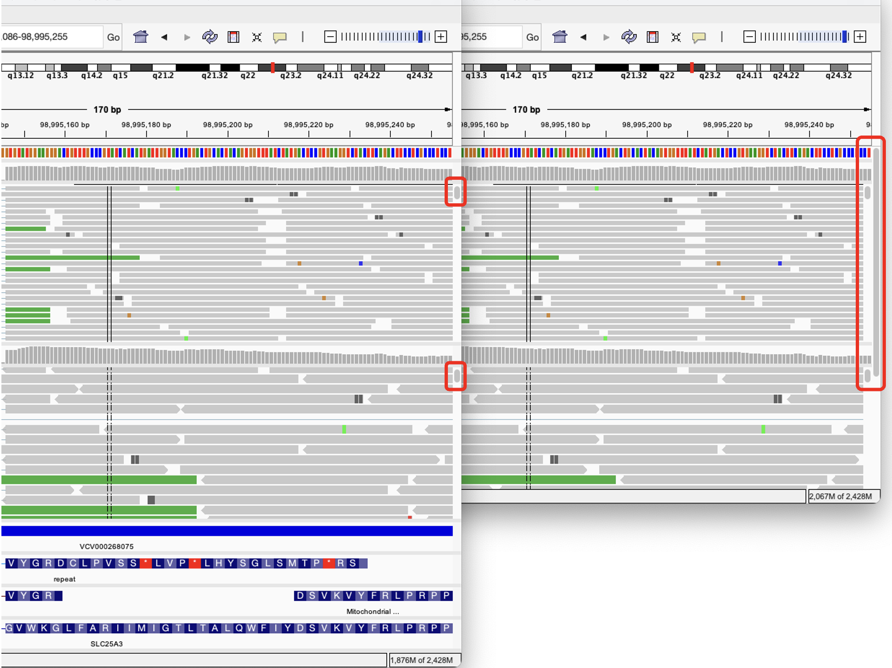
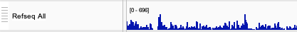
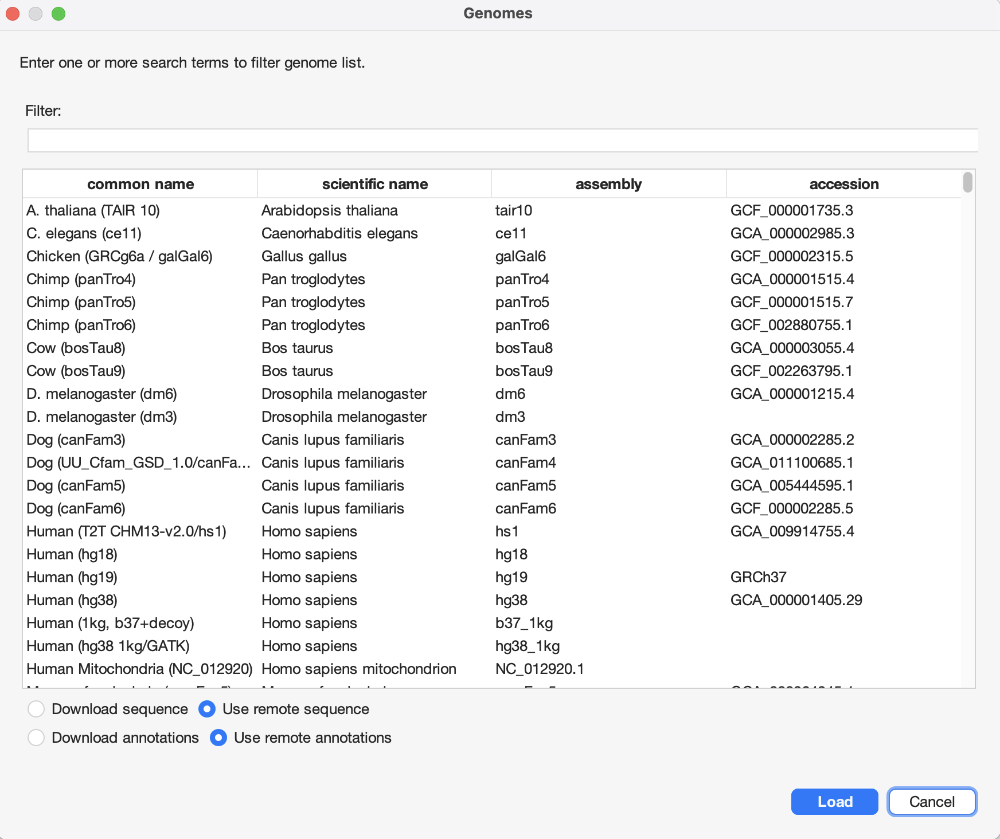
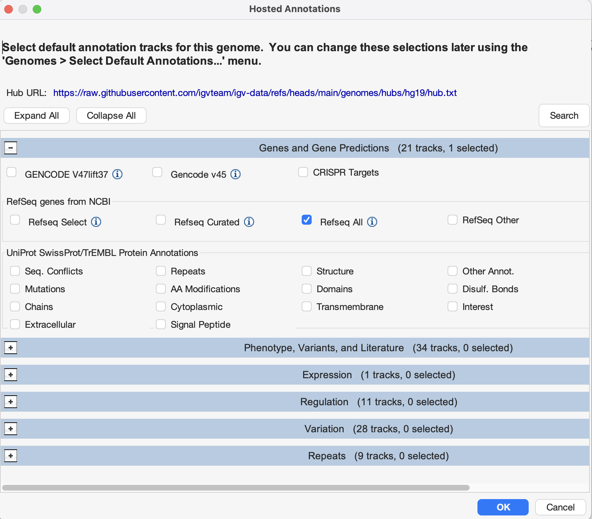

# 
 IGV 3.0 Beta - May 2026 

This section describes new features and other major updates in the Beta version IGV 3.0. 
  It can be downloaded from [here](../Download3.0Page.md).

**RELEASE NOTES ARE WORK IN PROGRESS. HERE ARE SOME ITEMS NOT YET DESCRIBED IN THE SECTIONS BELOW:**

* sessions now in .json format; compatible with igv-web; can still load .xml sessions from older igv releases
* hic files
* misc alignment improvements:
    * sorting alignments by default on jump -but not on pan
    * default - show center lines 
    * group alignments by selected
    * support selecting reads by base and multiple read names (#1764)
    * Coloring alignments to highlight those that are split/chimeric
* minimize track heights
* HGVS notation & Clinvar (see Jim's ucsc slides)
* support MANE fields in genome config? 

## Track size and placement

In previous versions of IGV, the main part of the IGV window that contains the tracks was divided vertically into one or more panels. Each panel could contain one or more tracks, and the panels could be resized by dragging the horizontal dividers between them. A panel scrollbar was displayed if the content exceeded the height of the panel. However, all panels had to fit within the main window; there was no scrollbar to allow panels to scroll out of view.

In IGV 3.0, the track area is no longer divided into panels. Instead, all tracks are placed in a single area that can be scrolled vertically if the tracks do not all fit in the window. Each track can be resized via the track's popup menu or by dragging the horizontal divider between tracks. Some track types (e.g. alignment tracks) have rows of data that can scroll vertically if they do not fit within the height of the track. These data rows can also be resized via the track's popup menu to allow more or less data to be visible within the track height.

The two screenshots below show the same IGV 3.0 session with two alignment tracks and four annotation tracks, but the IGV window in the screenshot on the right has been resized to a smaller height. Both show scrollbars in the two alignment tracks as the track height does not accommodate all the alignment rows. The screenshot on the right shows an additional scrollbar for the whole track area, as the smaller window height does not accommodate all the tracks. 

{height=480}

To change the order of the tracks in the IGV window, you can either 

* use the _View > Reorder Tracks_ menu item, or 
* click on a track's drag handle (it looks like a stack of horizontal lines to the left of the track's name) and drag and drop it to a new position.  

## IGV menu layout

The IGV menu bar has been **reorganized** and has **additional features**. Major changes include: 

1. Changes to the **File** menu:

    * _Load from File_ and _Load from URL_ have been renamed _Load Tracks from File_ and _Load Tracks from URL_ to clarify that these menu items are for loading tracks.
   
    * Sample information files are now loaded through new menu items in the _File_ menu: _Load Sample Info from File_ and _Load Sample Info from URL_. 
    
    * The menu items for controlling sessions have been moved from the File menu to a new top-level **Sessions** menu. 
   
    * Hosted tracks previously found by selecting _Load from Server_ are now found in a new top-level **Track Hubs** menu.

2. The **Genomes** menu has a new entry for selecting the default annotations tracks for a reference genome. 
Loading hosted genomes has also changed, as described in the section on [_Reference genomes_](.#reference-genomes) below. 

3. The new **Sessions** menu does not include the items _New Session_ and _Reload Session_ that used to be in the _File_ menu. Instead, there is a new _Reset Session_ menu item that will reset the state to either the last loaded session file, if one has been loaded, or clear all the currently loaded tracks if no session file has been loaded. Other session-related changes are described in the section on [_Sessions_](.#sessions) below.

4. The new **Track Hubs** menu provides access to the hosted tracks previously found by selecting *File > Load from Server*, as well as public track hubs hosted by the UCSC Genome Browser and other track hubs that can be accessed via URL. The section below on [_Hosted tracks and track hubs_](.#hosted-tracks-and-track-hubs) describes this in more detail.

5. Two new items have been added to the **View** menu: 

    * _Show Selection Checkboxes_ displays checkboxes next to track names that can be used to select multiple tracks and then perform operations on them by right-clicking on one of the selected tracks and choosing an operation from the pop-up menu.
   
    * _Reorder Tracks_ opens a window that allows you to reorder tracks by dragging and dropping them in the list.
   
6. The **Tracks** menu has been removed. Most of the items have alternatives:

    * The items _Sort Tracks_, _Group Tracks_, and _Filter Tracks_ have been moved to the track popup menu for multi-sample track types that support those operations. The items are now named _Sort Samples by Attribute_, _Group Samples by Attribute_, and _Filter Samples by Attribute_. 
   
    * The item _Overlay Data Tracks_ has been moved to the track popup menu for quantitative data tracks as _Overlay Tracks_. It is visible only when multiple tracks are selected. 

    * _Set Track Height_ in the old _Tracks_ menu would set all the tracks to the same specified height. Instead, you can now multi-select all the tracks or a subset of them, right-click on one of them to bring up the popup menu, and select _Set Track Height_. In IGV 3.0, you select multiple tracks by using the checkboxes that are displayed when you select _View > Show Selection Checkboxes_.
   
    * Use the {height=28} button in the toolbar instead of the _Fit to Window_ item in the old _Tracks_ menu.  

The **new menu structure** is as follows: 

**File**

    Load Tracks from File
    Load Tracks from URL 
    Load Sample Info from File
    Load Sample Info from URL
    Save PNG Image
    Save SVG Image
    Exit

**Genomes**

    Load Genome from Host
    Load Genome from File
    Load Genome from URL
    Select Default Annotations
    Remove Genomes

**Track Hubs**

    [List of categories of default tracks for the current reference genome]
    [List of selected track hubs]
    Select Track Hubs
    Add Track Hub from URL

**Sessions**

    Load Session from File
    Load Session from URL
    Save Session
    Reset Session
    Autosaved Sessions 

**View** 

    Preferences
    Show Selection Checkboxes
    Show Name Panel
    Set Name Panel Width
    Show Attribute Display
    Select Attributes to Show
    Show Header Panel
    Reorder Tracks
    Go to 

**Regions** _(has not changed in 3.0)_

    Region Navigator
    Gene Lists
    Export Regions
    Import Regions

**Tools** _(has not changed in 3.0)_

    Run Batch Script
    Run igvtools
    Find Motif
    BLAT
    Combine Data Tracks

**Help** _(has not changed in 3.0)_

    User Guide
    Help Forum
    About IGV

## Reference genomes 

When selecting a reference genome from the _Genomes > Load Genome from Host_ menu, you will now see a list of all genomes hosted at the UCSC Genome Browser GenArk site and selected other genomes. The list GenArk hosted genomes is retrieved in real time from the UCSC server, so it is always up to date. In previous releases, the list contained a much shorter curated list of genomes.

{height=440}

By default, the curated genomes from earlier IGV releases is presented at the top of the list. The list can be **filtered** by typing one or more terms in the search box at the top of the window. Or **sort** the list by clicking on any of the column headers. To **select** a genome, click on the row for that genome and then click the _Load_ button.

!!! Tip " " 
    By default, IGV will access the UCSC server on demand to load the sequence and annotations in view as you move between different loci in the genome. Alternatively, you can download the sequence and annotations to your local computer by checking the radio buttons for _Download sequence_ and _Download annotations_. This will allow IGV to function without an internet connection, but may require considerable disk space as it will download the complete sequence and annotation files.

When you click the _Load_ button, a new window will open that allows you to select the **default annotation tracks** to be loaded with the genome. The tracks are presented in categories, and you can expand or collapse a category by clicking on the + or - sign to the left of the category name. Note that some categories are presented as collapsed when you open the window. Select one or more tracks by checking the boxes by their name, and click _OK_.

{height=440}

Once loaded, the selected genome will also be added to the _genome dropdown menu_ in the IGV toolbar. Whenever you load the genome from the dropdown, the default annotation tracks you selected will be loaded automatically. To **change the default annotation tracks** for a genome, use the _Genomes > Select Default Annotations_ menu item.

## Hosted tracks and track hubs 

Hosted tracks that previously were loaded via the _File > Load from Server_ menu are now made available through the **Track Hubs** menu. The tracks are organized into categories that are listed at the top of the menu. Click on a category name to see the list of available tracks in that category. 

At the bottom of the _Track Hubs_ menu are two items for connecting to **UCSC-style track hubs**.

1. Click on _Select Track Hubs_ to open a window that lists all public track hubs from **the UCSC Track Hub Registry** that are relevant for the current reference genome. The list is retrieved in real time from the UCSC server, so it is always up to date. The list can be **filtered** by typing one or more terms in the search box at the top of the window. Or **sort** the list by clicking on any of the column headers. **Select** one or more hubs by checking the boxes by their name and then click the _OK_ button to add them to the _Track Hubs_ menu.

2. Click on _Add Track Hub from URL_ to access **any track hub by entering its URL**. This opens a window in which you can paste the URL of the hub's `hub.txt` file and clicking ok will add the hub to the *Track Hubs* menu. It can be a private hub on your intranet or a public hub that is accessible by URL. 

To **load tracks from a hub** that was added to the menu by either of these methods, click on the hub name in the _Track Hubs_ menu. This opens a window that lists all tracks in the hub. A warning will be presented if the hub does not contain any tracks that are  compatible with IGV. Select one or more tracks by checking the boxes by their name, and click _OK_ to load them.

To **remove hubs from the menu**, click on _Select Track Hubs_, uncheck the hubs to be removed, and click _OK_. If any hubs were added by URL, they are also listed in the _Select Track Hubs_ window and can be removed in the same way.

!!! Tip " " 
    The hubs remain in the _Track Hubs_ menu across IGV sessions. The state of the menu is stored in the `hubs.txt` file in the `igv` folder in your user home folder. 

## Sessions

**Describe file format changes: XML to JSON.**

## Visual themes

A new feature in the _General_ tab of the _View > Preferences_ window allows you to select a **visual theme** for IGV. Two of the themes support a **dark mode**, which may be easier on the eyes in low-light environments. Switching to a different theme will require a restart of IGV before it takes effect.

    