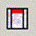

Regions of interest (ROI) are intervals defined by the user using one of the methods described below. ROIs are marked
in red below the ruler. Hovering the mouse over this red region displays lines that demarcate the ROI down the panels.
Clicking on the red highlight pops up a menu for options that include sorting by various data-specific metrics and
copying to the clipboard or BLAT searching the corresponding reference sequence (**Screenshot** 2015.05.05).

* View a session's ROIs in the _Region Navigator_ under the _Regions_ menu. The _Region Navigator_'s list is editable,
  sortable and as the name indicates, navigable.
    * Navigate to a single locus or view multiple loci in split
      panes ([multi-locus view](multi_locus.md)) by selecting them and
      clicking _View_.
    * Distinguish overlapping ROIs using the _Region Navigator_.
    * Enter a short description for each ROI viewable in the _Region Navigator_.
* Defined ROIs persist within an IGV session. 
* Import and export ROIs as [BED](http://www.broadinstitute.org/software/igv/BED) files using _Regions_\>_Import
  Regions_ and _Regions_\>_Export Regions_.

This page outlines three ways to define a region of interest--(1) by mouse, (2) by keyboard shortcut, and (3) by using
the _Region Navigator._ The fourth section describes right-click menu options.

Define by mouse
---------------

On the tool bar, click the Define a Region of Interest icon:

In the data panel, single click the start of the region and then the end of the region. Do **NOT** click and drag. IGV
displays lines delimiting the region of interest for the first and second click, then marks the region in red under the
ruler.

This options works for single bases so long as the reference sequence resolves bases in view. The reference sequence
appears above the annotation track when zoomed in as described in
the [Sequence Track Options](http://www.broadinstitute.org/software/igv/sequence_track_options) page.

Define by keyboard shortcut
---------------------------

Display the region of interest to fill the entire view and press _Control_ \+ _R_.

* The entire ruler view will be marked red.
* Does not work to select multiple regions at once in split-panes.

Region Navigator features
-------------------------

To open the Region Navigator select _Regions>Region Navigator_ from the menu bar. The _Region Navigator_ lists defined
regions of interest (ROI) in a sortable table as shown in the **Screenshot** (2015.05.06).

The Description field is blank until filled by you. To input a description, either right-click on the ROI and select _
Edit description_ from the menu or double-click the field in the _Region Navigator_.

The following table summarizes the features available from the _Region Navigator_.

To select an ROI from the list, click on it. Select multiple ROIs from the list by holding down a keyboard key and
clicking by mouse, e.g. _Shift_ \+ _mouse-click_ for consecutive rows or \[Mac/PC\] _Command/Control_ + _mouse-click_ to
select individual rows.

 

**Region Navigator feature**

**Description**

**Define ROIs**

_Add_

Add the currently displayed region in its entirety to the list.

_Delete_

Remove the selected ROI from the list.

Double-click cells under _Start_, _End_, or _Description_

The cell will be boxed as shown in the **Screenshot** above. Edit cell content.

**Sort list**

_Show All Chrs_

Uncheck or check to limit the list to loci on the displayed chromosome or all chromosomes.

Click a column header, e.g. _Chr_

Sort table by ascending or descending alphanumeric order.

_Search_ and _Clear Search_

Type a search term on which to filter the displayed list. To remove the filter, click _Clear Search_.

**Navigate to ROIs**

_View_

Navigate the display to the selected ROI. If multiple ROIs are selected in the navigator, the loci display in split
panes.

_Zoom to Region_

Uncheck to keep the current zoom level when navigating to a new ROI. Check to ensure IGV adjusts the zoom level to
display the entire ROI when navigating to the new ROI.

Region of Interest options
--------------------------

Click the red bar under the ruler to display the region of interest (ROI) context menu for the following options.

**Menu option**

**Description**

**Sort**

Sort based on data values within the ROI. Sort options vary with data type and may not be available for regions of
interest for certain file types, e.g. alignment or VCF tracks, for which sort options are available via feature pop-up
menu.

* For copy number variation data sort by amplification, deletion, breakpoint amplitudes, and value.
* For mutation data sort by mutation count or value.
* For expression data sort by expression or value.
* For alignments
  see [alignment track pop-up menu options](http://www.broadinstitute.org/software/igv/PopupMenus#AlignmentTrack).
* For VCF data see [VCF track pop-up menu options](http://www.broadinstitute.org/software/igv/PopupMenus#VCF).

**Scatter Plot**

Available for continuous value data, e.g. gene expression, copy number, and methylation data. See
the [Scatter Plots](http://www.broadinstitute.org/software/igv/ScatterPlots) section for details.

**Zoom**

Center and zoom the display to the ROI.

**Edit description**

Input a short description for the ROI.

**Copy sequence**

Copy the reference sequence to the clipboard.

**BLAT sequence**

BLAT search the section of the reference sequence against the entire reference genome. See
the [BLAT Search](http://www.broadinstitute.org/software/igv/BLAT) page for details.

**Delete**

Removes the region of interest.