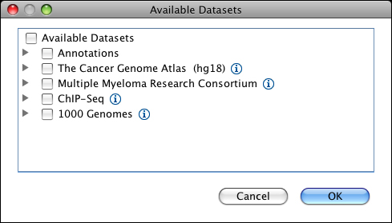

<!---
The page title should not go in the menu
-->

 Loading and removing data 

# Loading tracks

Tracks can be loaded from local files, URLs, and remote track servers. See [File Formats](../FileFormats/DataTracks.md) for information about the 
file formats IGV accepts for tracks.

To **load tracls from the local file system** or other file systems you have mounted:

1.  Select _File > Load from File_. IGV displays the Select Files window.
2.  Select one or more data files or sample information files, then click _OK_.

To **load tracks that are accessible via URL** on a local intranet or the internet:

1.  Select _File > Load from URL_.
2.  Enter the URL for a data file or sample information file; If the file is indexed, make sure to enter the index file name in the field provided; Click _OK._

!!! note "" 
    For BAM, TDF, and indexed file formats the web server must support HTTP byte-range requests.

To **load hosted tracks**:

For some genome assemblies IGV provides access to remotely hosted track files through the "Load Hosted Tracks" menu item. 

1.  Select _File > Load Hosted Tracks..r_. The Available Datasets window appears. The Available Datasets are specific to the current reference genome. Not all genomes have corresponding hosted datasets.  
    
        
2.  Expand the tree to see the datasets; Click the checkboxes to select one or more dataset; Click _OK_.
!!! tip " "
    Be aware that clicking on a folder checkbox selects all of its subfolders and all of the datasets in those folders. This can potentially be a huge amount of data. To be sure you are loading only the data you want, open collapsed folders and select only the datasets of interest.

To **load UCSC Track Hubs**:

Genome assemblies and associated tracks hosted at the [UCSC GenArk](https://hgdownload.soe.ucsc.edu/hubs/) site can be loaded directly into IGV from the 
"Load Track Hub..." menu item. Input can be either a url to the "hub.txt" file describing the hub, or a 
NCBI RefSeq or GenBank identifier.
Track Hubs always define the reference sequence, and typically include a set of annotation tracks.  For more information
on the GenArk resource see 

`Clawson, H., Lee, B.T., Raney, B.J. et al. GenArk: towards a million UCSC genome browsers. Genome Biol 24, 217 (2023).`
[https://doi.org/10.1186/s13059-023-03057-x](https://doi.org/10.1186/s13059-023-03057-x)

1.  Select _File > Load Track Hub..._.  

2. Enter a RefSeq assembly identifier (e.g. GCF_003597395.1), GenBack assembly identifier (e.g. GCF_003597395.1), or an url to a "hub.txt" file (e.g. https://hgdownload.soe.ucsc.edu/hubs/GCF/003/597/395/GCF_003597395.1/hub.txt).

# Removing tracks 

To remove **all** tracks:

*   Select _File > New Session_. This is essentially the same as restarting IGV. The reference genome tracks are not removed.

To remove **specific** tracks, do one of the following:

*   Right-click on a track (either in the data panel or the track name) and select _Remove Tracks_ in the pop-up menu.
*   Select multiple tracks and then right-click on one of the selected tracks and select _Remove Tracks_ in the pop-up menu. You can select multiple tracks either by using the normal multi-select mouse actions (e.g. CTRL-click on Windows; CMD-click on Mac) or by clicking a sample attribute value to select all tracks tagged with that attribute value.

 

 