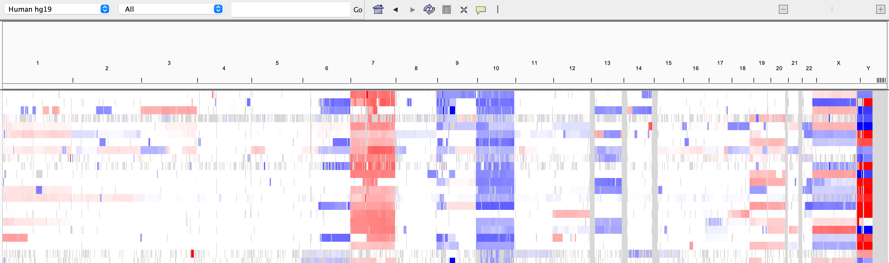
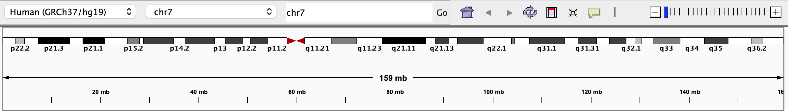
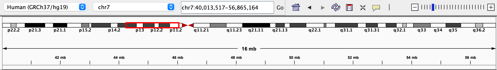
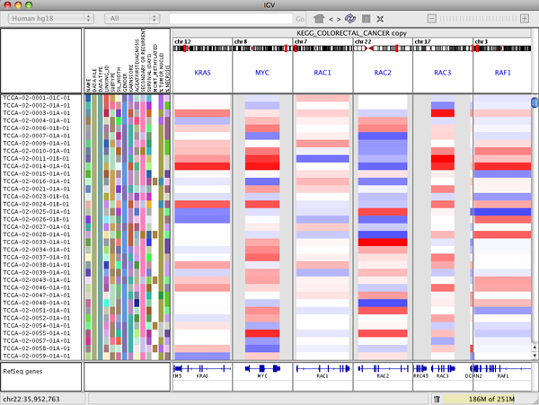
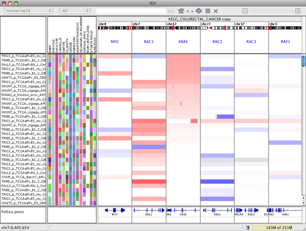
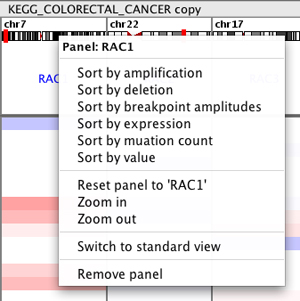
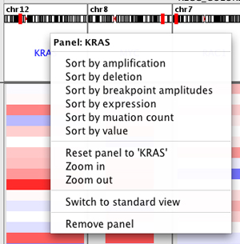
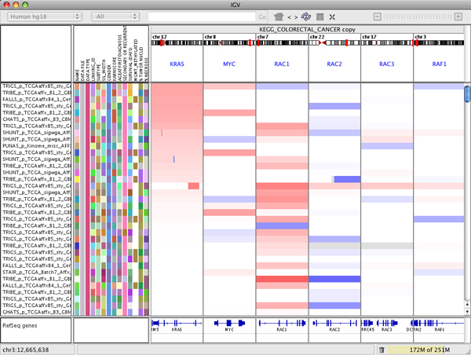

<!---
The page title should not go in the menu
-->
<p class="page-title"> Navigating the view </p>


# Navigation controls

IGV provides several navigation controls for specifying the genomic region to view, which can be the whole genome where all the chromosomes are laid out side by side, a single whole chromosome, or any section of a chromosome all the way down to base-pair resolution. IGV also supports viewing multiple regions side by side, as described in the [section below](#view-multiple-regions).

To view the **whole genome**

- Click on the _home_ icon in the toolbar (it looks like a house); or

- Select _**All**_ from the chromosome dropdown menu; or

- Type _All_ into the locus search box, which is next to the chromosome dropdown menu

The screenshot below shows a whole genome view with segmented copy number data. In the area below the tool bar, the tick marks indicate the chromomosome boundaries, and each chromosome is labeled.



To view a **whole chromosome**:

- Click on one of the chromosome labels in the whole-genome view; or

- Select the chromosome from the chromosome pulldown menu; or

- Type the chromosome name into the locus search box

When viewing all or part of a single chromosome, an ideogram of the chromosome and a ruler indicating the extent of the current region are displayed below the toolbar, and the size of the region and its genomic coordinates are displayed in the toolbar. 




To **zoom** in and out **within a chromosome**:

| Zoom in  | Zoom out |
|----------|----------|
| Double-click or shift-click on a track; the new view will be centered on the clicked locus | Alt-click on a track; the new view will be centered on the clicked locus |
| Click the plus (+) icon on the zoom slider | Click the minus (-) icon on the zoom slider |
| Click a zoom level on the zoom slider in the toolbar| Click a zoom level on the zoom slider in the toolbar |
| Click and drag on the genome ruler to sweep out an area to which to zoom |

When zoomed into a subregion of a chromosome, a red box on the ideogram indicates where the region is located on the chromosome.



To **pan** across to neighboring regions **within a chromosome**:


- Click and drag in any data track data; or

- Press the left and right arrow keys; or

- Press the Home and End keys to pan by a whole screen width

<br>
To **jump** to another region **within a chromosome** without changing the zoom level:

- Click in the ideogram to center the view on the clicked locus; or

- Click in the ruler to center the view on the clicked locus

<br>
To view a **specific region anywhere in the genome**, use the search box in the IGV toolbar to enter one of the following:

*   A locus in ***genome coordinates*** (for example ```chr5:90,339,000-90,349,000```).

*   A ***gene symbol*** or other feature identifier in the **reference genome** annotation track (for example ```DPYD``` or ```NM_10000000```). An auto-complete menu will show the possible matches when a partial string is entered. The view will be centered on the found feature, with optional padding on either side, which can be adjusted via ***View > Preferences > General***. _This search is only available for the most commonly used IGV-hosted reference genomes._

*   A ***genome symbol*** or other identifier in a _**non-indexed**_ **feature track** (e.g., BED, GFF, etc) that has been loaded into IGV. The view will be centered on the found feature, with optional padding on either side, which can be adjusted via ***View > Preferences > General***. _This is not supported for indexed files because IGV does not keep the whole file in memory, and therefore cannot search through it for the identifier._
      

*   A ***mutation*** in a feature. IGV accepts two mutation formats:
    *   Amino acid mutation. For example ```KRAS:G12C``` would look for a mutation in KRAS on the 12th amino acid, from Glycine to Cystine. ```*``` is a stop codon.

    *   Nucleotide mutation. For example ```KRAS:123A>T``` would look for a mutation in KRAS from adenine to thymine at the 123rd base.

<br>
To **navigate between features** in a feature track (e.g., gene track, BED, or GFF):

*   First select the track by clicking on the track name. Then jump from feature to feature:

    *   Press ```Ctrl+f``` or just ```f``` to jump forward to the next feature.

    *   Press ```Ctrl+b``` or just ```b``` to jump backward to the previous feature.

    By default, IGV positions the start of the next (or previous) feature at the center of the display and keeps the zoom level the same. Settings in _**View > Preferences > General**_ can be changed to instead center the view on the feature and zoom in/out to a level that exactly fits the feature plus some optional padding on either side.

!!! tip "Tip"
    To easily navigate between loci of particular interest to you, create a *non*-indexed BED file of those loci and provide meaningful names to each one. Once you've loaded that file, you can enter the names into the search box or jump to the next/previous locus using the `f` and `b` keys. 

# View multiple regions

By default, IGV displays one contiguous genomic region, but multiple regions can also be displayed side-by-side in split panels. All the panels in this multi-locus view display the same set of tracks. 

### Managing the panels

To **enter multi-locus view**:

*   Use the search box in the toolbar to enter multiple loci separated by spaces. You can enter genomic coordinates, feature names, or a combination of both; or

*   Select and view multiple _regions of interest_ in the [Region Navigator](../regions/#regions-of-interest); or

*   Right-click on a paired alignment of a BAM track and select _**View mate in split screen**_ from the popup menu; or

*   Select and view a named [Gene List.](../regions/#gene-lists)


!!! note " "
    There is no set limit on the number of loci, but if the IGV window is split into too many panels, each one will be too small to be useful. 

The following screenshot shows a multi-locus view of segmented copy number data. The IGV data panel has been split into 6 separate vertical panels displaying the regions containing the genes KRAS, MYC, RAC1, RAC2, RAC3, and RAF1. 



To **rearrange the panels** use drag and drop:  

* Click on the white panel header and drag it to its new position.  For example, in the figure below KRAS has been dropped between RAC1 and RAC2.



To **remove a panel**: 

* Right-click on the white panel header and select _**Remove panel**_ from the popup menu.



To **exit multi-locus view**:

* To change to a standard view of the region defined by any of the panels:

    * Click the locus in the header at the top of the panel; or 

    * Right-click in a header and select _**Switch to standard view**_.

* To change to a standard view of any other region:

    * Enter a single region in the search box in the toolbar.


### Controling the view in a panel

To **zoom** the view:

* To zoom **in**, double-click or shift-click on any data track in a panel. The new view will be centered on the clicked locus.

* To zoom **out**, alt-click on any data track in a panel. The new view will be centered on the clicked locus.

    !!! note " "
        The zoom slider in the toolbar is disabled in multi-locus view. 

To **pan** the view:

- Click and drag in any data track data in a panel; or

- Select a panel by clicking on any data track within the panel, then press the left and right arrow keys. Once a panel is selected you can press the keys multiple times; or

- Select a panel by clicking on any data track within the panel, then press the Home and End keys to pan by a whole screen width. Once a panel is selected you can press the keys multiple times. 

!!! note " "
    Even if you change the view within a panel, the locus label in the panel header is still the locus specified when you entered multi-locus view. Resetting the IGV window to the standard view from a panel will set the view to the locus in the panel header, not the current view in the panel after panning and zooming.

### Sorting tracks by panel

Right-click in the panel header to bring up the sort menu. This menu will vary depending on data type.



The following image illustrates what happens if you select _Sort by amplification_ in the KRAS panel. All the tracks are sorted by the value in the KRAS panel. Note that each panel displays the same tracks, so the display will change in all the panels.


