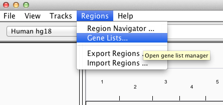

<!---
The page title should not go in the menu
-->

 Navigating the view 

# Zoom in and out

A number of different controls are provided to zoom the view to larger or smaller regions of the genome, from a whole-genome view that lays out all the chromosomes side by side, to a single whole chromosome, and all the way to base-pair resolution.

|                  |               |
|-----------------|------------------|
|  | Click the "home" icon to zoom out to the whole-genome view. |
|  | From the whole-genome view, zoom to a chromosome by clicking its label. |
|  | Select a chromosome from the drop-down menu to zoom to it; or select "All" to zoom out to the whole genome view |

To zoom in and out on a chromosome:

| Zoom in  | Zoom out |
|----------|----------|
| +        |   -      |
| Double-click or shift-click the track data | Alt-click (Mac: option-click) the track data |
| Click a zoom level on the zoom slider | Click a zoom level on the zoom slider |
| Click the plus (+) icon on the zoom slider | Click the minus (-) icon on the zoom slider |
| Click and drag on the genome ruler to select an area to which to zoom |

# Scroll and pan

| Vertical scroll of data tracks |  Horizontal pan across the genome \* |
| ----------------------- | ------------|
| Scroll bar in the IGV window | Click and drag the track data |
| Click and drag the track data | Click the chromosome ideogram to scroll to that location |
| Page Up and Page Down keys | Click the ruler to center that location |
| Up and down arrow keys | Left and right arrow keys |
| | Home and End keys (scroll by screen width)|

* You cannot pan horizontally across the genome when IGV is displaying the whole genome or a whole chromosome; you must be zoomed further in.

# Search

Use the search box to find and go to a genomic locus:

*   A locus in genome coordinates (for example, chr5:90,339,000-90,349,000)
*   A gene symbol or other feature identifier (e.g., DPYD or NM\_10000000) in the default reference genome annotation track.
    *   When searching features, IGV will accept partial matches. An auto-complete menu will show the possible matches when a partial string is entered; if there are multiple matches IGV will show a dialog asking for clarification
*   A genome symbol or other identifier in a _non-indexed_ feature track loaded into IGV (e.g., BED, GFF, etc). If the file is indexed, IGV does not keep the whole file in memory, and therefore cannot search through it for the identifier.
*   A mutation in a feature. IGV accepts 2 mutation formats:
    *   Amino acid mutation notation of this form:

        KRAS:G12C

        The above would look for a mutation in KRAS on the 12th amino acid, from Glycine to Cystine.

        \* is stop codon

    *   Nucleotide mutation of this form:

        KRAS:123A>T

        The above would look for a mutation in KRAS from adenine to thymine at the 123rd base.

A track name cannot be searched for in the search box. To find specific tracks, use menu item [_Tracks_\>_Filter Tracks_.](http://www.broadinstitute.org/software/igv/SortGroupFilter#filter)

# Jump to a locus

If you have a feature track loaded (e.g., Gene track, BED, or GFF file), you can jump from one feature to the next.

1.  Click on the track name to select the track that contains the features that you want to find.
2.  Jump from feature to feature:

    *   Press Ctrl+f to jump forward to the next feature.
    *   Press Ctrl+b to jump backward to the previous feature.

    IGV positions the start of the next (or previous) feature at the center of the display.

You can also jump from one exon to the next. To exon-jump, select a feature track and press Shift+Ctrl+f to center the next exon in your view, Shift+Ctrl+b to move back one exon.

# View multiple regions

By default, IGV displays one contigous genomic region, but multiple loci can also be displayed side-by-side in split panes. There is no set limit on the number of loci, but if the IGV window is split into too many panes, each one will be too small to be useful. Enter multi-locus view by:

*   Using the search box in the toolbar to enter multiple loci separated by spaces. You can enter genomic coordinates, feature names, or a combination of both.

or

*   Selecting and viewing multiple _regions of interest_ in the [Region Navigator](http://software.broadinstitute.org/software/igv/regionsofinterest).

or

*   Right-clicking on a paired alignment of a BAM track and selecting _View mate in split screen_

or

*   Selecting a named [Gene List as described below.](#GeneLists)

To change the size of the flanking region around the gene displayed, before loading data go to _View_\>[_Preferences_](http://www.broadinstitute.org/software/igv/Preferences)\>_General_\>_Feature flanking region_ and enter the base pairs or percent to display on either side of each locus.

The following screenshot shows a multi-locus view of segmented copy number data. The IGV data panel has been split into 6 separate vertical panels displaying the regions containing the genes KRAS, MYC, RAC1, RAC2, RAC3, and RAF1. All the panels display the same set of data tracks.

Removing or Rearranging Panels

To remove a panel, right-click on the panel header and select _Remove panel_.

Panels can be rearranged by drag and drop.  Click on the white header bar at the top of the panel and drag it to its new position.  For example, in the figure below KRAS has been dropped between RAC1 and RAC2.

## Changing the view in a panel

The zoom slider in the toolbar is disabled in multi-locus view. However, you can double-click in a panel to zoom in the view in that panel (or alt-click to zoom out). Click-dragging will also pan the view in the panel.

To return to the original view of the locus specified, right-click the name header at the top of the panel you want to reset and select _Reset panel to '\[gene name or locus\]'_.

To return to the normal single-locus view, double-click the name header at the top of any of the panels, or right-click in a header and select _Switch to standard view_.

## Sorting tracks by panel

Right-click in the panel header to bring up the sort menu. This menu will vary depending on data type.

The following image illustrates what happens if you select _Sort by amplification_ in the KRAS panel.

## Gene lists

To view a gene list or define a new one, select _Regions >Gene Lists..._.

This opens a window for selecting an existing list or creating a new list.

To view an existing gene list in multi-locus view, select a name in the _List_ column of any _Group_ and click _View_. IGV informs you of items that cannot be mapped to the current reference genome and continues on to display loci with matches.

l
### My gene Lists

You can click _Import_ to upload a text file containing your own gene list. Load lists of genes or loci in [GMT](http://www.broadinstitute.org/cancer/software/genepattern/file-formats-guide#GMT), [GRP](http://www.broadinstitute.org/cancer/software/genepattern/file-formats-guide#GRP) and [BED](http://www.broadinstitute.org/software/igv/BED) format. For example, find and download GMT files from the [Molecular Signatures Database](http://www.broadinstitute.org/gsea/msigdb/index.jsp).

You can also click _New_ to create a new gene list. This opens a dialog in which you can enter a name, description, and your list of genes or regions.

*   Entries in a gene list can be a gene symbol or other feature names that correspond to annotation tracks, or a locus defined as  <chr>:<start>-<end>.
*   Alternatively, paste a BED format file contents.

New and imported lists will appear under the _My lists_ group and are saved for continued future access in the _lists_ subfolder in the _igv_ folder installed in your home directory.

# Regions of Interest

Regions of interest (ROI) are intervals defined by the user using one of the methods described below. ROIs are marked
in red below the ruler. Hovering the mouse over this red region displays lines that demarcate the ROI down the panels.
Clicking on the red highlight pops up a menu for options that include sorting by various data-specific metrics and
copying to the clipboard or BLAT searching the corresponding reference sequence (**Screenshot** 2015.05.05).

* View a session's ROIs in the _Region Navigator_ under the _Regions_ menu. The _Region Navigator_'s list is editable,
  sortable and as the name indicates, navigable.
    * Navigate to a single locus or view multiple loci in split
      panes by selecting them and clicking _View_.
    * Distinguish overlapping ROIs using the _Region Navigator_.
    * Enter a short description for each ROI viewable in the _Region Navigator_.
* Defined ROIs persist within an IGV session. 
* Import and export ROIs as [BED](http://www.broadinstitute.org/software/igv/BED) files using _Regions_\>_Import
  Regions_ and _Regions_\>_Export Regions_.

This page outlines three ways to define a region of interest--(1) by mouse, (2) by keyboard shortcut, and (3) by using
the _Region Navigator._ The fourth section describes right-click menu options.
## Define by mouse

On the tool bar, click the Define a Region of Interest icon:

In the data panel, single click the start of the region and then the end of the region. Do **NOT** click and drag. IGV
displays lines delimiting the region of interest for the first and second click, then marks the region in red under the
ruler.

This options works for single bases so long as the reference sequence resolves bases in view. The reference sequence
appears above the annotation track when zoomed in as described in
the [Sequence Track Options](http://www.broadinstitute.org/software/igv/sequence_track_options) page.

## Define by keyboard shortcut

Display the region of interest to fill the entire view and press _Control_ \+ _R_.

* The entire ruler view will be marked red.
* Does not work to select multiple regions at once in split-panes.

## Region navigator

To open the Region Navigator select _Regions>Region Navigator_ from the menu bar. The _Region Navigator_ lists defined
regions of interest (ROI) in a sortable table as shown in the **Screenshot** (2015.05.06).

The Description field is blank until filled by you. To input a description, either right-click on the ROI and select _
Edit description_ from the menu or double-click the field in the _Region Navigator_.

The following table summarizes the features available from the _Region Navigator_.

To select an ROI from the list, click on it. Select multiple ROIs from the list by holding down a keyboard key and
clicking by mouse, e.g. _Shift_ \+ _mouse-click_ for consecutive rows or \[Mac/PC\] _Command/Control_ + _mouse-click_ to
select individual rows.

 

**Region Navigator feature**

**Description**

**Define ROIs**

_Add_

Add the currently displayed region in its entirety to the list.

_Delete_

Remove the selected ROI from the list.

Double-click cells under _Start_, _End_, or _Description_

The cell will be boxed as shown in the **Screenshot** above. Edit cell content.

**Sort list**

_Show All Chrs_

Uncheck or check to limit the list to loci on the displayed chromosome or all chromosomes.

Click a column header, e.g. _Chr_

Sort table by ascending or descending alphanumeric order.

_Search_ and _Clear Search_

Type a search term on which to filter the displayed list. To remove the filter, click _Clear Search_.

**Navigate to ROIs**

_View_

Navigate the display to the selected ROI. If multiple ROIs are selected in the navigator, the loci display in split
panes.

_Zoom to Region_

Uncheck to keep the current zoom level when navigating to a new ROI. Check to ensure IGV adjusts the zoom level to
display the entire ROI when navigating to the new ROI.

Region of Interest options
--------------------------

Click the red bar under the ruler to display the region of interest (ROI) context menu for the following options.

**Menu option**

**Description**

**Sort**

Sort based on data values within the ROI. Sort options vary with data type and may not be available for regions of
interest for certain file types, e.g. alignment or VCF tracks, for which sort options are available via feature pop-up
menu.

* For copy number variation data sort by amplification, deletion, breakpoint amplitudes, and value.
* For mutation data sort by mutation count or value.
* For expression data sort by expression or value.
* For alignments
  see [alignment track pop-up menu options](http://www.broadinstitute.org/software/igv/PopupMenus#AlignmentTrack).
* For VCF data see [VCF track pop-up menu options](http://www.broadinstitute.org/software/igv/PopupMenus#VCF).

**Scatter Plot**

Available for continuous value data, e.g. gene expression, copy number, and methylation data. See
the [Scatter Plots](http://www.broadinstitute.org/software/igv/ScatterPlots) section for details.

**Zoom**

Center and zoom the display to the ROI.

**Edit description**

Input a short description for the ROI.

**Copy sequence**

Copy the reference sequence to the clipboard.

**BLAT sequence**

BLAT search the section of the reference sequence against the entire reference genome. See
the [BLAT Search](http://www.broadinstitute.org/software/igv/BLAT) page for details.

**Delete**

Removes the region of interest.