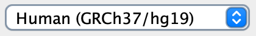
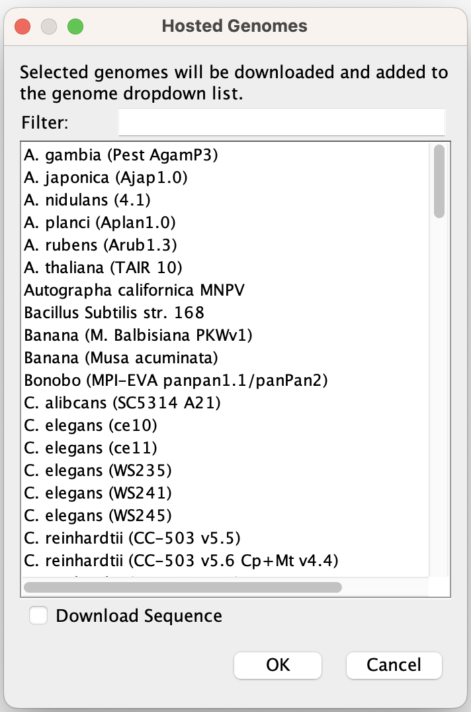

<!---
The page title should not go in the menu
-->
<p class="page-title"> Reference genome </p>

# Loading a reference genome

IGV requires a reference genome. It serves as the "coordinate system" for displaying the tracks. When you first launch
IGV, the human genome GRCh38/hg38 is loaded by default. The genome dropdown menu on the left end of the IGV window
toolbar displays the current reference genome, and contains a selection list of recently loaded genomes.

{width=300}

Options for changing loading a genome not yet on the selection list are described below
and include selecting a predefined genome from the "hosted genome" list, or loading a custom genome
`json` or sequence file. 

!!! note " "
    When you switch to a different reference genome, IGV will clear the current session.

### Select a hosted genome

IGV provides a limited selection of predefined genome definitions. The list can be accessed from the *Genomes* menu

* Select *Genomes > Select Hosted Genome*

This will pop up a window with the full list of hosted genomes. If you find your genome of interest there, select it and
click ok. Your selected genome will replace the reference genome in the main IGV window. Once you have selected a genome
from the full list, it will remain in the genome dropdown menu in the toolbar.

{width=356}

!!! tip " "
    See the *Advanced* section below for information on how to [host your own customized list of genomes](#hosting-genomes).

!!! tip " "
    IGV's hosted genomes require an internet connection. See the *Advanced* section below for information on how to [download a hosted genome for offline use of IGV](#using-igvs-hosted-genomes-offline).

### Define a custom genome

To load a reference genome that is not included in IGV's set of hosted genomes, you can load a file the specifies the
genome by clicking on *Genomes > Load Genome from File** or *Genomes > Load Genome from URL*. The following
file types are supported for defining a custom genome (1) Fasta and .2bit sequence files, (2) IGV ***genome json***
files, and (3) NBCI genbank (.gbk) files.  

#### Sequence only

A reference genome can be defined by loading a FASTA or .2bit file for the genome sequence. With this option the gene
annotations will not be loaded automatically. However, annotation files can be loaded from the **Files > Load from*
menus.

FASTA files can be plain text or block gzipped, and must be indexed with a .fai as defined by the Samtools
suite (www.htslib.org). If the file is plain text (not block gzipped) and not indexed, IGV will attempt to index it.

#### Full reference genome

To automatically load gene annotations, as well as an optional cytoband file, along with the genome sequence, you can
create and load a genome JSON file, which is described in
the [File Formats: Genomes](../FileFormats/Genomes/#igv-reference-genome-json) section.

# Removing a genome from the menu

When you have loaded a reference genome, it will remain in the genome dropdown menu unless you remove it.

To remove a genome from the dropdown menu:

* Select *Genomes>Remove Genomes*.
* Select the genomes you want to remove and click *Remove*.

!!! Note " "
    You cannot remove the genome that is currently being used in the IGV window.

# Viewing the reference genome tracks

All genomes include a reference sequence track, and optionally can define one or more annotation tracks. See
the following sections for more infomation on reference and annotation track conventions.

* [Reference sequence track](tracks/sequence.md)
* [Annotation track](tracks/annotations.md)

# Advanced

## Using IGV's hosted genomes offline

When an IGV hosted genome is loaded as the reference genome, the application downloads a file that specifies the details
of where to find the dependent files that contain the sequence, gene annotations, etc. However, the dependent files
themselves are not downloaded to the user's computer, rather they are accessed on demand as the user nagivates to
different regions of the genome. Therefore, an internet connection is required throughout the user session. This section
describes how to download a hosted genome and configure it for use in IGV without an internet connection.

Some of the most frequently used genomes have been **packaged for easy download**.

1. Check our [public Google drive](https://drive.google.com/drive/folders/16EEDgjwVZ6hPA0sLzatQ_s301HRS6M-F?usp=sharing)
   to see if your genome of interest is there.

2. Download the zip file corresponding to your genome of interest. Each package contains a .json genome specification
   file and a folder containing all the necessary dependent files.

4. Load the genome into IGV by clicking on *Genomes > Load Genome from File* and selecting your local version of the
   .json file. If you previously loaded the same genome into IGV using the regular hosted options, you may need to
   delete its .json file to prevent conflicts with the local version. The hosted-based files can be found in the
   folder ```<userhome>/igv/genomes```.

If your genome of interest is not available as a package, you will need to replace step 2 above with a series of steps
to download **individual components** and prepare them for offline use:

1. Locate the .json genome specification file for your hosted genome of interest. Not all IGV genomes have a
   corresponding .json file that can be downloaded for local use. As of March 29, 2022, the following files are
   available. For the most up to date list, see all the entries that contain a .json file in
   the [master hosted genome list](https://igv.org/genomes/genomes.tsv).

| Genome                             | JSON configuration file                                               |
|------------------------------------|-----------------------------------------------------------------------|
| A. thaliana (TAIR 10)              | https://s3.amazonaws.com/igv.org.genomes/tair10/tair10.json           |
| C. elegans (ce11)                  | https://s3.amazonaws.com/igv.org.genomes/ce11/ce11.json               |
| Chicken (GRCg6a / galGal6)         | https://s3.amazonaws.com/igv.org.genomes/galGal6/galGal6.json         |
| Chimp (panTro4)                    | https://s3.amazonaws.com/igv.org.genomes/panTro4/panTro4.json         |
| Cow (bosTau8)                      | https://s3.amazonaws.com/igv.org.genomes/bosTau8/bosTau8.json         |
| Cow (bosTau9)                      | https://s3.amazonaws.com/igv.org.genomes/bosTau9/bosTau9.json         |
| D. melanogaster (dm6)              | https://s3.amazonaws.com/igv.org.genomes/dm6/dm6.json                 |
| D. melanogaster (dm3)              | https://s3.amazonaws.com/igv.org.genomes/dm3/dm3.json                 |
| D. melanogaster (r5.9)             | https://s3.amazonaws.com/igv.org.genomes/dmel_r5.9/dmel_r5.9.json     |
| Dog (canFam3)                      | https://s3.amazonaws.com/igv.org.genomes/canFam3/canFam3.json         |
| Dog (canFam5)                      | https://s3.amazonaws.com/igv.org.genomes/canFam5/canFam5.json         |
| Human hg18                         | https://s3.amazonaws.com/igv.org.genomes/hg18/hg18.json               |
| Human (GRCh37/hg19)                | https://s3.amazonaws.com/igv.org.genomes/hg19/hg19.json               |
| Human (GRCh38/hg38)                | https://s3.amazonaws.com/igv.org.genomes/hg38/hg38.json               |
| Human hg38 (1kg/GATK)              | https://s3.amazonaws.com/igv.org.genomes/hg38_1kg/hg38_1kg.json       |
| Macaca fascicularis (macFas5)      | https://s3.amazonaws.com/igv.org.genomes/macFas5/macFas5.json         |
| Mouse mm10                         | https://s3.amazonaws.com/igv.org.genomes/mm10/mm10.json               |
| Mouse mm9                          | https://s3.amazonaws.com/igv.org.genomes/mm9/mm9.json                 |
| Rat (rn6)                          | https://s3.amazonaws.com/igv.org.genomes/rn6/rn6.json                 |
| S. cerevisiae (sacCer3)            | https://s3.amazonaws.com/igv.org.genomes/sacCer3/sacCer3.json         |
| Zebrafish (GRCz10/danRer10)        | https://s3.amazonaws.com/igv.org.genomes/danRer10/danRer10.json       |
| Zebrafish (GRCz11/danRer11)        | https://s3.amazonaws.com/igv.org.genomes/danRer11/danRer11.json       |
| SARS-CoV-2                         | https://s3.amazonaws.com/igv.org.genomes/ASM985889v3/ASM985889v3.json |
| S. pombe (ASM294v2)                | https://s3.amazonaws.com/igv.org.genomes/ASM294v2/ASM294v2.json       |
| Gorilla (gorGor4)                  | https://s3.amazonaws.com/igv.org.genomes/gorGor4/gorGor4.json         |
| Gorilla (gorGor6)                  | https://s3.amazonaws.com/igv.org.genomes/gorGor6/gorGor6.json         |
| Bonobo (MPI-EVA panpan1.1/panPan2) | https://s3.amazonaws.com/igv.org.genomes/panPan2/panPan2.json         |

2. Download and view the .json genome specification file.

   For example: ```curl -O https://s3.amazonaws.com/igv.org.genomes/ce11/ce11.json```

```
{
  "id": "ce11",
  "name": "C. elegans (ce11)",
  "fastaURL": "https://s3.amazonaws.com/igv.broadinstitute.org/genomes/seq/ce11/ce11.fa",
  "indexURL": "https://s3.amazonaws.com/igv.broadinstitute.org/genomes/seq/ce11/ce11.fa.fai",
  "cytobandURL": "https://s3.amazonaws.com/igv.org.genomes/ce11/cytoBandIdeo.txt.gz",
  "tracks": [
    {
      "name": "Refseq Genes",
      "format": "refgene",
      "url": "https://s3.amazonaws.com/igv.org.genomes/ce11/refGene.sorted.txt.gz",
      "indexURL": "https://s3.amazonaws.com/igv.org.genomes/ce11/refGene.sorted.txt.gz.tbi",
      "indexed": false,
      "order": 1000000,
      "removable": false,
      "visibilityWindow": -1
    },
    {
      "name": "Genes",
      "format": "bed",
      "url": "https://s3.amazonaws.com/igv.org.genomes/locations/geneLocations_ce11.bed.gz",
      "hidden" : true,
      "searchable": true
    }
  ]
}
```

3. Download the files referenced in the genome specification.

   In the above ce11 example, the files are:

    https://s3.amazonaws.com/igv.broadinstitute.org/genomes/seq/ce11/ce11.fa
    https://s3.amazonaws.com/igv.broadinstitute.org/genomes/seq/ce11/ce11.fa.fai
    https://s3.amazonaws.com/igv.org.genomes/ce11/cytoBandIdeo.txt.gz
    https://s3.amazonaws.com/igv.org.genomes/ce11/refGene.sorted.txt.gz
    https://s3.amazonaws.com/igv.org.genomes/ce11/refGene.sorted.txt.gz.tbi
    https://s3.amazonaws.com/igv.org.genomes/locations/geneLocations_ce11.bed.gz

!!! Danger "Important:"  
    Some genome JSON files contain multiple formats for genome sequence to support multiple versions of IGV. It is not neccessary to download all versions of the sequence data.  In particular, if the JSON defines the property `twoBitURL` it is not neccessary to download the referenced `fastaURL` or `indexURL`.  In that case the fasta and index properties should be removed from your local JSON file.

4. Edit your local copy of the genome specification file

   Your local copy of the .json file should reference the downloaded files. Reference can be by URL to a file on your
   local network, or by file path, which can be relative to the location of the .json file. For example if the
   downloaded data files are in the same directory as the .json file, your local ```ce11.json``` file will look like
   this:

```
{
  "id": "ce11",
  "name": "C. elegans (ce11)",
  "fastaURL": "ce11.fa",
  "indexURL": "ce11.fa.fai",
  "cytobandURL": "cytoBandIdeo.txt.gz",
  "tracks": [
    {
      "name": "Refseq Genes",
      "format": "refgene",
      "url": "refGene.sorted.txt.gz",
      "indexURL": "refGene.sorted.txt.gz.tbi",
      "indexed": false,
      "order": 1000000,
      "removable": false,
      "visibilityWindow": -1
    },
    {
      "name": "Genes",
      "format": "bed",
      "url": "geneLocations_ce11.bed.gz",
      "hidden" : true,
      "searchable": true
    }
  ]
}
```

## Hosting genomes

The list of hosted reference genomes in the IGV menus is defined by the file specified in the *Genome server URL* field
of the *Advanced* tab of the *View > Preferences* window. By default, the *Genome server URL* is set to a file hosted
at https://igv.org. You may wish to **replace it with your own customized list of genomes** for a variety of reasons.
For example, to limit the list to only those genomes that are of interest to you and your colleagues or to add a genome
that is not included with the default hosted genomes.

To host your own customized list of reference genomes:

1. Create a text file listing all the genomes you wish to include in the hosted genomes menu. The file format is
   described below.

2. Upload the file to your web server.

3. Start IGV. Select *View > Preferences > Advanced* and set the *Genome server URL* to the URL to your genomes file on
   your server.

4. Shut down IGV. Upon restart your hosted genome list will be used in place of the default list.

The **file format for the reference genome list** defines one genome per line with three tab-delimited columns:

* The genome **name**, which will appear in the menu.

* A **URL** to a .json or .genome file that specifies the details of the genome. This can point to a file from IGV's
  default list or your own custom genome file that you have uploaded to a web server.

  The .json format for reference genomes is [described here](../../../FileFormats/Genomes/#igv-reference-genome-json).
  Use this format to define any custom genomes you wish to add the list. The .genome format is an older format and is
  supported only for backwards compatibility with existing .genome files.

* The genome **ID**. The ID is arbitrary, but for genomes from UCSC use their ID. This is important for the BLAT tool,
  which uses the UCSC BLAT server.

!!! tip " "
    To use IGV's default genome list file as a starting point for your new file, you can download it from [https://igv.org/genomes/genomes.tsv](https://igv.org/genomes/genomes.tsv).
