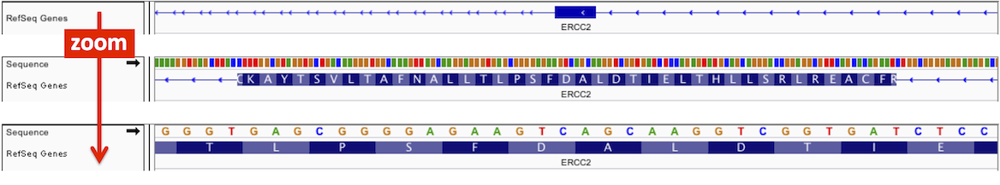

<!---
The page title should not go in the menu
-->
<p class="page-title"> Reference genome </p>

IGV requires a reference genome. It serves as the "coordinate system" for displaying the tracks. 

# Loading a reference genome

When you first launch IGV, the human genome GRCh39/hg19 is loaded by default. The genome dropdown menu on the left end of the IGV window toolbar displays the current reference genome.

{width=262}

You can switch genomes by loading one of IGV's hosted reference genomes or by loading your own genome files. 

!!! note " "
    When you switch to a different reference genome, IGV will clear the current session. 

### Hosted genomes

First check to see if the genome you want is in the dropdown menu in the toolbar. If you find it there, just select it from the list.

If the genome you want is not on the dropdown list: 

* Click the ***More...*** entry at the end of the list; or 
* Select ***Genomes > Select Hosted Genome***

This will pop up a window with the full list of hosted genomes. If you find your genome of interest there, select it and click ok. Your selected genome will replace the reference genome in the main IGV window. Once you have selected a genome from the full list, it will remain in the genome dropdown menu in the toolbar.

{width=356}

!!! tip " "
    See the *Advanced* section of this User Guide for information on how to [host your own customized list of genomes](../advanced/reference_genomes_adv/#customizing-hosted-genomes). 
    
!!! tip " "
    IGV's hosted genomes require an internet connection. See the *Advanced* section of this User Guide for information on how to [download a hosted genome for offline use of IGV](../advanced/reference_genomes_adv/#using-hosted-genomes-offline). 
    
### Other genomes

To load a reference genome that is not included in IGV's set of hosted genomes, you can load a file the specifies the genome by clicking on ***Genomes > Load Genome from File*** or ***Genomes > Load Genome from URL***.

When you load a reference genome via the *Genomes* menu, it will be added to the genome dropdown menu and from then on you can select it from there. 

#### Sequence only

If you load the FASTA file for the sequence of your reference genome of interest, the gene annotations will not be loaded automatically. If you have the gene annotation file, it can be loaded like any other data file via the ***Files > Load from*** menus. 

FASTA files can be plain text or block gzipped, and must be indexed with a .fai as defined by the Samtools suite (www.htslib.org). If the file is plain text (not block gzipped) and not indexed, IGV will attempt to index it.   

#### Full reference genome

To automatically load gene annotations, as well as an optional cytoband file, along with the genome sequence, you can create and load a genome JSON file, which is described in the [File Formats: Genomes](../FileFormats/Genomes/#igv-reference-genome-json) section. 

# Removing a genome from the menu
When you have loaded a reference genome, it will remain in the genome dropdown menu unless you remove it. IGV uses the folder ```<userhome>/igv/genomes``` to store information about the genomes in the menu.

To remove a genome from the dropdown menu:

* Select ***Genomes>Remove Genomes***.
* Select the genomes you want to remove and click ***Remove***. 

!!! tip " "
    You cannot remove the genome that is currently being used in the IGV window.
    
    
# Creating a chromosome name alias file

One of the common causes for a data loading failure is a mismatch in chromosome names between the data file and the reference genome it is being viewed against.  

One workaround is to create a tab delimited "alias" file to specify alternate names for a chromosome. For instance, the first 2 lines of an alias file might look like this:

```
chr1 <tab> 1 <tab> CM000663.2 <tab> NC_000001.11
chr2 <tab> 2 <tab> CM000664.2 <tab> NC_000002.12
```

Name the file with the pattern `<genome iD>_alias.tab`,  for example, **hg38_alias.tab**.  Place this file in the IGV **genomes** directory. The default location is `<user home>/igv/genomes`, but it can be changed in *View > Preferences > Advanced.*

!!! tip " "
    Certain well-known aliases are built into IGV and do not require an alias file.  These include mappings that involve adding or removing the prefix `chr` to the name, for example IGV treats chromosomes named **1** and **chr1** as the same chromosome. Also, NCBI identifiers that start with `gi|` are automatically mapped.

# Viewing the reference genome tracks

## Gene annotation track
The IGV hosted genomes include a default gene annotation track. It is displayed the same way as any other [feature/annotation track](tracks/annotations.md) that is loaded into IGV.

## Sequence track

When zoomed in sufficiently, the reference genome _**Sequence**_ track appears at the top of the lower panel above the corresponding _Genes_ track, if any, in the IGV display. The sequence is represented by
colored bars or colored letters, depending on zoom level, with adenine (A) in green, cytosine (C) in blue, guanine (G) in yellow, and thymine (T) in red. 
<!---
TBD describe how to change the default colors
-->

IGV displays the sequence of bases as they appear in the FASTA file for the reference genome. In addition to the upper
case letters A, C, G, and T, you may see lower case letters for these bases, and also N/n. Lower case letters often
mark repeated regions, and N/n may represent ambiguous nucleotides. However, the convention for the use of case and N, is
not completely standardized, and depends on the creator of the genome sequence.



### Flipping the strand

You can change the strand that is displayed by clicking on the arrow in the title to the left of the track. Note that
the sequence and the arrow are only displayed when zoomed in to a sufficiently small region.

* Alternatively, right-click on _**Sequence**_ track to select _**Flip strand**_ from the pop-up menu.


The direction of the arrow indicates which strand is currently displayed. An arrow pointing left indicates that the
negative strand is showing. This strand will show the complement nucleotides and reverse complement translations.

### Sequence translation

With the reference genome sequence track, you can optionally display a 3-band track that shows a 3-frame translation of
the amino acid sequence for the corresponding nucleotide sequence. The translation is shown for the strand indicated.

* Right-click on _**Sequence**_ track to select _**Show translation**_ from the pop-up menu and to select a _**Translation Table**_.


Amino acids are displayed as blocks colored in alternating shades of gray. Methionines are colored green, and all stop
codons are colored red. When you zoom all the way in, the amino acid symbols will appear.

You can toggle the display of this translation track by clicking once, anywhere in the sequence or translation track, or
by toggling _**Show Translation**_ in the track popup menu.
