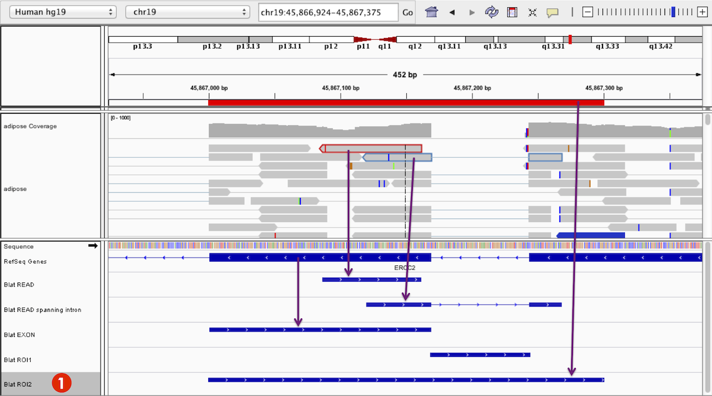
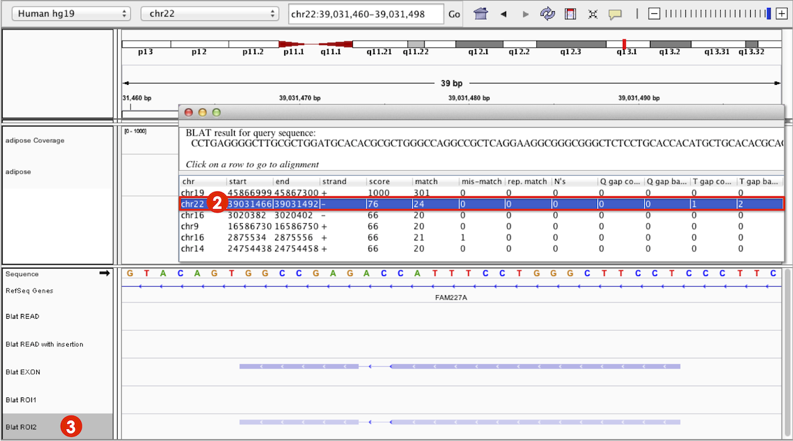

# How to run BLAT

IGV supports  [BLAT](http://en.wikipedia.org/wiki/BLAT_%28bioinformatics%29) (BLAST-like Alignment Tool) for on-the-fly 
alignment of query sequences up to 8 kb in length.  Query sequencs can be user defined, a read sequence from an alignment, 
or taken from a region of the target (reference) genome defined by a  _feature_  or _region of interest_.

* **User-specified sequence:** Select _BLAT_ from the _Tools_ menu in the main menubar, and enter the sequence.
* **Features:** Right-click on the feature in the track and select _Blat sequence_ from the pop-up menu. The BLAT input
  sequence is the section of the reference genome defined by the feature start and end bounds.
* **Alignments:** Right-click on the aligned read and select _Blat read sequence_ from the pop-up menu. Note that in
  this case, the BLAT input sequence is the read sequence. It is _not_ the sequence of the reference genome where the
  read was aligned.  Options to BLAT soft clips are presented if soft clips are present of sufficient length.
* **Regions of Interest (ROI):**
  After [creating a region of interest](../roi.md), click on the
  region's red bar and select _Blat sequence_ from the pop-up menu. The BLAT input sequence is the sequence of the
  reference genome defined by the region bounds.

The default search engine is the BLAT server hosted at 
the [UCSC Genome Browser](https://genome.ucsc.edu/cgi-bin/hgBlat). UCSC's BLAT search supports most UCSC
derived genomes including human and mouse genomes.  See below fo instructions on specifying a custom BLAT server,
or configurint a command-line BLAT tool.

# BLAT results

## Feature track

Each query sequence appears as a new _Blat_ feature track in the lower panel of IGV's display. The **Screenshot** (
2015.04.01) shows five different _Blat_ feature tracks for the following sequences:

1. Red highlighted read
2. Blue highlighted RNA-Seq read spanning an intron
3. An exon feature
4. An ROI covering an intronic region
5. An ROI spanning a region covering examples a–d.

Manipulate this track just like other feature tracks as outlined in
the [Feature Tracks section of the Pop-up Menus](http://www.broadinstitute.org/software/igv/PopupMenus#FeatureTrack)
page.

* Each search item adds a new _Blat_ feature track.
* _Blat_ features display aligned regions as rectangles and gaps in alignments with lines.
* The _Blat_ features change opacity depending on alignment score from dark blue to light blue.
* The _Blat_ feature marks directionality relative to the original search sequence as displayed by IGV, from left to
  right, with arrowheads.
* _Expanded_ or _Collapsed_ views of the _Blat_ feature track labels the search feature _YourSeq_. You cannot alter this
  label but can rename the feature track.



## Results panel

Results are presented in a new window that displays the query sequence, location of hits, match score, and other metrics
as shown in the **Screenshot** (2015.04.01). Hits are listed in descending order of alignment score.


For the example hit highlighted in the **Screenshot** above, the original search sequence is returned as the top hit.
The read used in the search was an aligned RNA-Seq read spanning an intron (**example b**), which the BLAT results show
is a singly gapped alignment as indicated by the _1_ under the column _T gap count_.

* Each BLAT search gives a separate results panel.
* Once a results window is closed, you cannot reopen it.
* Click on a row in the results panel to navigate to the selected result locus. IGV centers the _Blat_ feature on the
  display.

For example, for ROI2 (**marked 1** above), clicking on the second hit in the results panel (**marked 2** in **
Screenshot** below) navigates the view away from chromosome 19 to the hit locus on chromosome 22 (**marked 3**). This
same region contains a hit for **example c**, a BLAT search done with an exon feature. Because the exon feature has a
higher alignment score than ROI2, its _Blat_ feature is shaded darker.




# Customizing BLAT

By default, a public service hosted at UCSC is used, and BLAT support is limited to IGV reference genomes that are 
derived from UCSC's hosted set.  This can be customized in IGV's advanced preferences to use another BLAT service, 
or a locally executable command line program that returns BLAT-like results.

To change the default BLAT service,  open the advanced preferences in IGV by selecting 
_View > Preferences > Advanced_, and edit the "Blat url".  The value is a string template with placeholders for the 
search sequence and genome ID:  ```$SEQUENCE``` and ```$DB```.  These values are substituted at runtime.  The default 
value is

```
https://genome.ucsc.edu/cgi-bin/hgBlat?userSeq=$SEQUENCE&type=DNA&db=$DB&output=json
```

Output from the web service or command line program should be JSON containing a "blat" property at the top level, 
followed by an array of PSL records representing the alignments.   Each PSL record is represented as a JSON array.   
An example is given below. Details of the PSL format is available at [UCSC](http://genome.ucsc.edu/FAQ/FAQformat#format2).   
If configuring a local command line program, the output should be written to STDOUT.


```json
{
    "blat" : [
        [33,1,0,0,0,0,0,0,"+","YourSeq",40,0,34,"chr1",249250621,155161117,155161151,1, 34,0,155161117],
        [33,1,0,0,0,0,0,0,"+","YourSeq",40,0,34,"chr1",249250621,155161255,155161289,1, 34,0,155161255],
        [33,1,0,0,0,0,0,0,"+","YourSeq",40,0,34,"chr1",249250621,155161315,155161349,1, 34,0,155161315],
        [33,1,0,0,0,0,0,0,"+","YourSeq",40,0,34,"chr1",249250621,155161435,155161469,1, 34,0,155161435],
        [33,1,0,0,0,0,0,0,"+","YourSeq",40,0,34,"chr1",249250621,155161495,155161529,1, 34,0,155161495]
    ]
}

```

An example of configuring a command line BLAT shell script, written for Linux and Mac systems, is given below.  This 
script takes the search sequence and database ID as arguments, and simply calls the UCSC service referenced above and 
diverts the output to STDOUT.

The script, testBlat.sh:

```bash
#!/bin/bash
wget -q -O - --no-check-certificate "https://genome.ucsc.edu/cgi-bin/hgBlat?userSeq=$1&type=DNA&db=$2&output=json"
```

To use the script, set the "Blat url" IGV preference to:

```
testBlat.sh $SEQUENCE $DB
```


