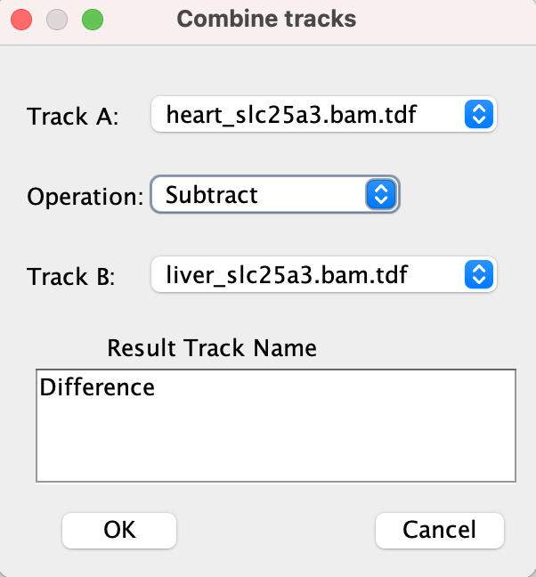
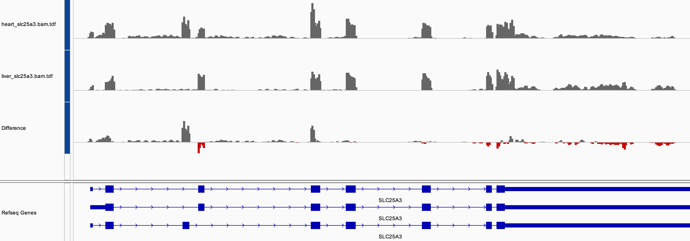

<!---
The page title should not go in the menu
-->

 Combining tracks 

# How to combine tracks

The data from two quantative data tracks can be combined into one track using arithmetic operations on the data values.

1. Select two tracks by using the normal multi-select mouse actions (e.g. `Ctrl-click` on Windows; `Cmd-click` on MacOS).
 
2. Select *Tools > Combine Data Tracks...*. 

3. In the dialog window that pops up:

    * Select an operation from the dropdown menu. The options are `Add`, `Subtract`, `Multiply`, and `Divide`.

    * Enter a name for the new track that will contain the results.

The original tracks and the new result track will be displayed.

# Example

We start by loading two .tdf files with the coverage data from RNA sequencing of heart and liver tissue. The files were generated by running the **Count** command in **igvtools** on the RNA-seq .bam files.

To see the difference in coverages, the `Subtract` operator was selected in the `Combine Data Tracks` dialog.

{width=260}

To highlight the negative differences, the negative color on the result track has been set to red by selecting *Change Track Color (Negative Values or Strand)...* in the tracks pop-up menu.

!!! tip " "
    It's best if all three tracks, the two input tracks and the result track, are set to the same data range. To dynamically autoscale them as a group, select all three tracks and then right-click on one and select *Group Autoscale*.