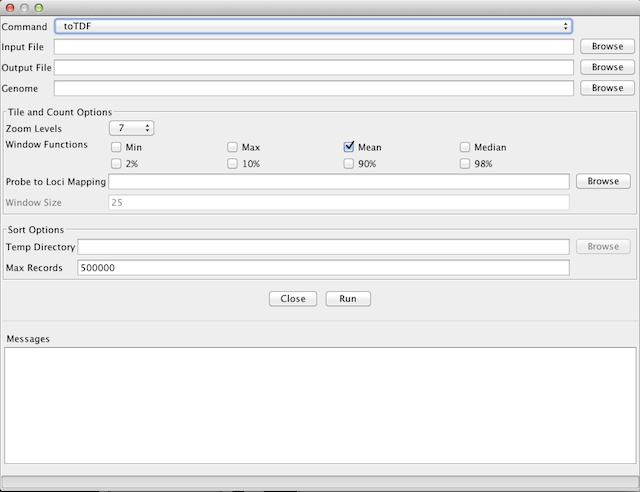
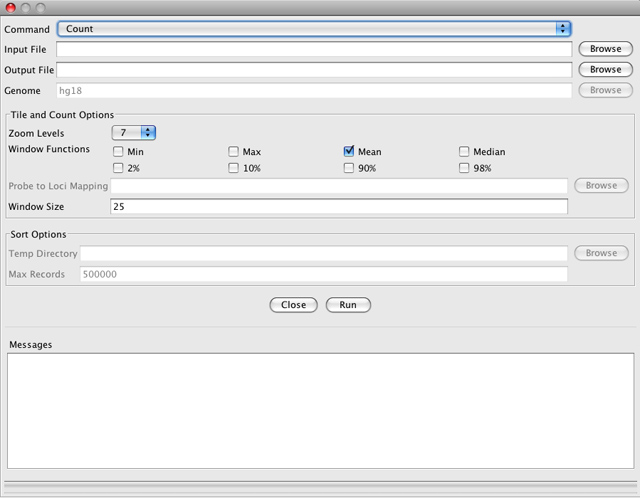
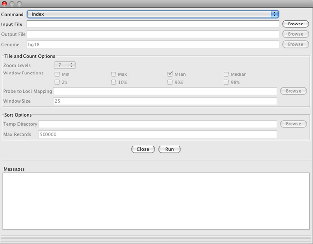
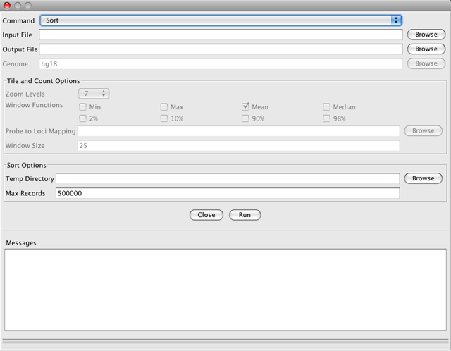

<!---
The page title should not go in the menu
-->

 igvtools 

igvtools provides a number of utilities to preprocess data files.

## How to run a tool

Select _**Tools > Run igvtools**_ to open the igvtools window. This window allows you to select and run the tools: [***toTDF***](#totdf), [***Count***](#count), [***Sort***](#sort), and [***Index***](#index).

1. Select the tool that you want from the _Command_ drop-down list. 
2. Specify the necessary files and/or genome.
3. Select any of the alternative options you want.
4. Click _Run_.

Information about the run will appear in the _Messages_ box at the bottom of the window. 

!!! danger " " 
    If you exit the IGV application, any tool that is in progress will be terminated.

!!! note " "
    You can also run the igvtools utilities from the command line, as described [here](../../advanced/command_line).

## toTDF

The _toTDF_ tool converts a sorted data input file to a binary tiled data (.tdf) file. Use this tool to pre-process
large datasets for improved IGV performance. This tool was previously known as _Tile_. 

* **Input File**

    * Click the _Browse_ button to select the input file

    * Supported formats are .wig, .cn, .snp, .igv, and .gct

* **Output File**

    * Must end in .tdf

    * By default, the field will be populated with the same name as the Input File, appended by ".tdf".  

* **Genome**

    * The current reference genome. To change to a different genome, close the igvtools window and set a new reference genome in the main IGV window.

* **Optional settings**

     * **Zoom Levels**. Specifies the maximum zoom level to precompute. The default is 7; this is sufficient for most files. This value can be reduced to reduce file size, though it will impair IGV performance.

    * **Window Functions**. Select the window functions to use when reducing data to precomputed tiles.  _Mean_ is the default, but you can also select _Min_, _Max_, or _Median_, as well as percentiles of the data.

    * **Probe to Loci Mapping**. Specifies a .bed file to be used to map probe identifiers to locations. This is useful when preprocessing .gct files. The .bed file should contain 4 columns: chr start end name (where name is the probe name in the .gct file).

## Count

_Count_ computes average feature density over a specified window size across the genome. Common usages include computing
coverage for alignment files and counting hits in Chip-seq experiments. By default, the resulting file will be displayed
as a bar chart when loaded into IGV. 

* **Input File**

    * Click the _Browse_ button to select the input file

    * The file must be sorted by start position (see the Sort tool)

    * Supported formats are .sam, .bam, .aligned, .psl, .pslx, and .bed

* **Output File**

    * Must end in .tdf or .wig

    * By default, the field will be populated with the same name as the Input File, appended by ".tdf". Change to .wig to change the output file type.

* **Genome**

    * The current reference genome. To change to a different genome, close the igvtools window and set a new reference genome in the main IGV window.

* **Optional settings**
 
    * **Zoom Levels**. Specifies the maximum zoom level to precompute. The default is 7; this is sufficient for most files.
  This value can be reduced to reduce file size, though it will impair IGV performance.

    * **Window Functions**. Allows user to select the window functions to use when reducing data to precomputed tiles.  _Mean_
  is the default, but you can also select _Min_, _Max_, or _Median_, as well as percentiles of the data.

    * **Window Size**. Specifies the window size over which coverage is averaged, in base pairs; default is 25 bp

## Index

This command creates an index for an alignment file or a feature file. Index files are required for loading alignment
files into IGV, and can significantly improve performance for large feature files. 
This command does not take an output file argument. Instead, the filename is generated by appending ".sai" (for
alignments) or ".idx" (for features) to the input filename as IGV relies on this naming convention to find the index .
The input file must be sorted by start position (see the _Sort_ tool, below).

Note that you do not directly load
the index file into IGV. Rather, IGV looks for a corresponding index file when the alignment or feature file is loaded.

* **Input File**

    * Click the _Browse_ button to select the input file

    * The file must be sorted by start position (see the Sort tool)

    * Supported formats are .sam, .bam, .aligned, .vcf, .psl, and .bed.

* **Output File**

    * The output file name cannot be set. It will generated in the same folder as the input file, and with the same name as the input file, appended by ".sai" (for alignments) or ".idx" (for features).

* **Genome**

    * The current reference genome. To change to a different genome, close the igvtools window and set a new reference genome in the main IGV window.

* **Optional settings** 

    * none

## Sort

_Sort_ sorts the input file by start position.

* **Input File**

    * Click the _Browse_ button to select the input file

    * Supported formats are .cn, .igv, .sam, .bam, .aligned, .psl, .bed, and .vcf

* **Output File**

    * The output file is the same file type as the input file.

    * By default, the field will be populated with the same file path and name as the Input File, with "sorted" inserted into the name before the file type suffix.

* **Genome**

    * The current reference genome. To change to a different genome, close the igvtools window and set a new reference genome in the main IGV window.

* **Optional settings** 

    * **Temp Directory**. Specifies a temporary working directory. For large input files, this directory will be used to
  store intermediate results of the sort. The default is the user's Temp directory.

    * **Max Records**. Specifies the maximum number of records to keep in memory during the sort. The default value is 500000.
  Increase this number if you receive "too many open files" errors. Decrease it if you experience "out of memory"
  errors.