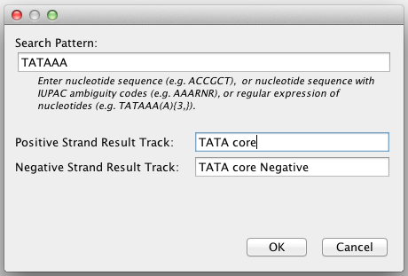
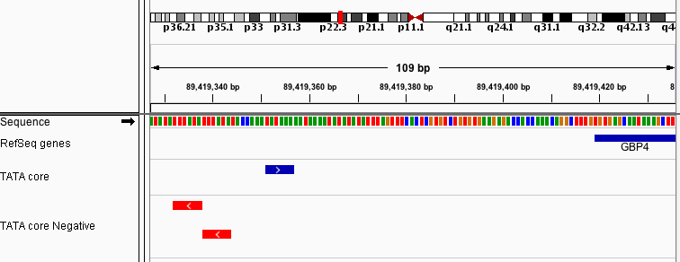

# How to run the Motif Finder

Search for a particular nucleotide sequence in the reference genome. The results are displayed as features in two new
tracks. By default, the results from the positive strand are displayed in blue, and results from the negative strand in
red. To change the color, right-click on the track and select _Change Track Color..._ from the pop-up menu.

Steps:

1. Bring up the motif finder dialog, via _Tools>Find Motif..._

2. Enter the sequence for which to search, using one of following three formats:

* A **sequence of nucleotides**.

* A sequence of nulceotides with **[IUPAC](http://www.chem.qmul.ac.uk/iubmb/misc/naseq.html) ambiguity codes**.

  For example, let's say you want to find bacterial promoter upstream elements consisting of 6 adenines (A), followed by
  a purine (A or G), then any nucleotide (A, C, G, or T), and finally another purine (A or G). You would enter the
  sequence "AAAAAARNR".

* A **regular expression** that follows Java regex syntax.

  For example, to find occurrences of the canonical TATA box sequences TATAAAAA, TATATAAA, and TATAAATA, you can enter
  the regular expression "TATA\[AT\]A\[AT\]A". Regular expressions are particularly useful for finding variable length
  sequences. For example, to search for the sequence TATAAA, optionally followed by any number of additional adenines,
  enter the regular expression "TATAAA+".

3. Enter names for the feature tracks that will show where the sequence matches the positive and negative strands of
the reference genome.

# Example

Since we entered a short sequence, it gets a large number of hits. Looking at the results directly upstream of the gene
GBP4, we see a match on the postive strand and two on the negative strand. Note that by default, the search result
tracks are displayed in _Expanded_ mode, so you can see overlapping matches.

