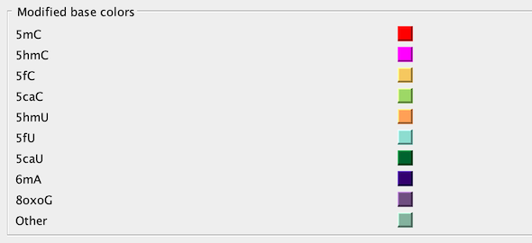
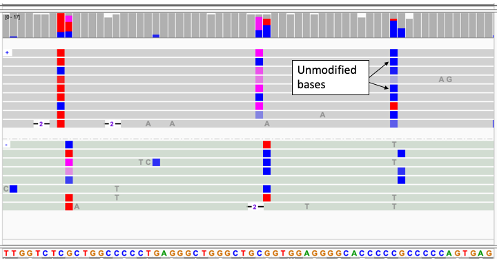

  Base modifications 

Options for coloring alignments by base modifications are enabled for alignments with  `MM` and optionally `ML` tags, 
denoting modification type and likelihood respectively.  
[(_see SAM/BAM format tag specifications_)](https://samtools.github.io/hts-specs/SAMtags.pdf).
When these tags are present  options appear in the `Color by` section of the alignment track menu to color 
all modifications present, or a specific modification, using  either a mono-color (default) or 2-color scheme.  For example,
in an experiment with both `5mC` and `5hmC` modifications the following menu options are available.

**Display Conventions**

Display conventions for base modification coloring options are listed below.

1. Alignment blocks are colored by DNA strand.  For 3rd generation reads this is the read strand.  For paired reads, the
   DNA strand  is assumed to be the strand of the read marked first-in-pair.

   * Gray for forward read
   * Sage for reverse read

2. Alignments are grouped by DNA strand.  This can be disabled from the **Base Mods** tab of the preferences window.

3. Mismatches to reference are flagged by displaying the read base in dark gray.

4. Base modifications are indicated by color, with a distinct color assigned to each modification type.  These colors
   are settable in user preferences

5. Alpha transparency is used to indicate the likelihood of the modification as reported by the ML tag.

In  both modes a base is assigned a color if the modification likelhiood exceeds a user-settable threshold, `0.5` (50%), 
by default.  In the case of multiple modifications  of a single base, the modification with the highest likelihood is 
used to assign color if that likelihood exceeds the  threshold,   If no modification likelihood exceeds the threshold 
the base remains uncolored.

The two-color option extends the mono-color scheme by assigning a color for the unmodified base, blue by default.   The likelihood of
no modification is taken as 1 - (sum of all modification likelhoods).  For example, a base with likelihoods of
5hmC = 30% and 5mC = 10%, would be assigned a likelihood of no modification of 60%.  This mode gives equal emphasis to
modified and unmodified bases. 

Note that visualization of 5-Methylcytosine (5mC) modifications in 2-color mode, which assigns `red` to 5mC modification
and `'blue` to a likely unmodified base, is consistent 
with visualization of methylation from [bisulfite sequencing](./bisulfite_sequencing.md), making experiments from the 
two technologies comparable.

Default colors for common modifications are show below.  The colors are user settable on the `Base Mods` tab of the user
preferences window.  Additionally, color representing the unmodified base can be set and 
customized for each canonical base (A,C,T, and G).

**Example Screenshots**

**Mono-color display of reads with 5mC and 5hmC modifications**

**2-Color display of reads with 5mC and 5hmC modifications**

**5mC methylagion**

5mC experiment in 2-Color mode (5mC == Red, No modification == Blue, Threshold = 0.5)

