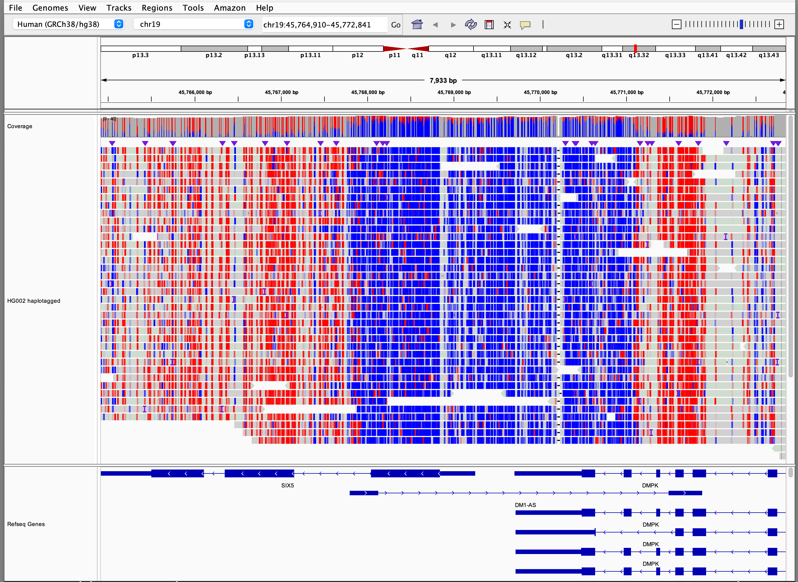

  Base modifications 

Options for coloring alignments by base modifications are enabled for alignments with  `MM` and optionally `ML` tags, 
denoting modification type and likelihood respectively.  
[See SAM/BAM format tag specifications](https://samtools.github.io/hts-specs/SAMtags.pdf).
When these tags are present menu options appear to color by all modifications present, or a specific modification, in either
monocolor or 2-color modes.  Display conventions for these modes are described below.

1. Alignment blocks are colored by DNA strand.  For 3rd generation reads this is the read strand.  For paired reads, the 
DNA strand  is assumed to be the strand of the read marked first-in-pair.
    * Gray for forward read 
    * Sage for reverse read 

2. Alignments are grouped by DNA strand.  This can be disabled from the **Base Mods** tab of the preferences window.

3. Mismatches to reference are flagged by displaying the read base in dark gray.

3. Base modifications are indicated by color, with a distinct color assigned to each modification type.  These colors 
are settable in user preferences.

4. Two modes are provided for coloring base modifications, `Monocolor` and `2-Color`.    Both modes compare likelihood
of modification with a user-settable threshold, `0.5` (50%) by default, and color the base if likelihood exceeds the 
threshold.   In the case of multiple modifications of a single base, the modification with the highest likelihood is 
used to assign color if that likelihood exceeds the `threshold`,   If no modification likelihood exceeds the `threshold` 
the base remains uncolored (gray)

**Monocolor**

This coloring mode highlights the presence of a modification exceeding the threshold, if any,  by its assigned color, 
with alpha transparency used to indicate the liklelihood of the modification as reported with the ML tag.     

**2-Color**

This  mode extends the monocolor scheme by assigning a color for the unmodified state, `blue` by default.   The likelihood of 
no-modification is taken as 1 - (sum of all modification likelhoods).  For example, a base with likelihood of 
5hmC = 30%,  5mC = 10%, would be assigned a likelihood of no modification of 60%.
As in mono-color mode, color is assigned based on the modification with highest likelihood, with the addition of
`unmodified` as a possible state.  This mode gives equal emphasis to
modified and unmodified bases.  If no modification (including `unmodifed`) exceeds the threshold the 
base remains uncolored.  This is possible when 2 or more modification likelihoods are recorded for a single base.

Visualization of 5-Methylcytosine (5mC) modifications in this mode is consistent with visualization of methylation from
[bisulfite sequencing](./bisulfite_sequencing.md), making experiments from the two technologies comparable.  

The color representing the unmodified base can be set on the **Base Mods** tab of the prefeneces page.  Settings are
available for each canonical base, A,C,T, and G.

**Example screenshots**

5mC experiment in 2-Color mode with default settings (5mC == Red, No modification == Blue, Threshold = 0.5)

## Coverage track