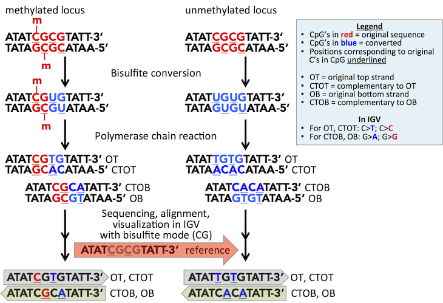
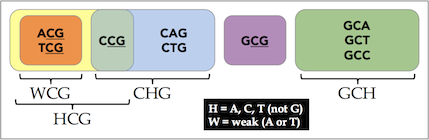

 Bisulfite sequencing

This page describes a special alignment base coloring mode for visualization of DNA
libraries that have undergone bisulfite conversion and sequencing. The mode supports visualization of alignments from
the following and similar techniques:

*   BS-Seq, bisulfite sequencing
*   RRBS-Seq, reduced representation bisulfite sequencing
*   TAB-Seq, Tet-assisted bisulfite sequncing
*   NOMe-Seq

### Enabling bisulfite sequencing coloring 

Bisulfite sequence coloring is invoked from the alignment track popup menu by selecting a context under the submenu
item *Color alignments by > bisulfite mode*.  IGV recognized contexts are described in the table below.

| **IGV Bisulfite mode** | **description**                                                                                                                                        | **relevance**                                                                                                                                                                                                                                                                                                                                                                   |
|--------- |--------------------------------------------------------------------------------------------------------------------------------------------------------|---------------------------------------------------------------------------------------------------------------------------------------------------------------------------------------------------------------------------------------------------------------------------------------------------------------------------------------------------------------------------------| 
|  **CG** | CpG                                                                                                                                                    | Canonical methylation target site in eukaryotes                                                                                                                                                                                                                                                                                                                                 |
| **CHH** and **CHG** | H represents any nucleotide but guanine (H comes after G).<ul><li>CHH = CAA, CAT, CAC; CTT, CTA, CTC; CCC, CCA, CCT </li><li>CHG = CAG, CTG, CCG</li>  | Additional methylation sites: <ul><li>For mammals in a cell-type dependent manner. Pervasive in human embryonic stem cells (Lister 2009). For example, in H1 stem cells comprises almost 25% of all cytosines at which DNA methylation is identified compared to 99.98% mCG in IMR90 cells.</li><li>In plants serve as additional canonical methylation target sites.</li></ul> 
| **HCG** | ACG, TCG, CCG, inclusive of WCG | see [NOMe-Seq section](#nome-seq)                                                                                                                                                                                                                                                                                                                                               |
| **GCH** | GCA, GCT, GCC | see [NOMe-Seq section](#nome-seq)                                                                                                                                                                                                                                                                                                                                               |
| **WCG** | W represents A or T (Weak).  ACG, TCG | see [NOMe-Seq section](#nome-seq)                                                                                                                                                                                                                                                                                                |

### Display convention

When bisulfite sequence tracks are initially loaded, default coloring of mismatches against the reference will show 
red **T**'s and green **A**'s. When coloring is switched to bisulfite mode, two new coloring schema are applied and 
together allow you to visually distinguish read strand and bisulfite conversion status.

1.  Reads are colored by DNA strand. For paired reads, this is the same as coloring by _first-of-pair strand_.
    *   Gray for forward reads or forward read first pairs (F1 or F1R2)
    *   Sage for reverse reads or reverse read first pairs (R1 or R1F2)
2.  The chosen mode is highlighted in reads with a red or blue nucleotide corresponding to the position of the cytosine in the reference genome.
    *   For forward reads, a red **C** denotes a nonconverted cytosine, implying methyl or other protection, while a blue **T** denotes a bisulfite converted cytosine.
    *   For reverse reads, a red **G** denotes a nonconverted cytosine, implying methyl or other protection, while a blue **A** denotes a bisulfite converted cytosine.
    *   In zoomed-out views, colored nucleotides are represented by colored lines.

Because not all mode matching sites are biologically relevant in the context of methylation, bisulfite experiments 
compare changes in methylation between a control sample and the variable. When comparing two samples, a change in 
methylation status will be marked by a difference in color for a given site. Red to blue indicates loss of methylation, 
or hypomethylation; blue to red indicates increased protection by methylation, or hypermethylation, as shown for 
the tumor sample in the **screenshot** below which visualizes data from Berman _et al_ (2012).

### BS-Seq

**BS-Seq identifies sites of DNA methylation**

Coloring by bisulfite mode in IGV allows for visualization of alignments of BS-Seq reads, a DNA-modification 
technique used to distinguish sites of DNA methylation and hydroxymethylation in epigenetic studies. Alignments 
in IGV are against a reference genome of correct sequence as coloring is based on deviations from the reference 
sequence. Read alignment may have been against a bisulfite-transformed genome sequence, in which case genomic 
coordinates would still be for that of the original reference genome.

In DNA methylation, the methyl CH3 group is added to the cytosine base at the carbon 5 position (5-meC) in a 
sequence-context dependent manner. In mammals this context is typically CpG dinucleotides, and in plants this is CpG, 
CpHpG, and CpHpH di- and tri-nucleotides. These correspond to the CG, CHG, and CHH bisulfite coloring modes in IGV. 
The [IUPAC ambiguity code](http://en.wikipedia.org/wiki/Nucleic_acid_notation) H represents any nucleotide but guanine.

Promoter methylation is typically associated with repression, while genic methylation correlates with transcriptional activity.

**BS-Seq exploits the different sensitivities of cytosine and 5-meC to bisulfite**

Bisulfite modification exploits the different sensitivities of cytosine and 5-meC to deamination by bisulfite under 
acidic conditions. Cytosine undergoes conversion to uracil whereas 5-meC is unmodified and remains intact. The uracil 
is subsequently converted to thymine after PCR amplification while 5-meC residues remain cytosines.

A number of the different genome-wide methylome technologies use bisulfite chemistry and this IGV mode applies to those 
that in addition sequence the bisulfite converted DNA, such as by Illumina high-throughput sequencing. These include 
whole-genome bisulfite sequencing (WGBS) and reduced-representation-bisulfite sequencing (RRBS), both of which provide 
single-nucleotide resolution.

RRBS targets bisulfite sequencing to an enriched population of the genome while WGBS porportedly determines the 
methylation state of every cytosine in the target sequence. However, as with any technique 
[limitations](http://en.wikipedia.org/wiki/Bisulfite_sequencing#Limitations) exist, including the inability to 
discriminate 5-meC from 5-hydroxymethylcytosine (5-hmeC) modifications, which was discovered to be pervasive in 
mammalian DNA in 2009 (Yu, _Cell_ 2012).

Multiple techniques are used to distinguish 5-hmeC from 5-meC. Of relevance to coloring by bisulfite mode in IGV is 
TAB-Seq (Tet-assisted bisulfite sequencing), in which 5-hmeC sites are protected by glucosylation prior to bisulfite 
conversion. Because 5-meC sites remain unprotected from mTet1 oxidation to 5-carboxylcytosine (5-caC), and subsequent 
bisulfite conversion, only 5-hmeC site cytosines remain unchanged in reads (Yu, _Nature Protocols_ 2012).

The following **figure** diagrams the nucleotide conversions that occur for a methylated versus unmethylated locus 
during bisulfite conversion and PCR, and IGV's corresponding coloring of these sites in CG bisulfite mode.

For a given DNA fragment, four strands arise after treatment and PCR amplification. These are the original top strand (OT), 
the original bottom strand (OB), and strands which are complementary to OT and OB  (CTOT and CTOB). IGV visualizes 
reads in one direction, and for the given direction reads from the opposite strand are automatically displayed as the 
reverse complement. Therefore, OT and CTOT reads are displayed in the reference-forward direction (gray) while OB and 
CTOB reads are displayed in the reverse direction (sage) and are differentially colored as indicated.

To sort reads by strand, use the [right-click pop-up menu](http://www.broadinstitute.org/software/igv/PopupMenus#Alignmenttrack) 
on the alignment track.

You can also infer the read-strand by the specific nucleotides that are highlighted by the mode.  OT and CTOT yield 
methylation information for cytosines on the top strand (**C** and **T** highlighted), while OB and CTOB will give 
methylation information for the paired complement, that is for guanines paired to the methylatable cytosines 
(**G** and **A** highlighted).

### NOMe-Seq 

In addition to detecting methylation states, bisulfite conversion is used in footprinting studies. For example to 
determine nucleosome positioning in yeast and mammalian cells.

The additional IGV color modes--**HCG**, **GCH**, and **WCG** (**diagram**)--are relevant to NOMe-Seq, a genome-wide 
nucleosome footprinting and methylome sequencing method (Kelly 2012). This method obtains nucleosome positioning 
information based on the GpC methyltransferase _M.CviPI_ accessibility to GpC sites, and at the same time obtains 
endogenous DNA methylation information from CpG sites.

*   **GCH** cytosines are used to plot enzyme accessibility, that is, nucleosome protection or occupancy.
*   **HCG** cytosines are used for endogenous methylation. GCG is excluded due to ambiguity between endogenous and enzymatic methylation.
    *   The authors note that in their context, GCGs represent less than 0.24% of the genome and make up only 5.6% of all GC dinucleotides.
    *   In addition, 93.4% of GCG trinucleotides have a **GCH** within 20 bp (and half of these within 5 bp) from which nucleosome occupancy information can be derived.
*   Authors use **WCG** instead of **HCG** in certain calculations to exclude off-target activity of _M.CviPI_ on CCG sites.

### References

Berman, Benjamin P, Daniel J Weisenberger, Joseph F Aman, Toshinori Hinoue, Zachary Ramjan, Yaping Liu, Houtan Noushmehr, 
et al. 2012. “Regions of Focal DNA Hypermethylation and Long-Range Hypomethylation in Colorectal Cancer Coincide with 
Nuclear Lamina-Associated Domains.” Nature Genetics 44 (1): 40–46. doi:10.1038/ng.969.

Kelly, Theresa K, Yaping Liu, Fides D Lay, Gangning Liang, Benjamin P Berman, and Peter a Jones. 2012. “Genome-Wide 
Mapping of Nucleosome Positioning and DNA Methylation within Individual DNA Molecules Genome-Wide Mapping of Nucleosome 
Positioning and DNA Methylation within Individual DNA Molecules,” 2497–2506. doi:10.1101/gr.143008.112.

Lister, Ryan, Mattia Pelizzola, Robert H Dowen, R David Hawkins, Gary Hon, Julian Tonti-Filippini, Joseph R Nery, 
et al. 2009. “Human DNA Methylomes at Base Resolution Show Widespread Epigenomic Differences.” Nature 462 (7271). 
Nature Publishing Group: 315–22. doi:10.1038/nature08514.

Stirzaker, Clare, Phillippa C. Taberlay, Aaron L. Statham, and Susan J. Clark. 2014. “Mining Cancer Methylomes: 
Prospects and Challenges.” Trends in Genetics 30 (2). Elsevier Ltd: 75–84. doi:10.1016/j.tig.2013.11.004.

Yu, Miao, Gary C Hon, Keith E Szulwach, Chun-Xiao Song, Peng Jin, Bing Ren, and Chuan He. 2012. “Tet-Assisted Bisulfite 
Sequencing of 5-Hydroxymethylcytosine.” Nature Protocols 7 (12): 2159–70. doi:10.1038/nprot.2012.137.

Yu, Miao, Gary C Hon, Keith E Szulwach, Chun-Xiao Song, Liang Zhang, Audrey Kim, Xuekun Li, et al. 2012. “Base-Resolution 
Analysis of 5-Hydroxymethylcytosine in the Mammalian Genome.” Cell 149 (6): 1368–80. doi:10.1016/j.cell.2012.04.027.

