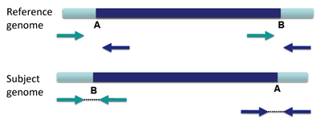
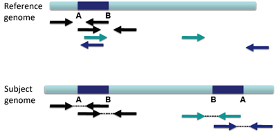
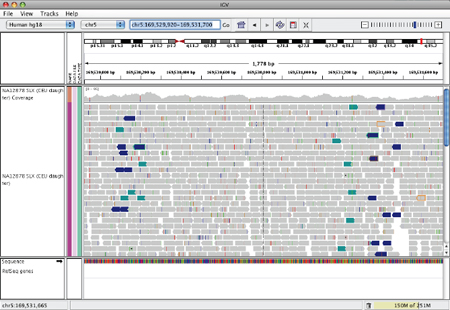
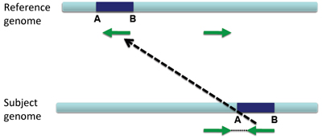

The orientation of paired reads can be used to detect structural events including:

*   inversions
*   duplications
*   translocations

By selecting _Color alignments>by pair orientation_, you can flag anomalous pair orientations in IGV.

Orientation is defined in terms of read-strand: left versus right, and first read versus second read of a pair.

_(figure courtesy of Bob Handsaker)_

These categories only apply where both mates map to the same chromosome.

Inversions
----------

An inversion is a large section of DNA that is reversed in the subject genome compared to the reference genome.

When an inversion shows up in paired-end reads, the reads are distinctively variant from the reference genome.

This appears in IGV as shown below.

Inverted Duplication
--------------------

When a large section of DNA is duplicated and inserted into the genome in a reversed configuration compared to the original sequence, this is called an inverted duplication.

There will be overlapping left and right reads, and there will likely be altered coverage depth/copy number.

This appears in IGV as shown below.

Tandem Duplication
------------------

When a large section of DNA is duplicated and inserted into the genome next to the original sequence, this is called a tandem duplication.

The reads will not only be duplicated, but also be arranged as shown below.

IGV will display this rearrangement as shown below.

Translocation on the Same Chromosome
------------------------------------

When a large section of DNA is removed from one location and inserted elsewhere, that is a translocation.

Translocations on the same chromosome can be detected by color-coding for pair orientation, whereas translocations between two chromosomes can be detected by coloring by insert size.

