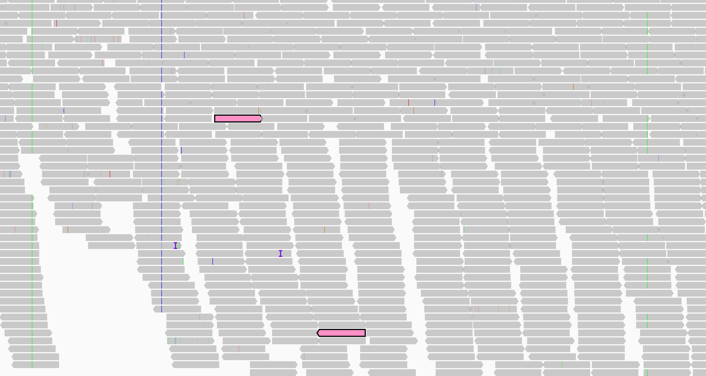
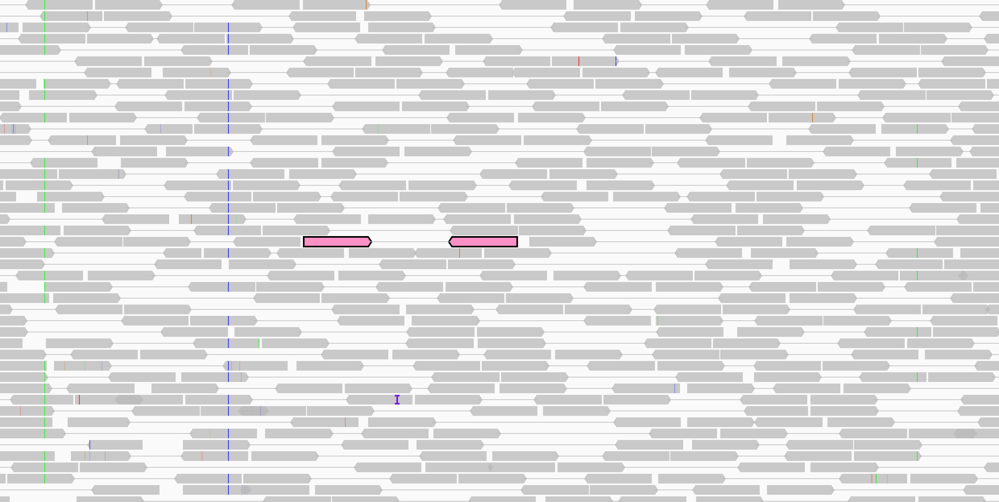
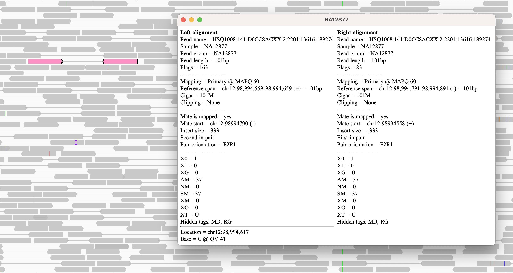
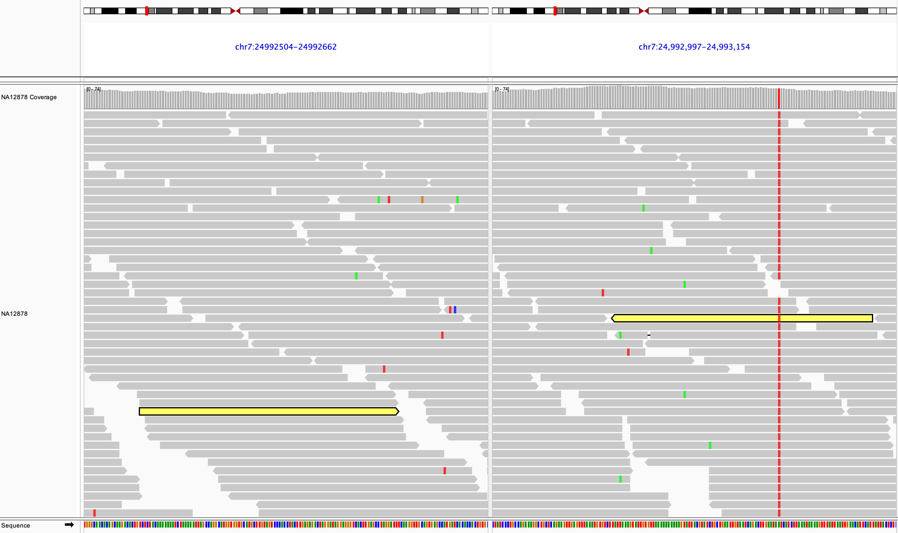
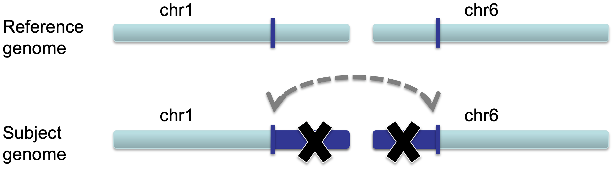
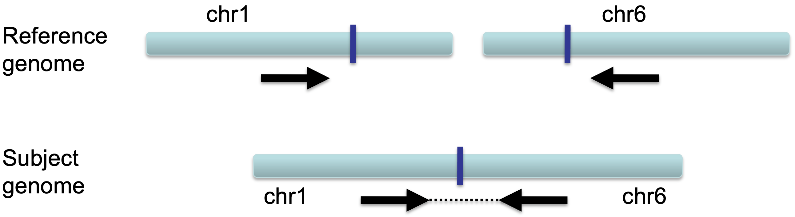

<!---
The page title should not go in the menu
-->

 Paired-end alignments 

# Viewing paired-end alignments

## View as pairs

By default, IGV displays paired-end alignments individually because they pack compactly. Select _View as pairs_ from the right-click menu to display pairs together with a line joining the ends. 

In the following two screenshots, the alignments of one pair are shown in pink. The upper screenshot displays the track in the default packed mode; in the lower screen shot the alignments are displayed as connected pairs. 
    
 

!!! tip " "
    To highlight an alignment and its paired mate in the same color, `Ctrl-click` on one of the alignments (`Cmd-click` on MacOS). The colors are arbitrary but unique to each pair. Repeating the click on either alignment will clear the color. Or select *Clear selections* from the track's pop-up menu to clear the highlight color from all alignments in the track.

When viewed as pairs, clicking on an alignment (or hovering over it if the pop-text behavior has been set to *On hover*) will display the read details for both the alignment and its mate.  

## Split screen view

Split screen views can be invoked on the fly from paired-end alignment tracks. Right-click over an alignment and select _View mate region in split screen_ from the pop-up menu. If the alignment does not have a mapped mate this option will be grayed out. Both alignments will be highlighted in color so you can more easily see the mate in the second panel.

You can select this option again for additional alignments and view multiple panels side by side. See the section on [viewing multiple regions](../../../navigation/#viewing-multiple-regions) for details on how to control the view.

# Detecting structural variants

Paired-end sequencing can yield evidence of structural variants such as insertions, duplications, translocations, and inversions. IGV can **detect anomalies found in the alignment of the paired reads** that might indicate putative structural variants. In particular, the expected distance between the two aligned reads of a pair and their relative orientation is known. When the actual values differ from the expected values, color is used to call out the anomalies. This is the default color mode for alignments, but you can choose to color alignments by a number of different attributes via the right-click pop-up menu.

!!! note " "
    If you see a pattern of many alignments colored the same way, it may be evidence of a structural variant. Seeing just a small sampling of colored alignments, with no systematic pattern, is less likely to indicate a variant.

<!---
TBD Add a description of insert size and pair orientation, e.g. from our workshop
-->

## Insert size

The expected (or *inferred*) insert size can be computed on the fly from the size distribution found in the loaded file (the default), or it can be specified as a specific size range in base pairs. The default insert size options can be changed for **all** tracks in the *Alignments* and *RNA* tabs of *View > Preferences*. To change the options for **one** track, select *Set insert size options* from the track's right-click pop-up menu.

The insert size color scheme is:

* Larger than expected insert size: Both reads are red 

* Smaller than expected insert size: Both reads are blue 

* Pairs aligned to different chromosomes: Each read is colored by the chromosome of its mate  

The insert size can be used to detect *deletions, insertions,* and *inter-chromosomal rearrangements*

### Deletions

In a deletion, a section of DNA is absent in the subject genome compared to the reference genome.

When pairs from a section of DNA spanning the deletion are aligned to the reference genome the **inferred insert size will be larger than expected**.  This is due to the deleted section of the genome, not present in the subject.  Schematically this can be visualized as follows, with the pairs of dark blue arrows representing the paired reads.

When the inferred insert size is larger than expected, both reads of the pair are **colored red**, as shown in the following example, where the two ends of a deletion are shown in split-screen view. 

### Insertions

In the case of an insertion, a section of DNA is present in the subject genome that is not represented in the reference genome.

The effect on distance between aligned pairs is opposite in the case of a deletion; the **inferred insert size is smaller than expected**.

When the inferred insert size is smaller than expected, both reads of the pair are **colored blue**.

!!! note " "
    The maximum size of an insertion detectable by insert size anomaly is limited by the size of the sequenced fragments. They must be long enough to span the insertion and include sequences on both ends that are mapped to the reference. Therefore, third-gen long read sequencing is able detect longer insertions than pair-end sequencing of shorter fragments.   

### Inter-chromosomal fusions

In the case of an inter-chromosomal fusion, a section of DNA on one chromosome of the subject genome is fused with a section of DNA on another chromosome. Chromosomes 1 and 6 are used as an example in the following schematics.

{width=420}

When a sequenced pair from a fragment of the subject's DNA that spans the fusion is aligned to the reference genome, **each read will be mapped to different chromosomes**.  

{width=420}

In this case, each read is **colored by the chromosome of its mate** (see color scheme [above](#insert-size)). 

The following example shows a split-screen view of two alignment tracks, one is a tumor sample and the other is a matched normal sample. The left panel displays a region of chromosome 1 and the right panel displays a region of chromosome 6. In the tumor sample track, a large number of reads on chromosome 1 are colored brown (the chromosome 6 color) because their mates aligned to chromosome 6. Similarly, their mates on chromosome 6 are colored blue (the chromosome 1 color). Note that the reads in the normal sample are grey, which means the rearrangement is only found in the tumor.

## Pair orientation

The orientation of paired reads can be used to detect *inversions*, *duplications*, and *translocations* on the same chromosome.

Orientation is defined in terms of read-strand: left versus right, and first read versus second read of a pair.

_(Figure courtesy of Bob Handsaker)_

The schematics in the following sections assume the Illumina paired-end sequencing convention.

### Inversions

An inversion is a large section of DNA that is reversed in the subject genome compared to the reference genome.

When an inversion shows up in paired-end reads, the reads are distinctively variant from the reference genome.

This appears in IGV as shown below.

### Inverted duplication

When a large section of DNA is duplicated and inserted into the genome in a reversed configuration compared to the original sequence, this is called an inverted duplication.

There will be overlapping left and right reads, and there will likely be altered coverage depth/copy number.

This appears in IGV as shown below.

### Tandem duplication

When a large section of DNA is duplicated and inserted into the genome next to the original sequence, this is called a tandem duplication.

The reads will not only be duplicated, but also be arranged as shown below.

IGV will display this rearrangement as shown below.

### Translocation on the same chromosome

When a large section of DNA is removed from one location and inserted elsewhere, this is called a translocation.

Translocations on the same chromosome can be detected by color-coding for pair orientation, whereas translocations between two chromosomes can be detected by coloring by insert size.

