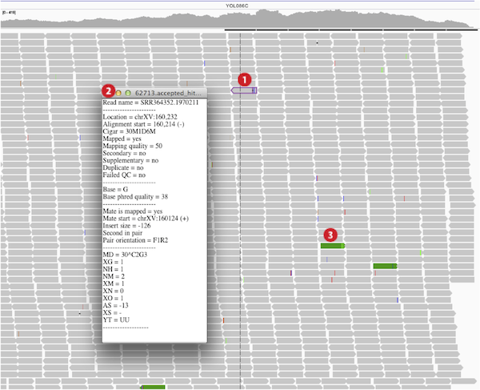
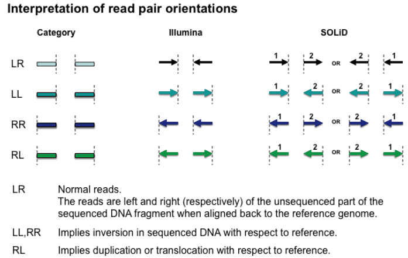

# Viewing paired-end alignments

## View as pairs

By default, IGV displays reads individually because they pack compactly. Select _View as pairs_ from the right-click menu to display pairs together with a line joining the ends as shown in the image below. The hover element details (2) are also displayed either for a single read in **normal view (left)** or for a pair of reads in **paired reads view (right)**.

 

## Colors

IGV colors paired-end alignments in two ways.

*   Interactively by user selection as shown in the purple highlighted reads marked by (1) in the images above, and
*   That deviate from expectations as marked by (3) in the image above.

Control+click (Mac: Command+click) a read to outline the read and its paired mate in the same color. Colors are arbitrary but unique to each pair. A black outline indicates that the selected read has no mate.

*   Control+click (Command+click) either read to clear the outline.
*   Right-click and select _Go to Mate Region_ to jump to the paired mate.
    *   If the paired reads have a large insert size, the paired mate will not be highlighted. Turn on the Color by insert size and pair orientation option from the popup menu to confirm as described below.
*   Right-click and select _Clear Selections_ to clear all outlines.

Outlined paired reads are preserved when switched to _View as pairs_ option. However, outlining reads only works in the unpaired view and not in the paired view.

Hover over or click a read to view information about the read, including the location of its paired mate.

IGV colors (1) paired end reads with inferred insert size smaller or larger than expected; (2) read with mate that is aligned to a different chromosome; (3) paired-end alignments with deviant pair orientation. Note that coloring by insert size is a feature designed originally for DNA alignments _against the genome_. It is based on set base pair values or computed from the size distribution of a library.

*   See [Interpreting Color by Insert Size](http://www.broadinstitute.org/software/igv/interpreting_insert_size) for more detail.
    *   Blue is for inserts that are smaller than expected
    *   Red is for inserts that are larger than expected.
    *   Inter-chromosomal rearrangements are color-coded by chromosome.
*   See [Interpreting Color by Pair Orientation](http://www.broadinstitute.org/software/igv/interpreting_pair_orientations) for more detail.
    *   Shades of green, teal, and dark blue show structural events of inversions, duplications, and translocations.
    *   Color assignments depend on sequencing platform.
*   Other _Color by_ options are described in the alignment track [pop-up menu](<?php echo base_path(); ?>PopupMenus#AlignmentTrack) options

Translocations on the same chromosome can be detected by color-coding for pair orientation, whereas translocations between two chromosomes can be detected by coloring by insert size. See both by selecting the _Color alignments by>_ _insert size and pair orientation_ option.

## Split screen view

Split screen views can be invoked on-the-fly from paired-end alignment tracks. Right-click over an alignment and select _View mate region_ _in split screen_ from the drop-down list. If the alignment clicked over does not have a mapped mate this option will be grayed out. You can select this option for mutliple alignments and view multiple panels side by side.

To return to a normal single screen view, right-click on the locus name at the top of the panel you wish to keep and select _Switch to standard view_. Alternatively, double-click the locus name.

You can control the view of each panel independently. Pan by click-dragging in the panel;  double-click to zoom in and alt-click to zoom out.

# Detecting structural variants

IGV uses color and other visual markers to highlight potential genetic alterations in reads against a reference sequence. Genetic alternations include single nucleotide variations, structural variations, and aneuploidy. Structural variations include insertions, deletions, inversions, tandem duplications, translocations, and other more complex rearrangements. Interpretation of some of these variations are discussed briefy in this section and the next. [Interpreting Color by Insert Size](http://www.broadinstitute.org/software/igv/interpreting_insert_size) and [Interpreting Color by Pair Orientation](http://www.broadinstitute.org/software/igv/interpreting_pair_orientations) give more detailed explaination of read colors.

An additional factor to take into consideration when judging potential genetic alterations is quality of reads and quality of mapping. IGV uses transparency to indicate quality.

*   For RNA-Seq, [TopHat](http://ccb.jhu.edu/software/tophat/index.shtml) outputs separate insertions.bed and deletions.bed files which IGV will load as separate tracks.
*   In addition to the .[BED](http://www.broadinstitute.org/software/igv/BED) format, the .[VCF](http://www.broadinstitute.org/software/igv/VCF) format file displays structural variation.

Colors and transparency are used at two levels within alignments: (1) for mapped reads, and (2) for individual bases within reads.

**Color**

**Transparency**

**mapped reads**

see [Paired-End Alignments](#paired) section

mapping quality

**individual bases**

Mismatched bases

read quality (phred) score

## Insert size

Coloring by insert size is for DNA alignments and is not designed to indicate RNA-Seq paired read mate distances. It is based on set base pair values or computed from the size distribution of a library against the reference genome as defined in the [Alignment Preferences Panel](http://www.broadinstitute.org/software/igv/Preferences#Alignments).

The inferred insert size can be used to detect structural variants, such as:

*   deletions
*   insertions
*   inter-chromosomal rearrangements

IGV uses color coding to flag anomalous insert sizes. When you select _Color alignments_\>_by insert size_ in the popup menu, the default coloring scheme is:

*    for an inferred insert size that is larger than expected (possible evidence of a deletion)
*    for an inferred insert size that is smaller than expected (possible evidence of an insertion)
*    for paired end reads that are coded by the chromosome on which their mates can be found

### Deletions

In a deletion a section of DNA is absent in the subject genome compared to the reference genome.

When pairs from a section of DNA spanning the deletion are aligned to the genome the inferred insert size will be larger than expected.  This is due to the deleted section of the genome, not present in the subject.  Schematically this can be visualized as follows:

So in the case of a deletion, the inferred insert size is GREATER THAN the expected insert size.   In IGV such an event might look like the following.

Reads that are colored red have larger than expected inferred sizes, and therefore indicate possible deletions.

### Insertions

In the case of an insertion, a section of DNA is present in the subject genome that is not represented in the reference genome.

The effect on distance between aligned pairs is opposite in the case of a deletion; the "inferred insert size" is smaller than expected.

The maximum size of an insertion detectable by insert size anomaly is limited by the size of the fragments.  They must be long enough to span the insertion and include sequences on both ends that are mapped to the reference.  The maximum detectable size is approximately equal to:

fragment length - (2x read length)

Detection of this event is therefore more likely with larger fragment libraries, such as Illumina mate-pair (not paired-end) and SOLID.

In the example above reads that are colored blue have smaller than expected inferred sizes, and therefore indicate insertions.

### Inter-chromosomal rearrangement

IGV codes inserts for inter-chromosomal rearrangements.  For instance, in this case, one end is on chromosome 1 and the other is on chromosome 6.

## Pair orientation

The orientation of paired reads can be used to detect structural events including:

*   inversions
*   duplications
*   translocations

By selecting _Color alignments>by pair orientation_, you can flag anomalous pair orientations in IGV.

Orientation is defined in terms of read-strand: left versus right, and first read versus second read of a pair.

_(figure courtesy of Bob Handsaker)_

These categories only apply where both mates map to the same chromosome.

### Inversions

An inversion is a large section of DNA that is reversed in the subject genome compared to the reference genome.

When an inversion shows up in paired-end reads, the reads are distinctively variant from the reference genome.

This appears in IGV as shown below.

### Inverted duplication

When a large section of DNA is duplicated and inserted into the genome in a reversed configuration compared to the original sequence, this is called an inverted duplication.

There will be overlapping left and right reads, and there will likely be altered coverage depth/copy number.

This appears in IGV as shown below.

### Tandem duplication

When a large section of DNA is duplicated and inserted into the genome next to the original sequence, this is called a tandem duplication.

The reads will not only be duplicated, but also be arranged as shown below.

IGV will display this rearrangement as shown below.

### Translocation on the same chromosome

When a large section of DNA is removed from one location and inserted elsewhere, that is a translocation.

Translocations on the same chromosome can be detected by color-coding for pair orientation, whereas translocations between two chromosomes can be detected by coloring by insert size.

