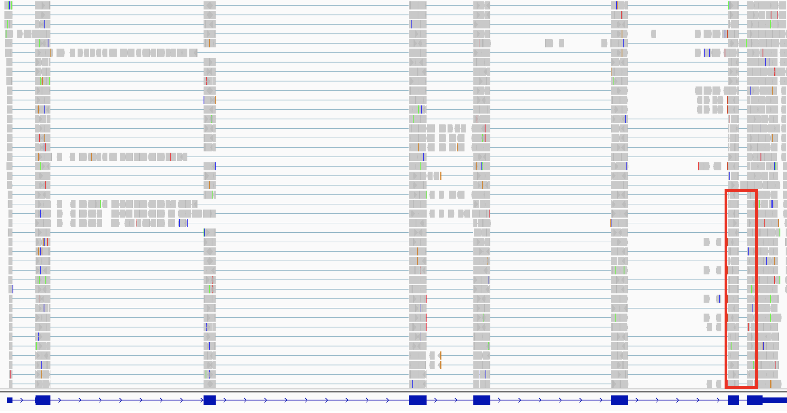
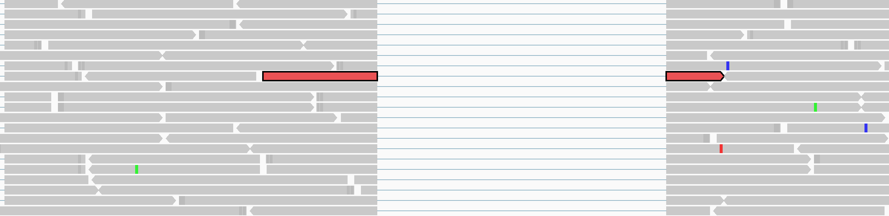
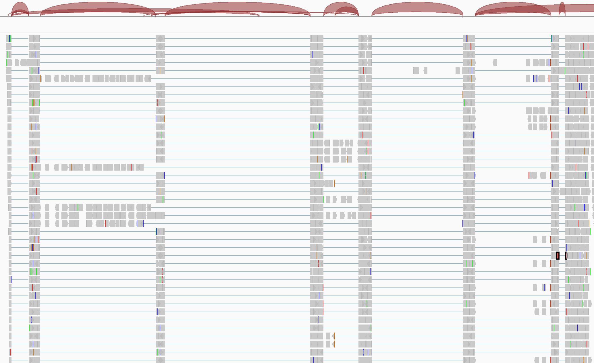
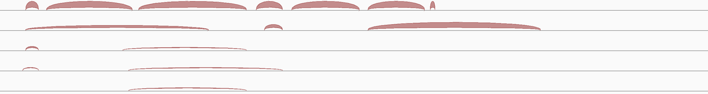
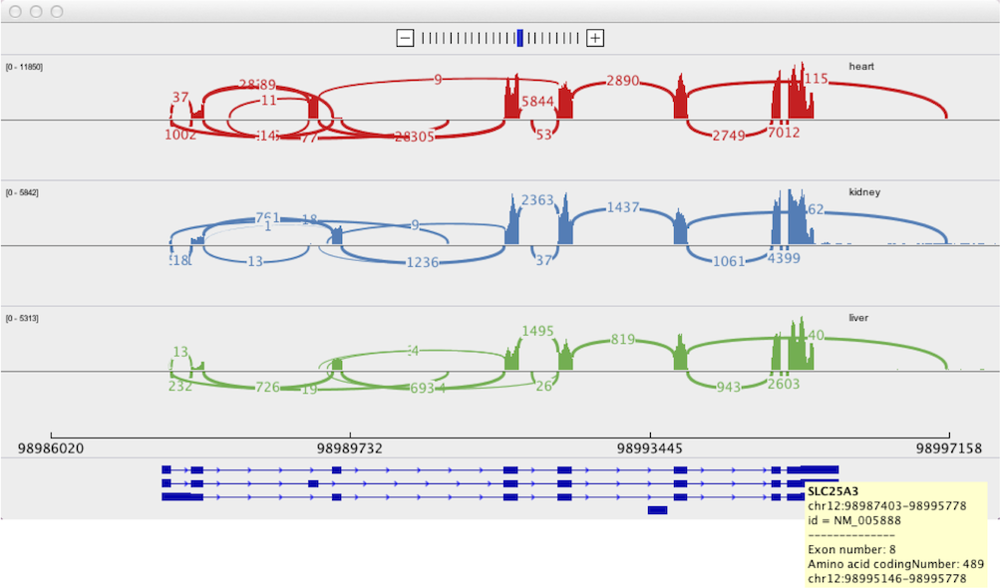

<!---
The page title should not go in the menu
-->

 RNA-seq data 

This section covers unique features of RNA-seq alignment tracks. See [Alignments basics](viewing_alignments_basics.md) for general features that also apply to RNA-seq tracks.

# RNA-seq alignments

With RNA sequencing, an individual read may span a splice junction, so when the data are aligned back to the full reference genome, a single alignment can be split into segments separated by potentially very long gaps. These reads are displayed as blocks connected by a thin blue line.

The following two screenshots show RNA-seq alignments. 

* The upper screenshot shows a ~8,000 bp region of an RNA-seq alignment track and a blue RefGene track. 
* The lower screenshot shows the data from the red box superimposed on the upper screenshot. The view is zoomed in to ~260 bp and individual reads are visible. One split read has been highlighted in red to make it stand out. You can `Ctrl-click` a read (or `Cmd-click` on MacOS) to highlight it with color. 

# Splice junction track

By default, IGV dynamically computes a splice junction track from RNA-seq alignments. The track displays arcs connecting the alignment blocks from split reads.

*   When available, the `XS` tag provided by the alignment is used to determine **strandedness**. If the tag is missing, strandedness is inferred from the read strand. For paired-end data the strand of the alignment marked `first in pair` is used.

    *   Junctions from the **forward** strand are colored **red** and extend above the center line.

    *   Junctions from the **reverse** strand are **blue** and extend below the center line.

*   The height and thickness of the arc are proportional to the **depth of read coverage** up to 50 reads. To display a more proportionate representation, select _Autoscale_ from the right-click menu. 
 
The following example shows the splice junction track created from the alignments in the example above.

To **see the details of a junction**, click on the junction (or hovering over it if the popup text behavior has been changed).

By default, all junctions are displayed together in *Collapsed* mode. To get a **better view of overlapping junctions**, change the display mode to *Expanded* in the right-click pop-up menu.

To **export the junctions** currently in view to a BED file, right-click on the track and select *Export Features...* from the pop-up menu. 
 
# Junction files

A BED file containing splice junction data can be loaded independently of alignments. The display is exactly the same as the dynamic junctions track described above. 

The junctions BED format:

* Is derived from the `junctions.bed` file produced by the [TopHat](http://ccb.jhu.edu/software/tophat/index.shtml) program.

* Must include a **track line** that specifies either `name=junctions` or `graphType=junctions`.

* The `score` field is used to indicate depth of coverage.

The BED file exported from a splice junctions track (as described above) is in the required BED format.

# Sashimi plots

Sashimi plots provide an alternate visualization of splice junctions from RNA-seq alignment tracks. The Sashimi plot is displayed in a separate window and allows for more manipulations of the plots than the junctions track.

To **view a Sashimi plot**:

1. First zoom out the view to contain the entire region of interest, as scrolling and zooming in the Sashimi plot will be limited to this initial region.

2.  Right click on the alignment track to bring up the pop-up menu, and select _Sashimi Plot_.

3.  Select a genome annotation track to serve as the reference annotation in the Sashimi plot. If there is only one possible track, e.g., the default RefSeq Genes track loaded with the reference genome, then it is automatically selected for the plot. If multiple feature tracks have been loaded into the IGV view, you will be presented with a dialog to select one.

4. Select one or more RNA-seq alignment tracks to include in the Sashimi plot. If there is only in the IGV view, it is automatically selected for the plot, otherwise you will be presented with a dialog to select one or more.

The coverage for each alignment track is plotted as a bar graph. Arcs representing splice junctions connect exons. Arcs display the number of reads split across the junction (junction depth). Genomic coordinates and the genome annotation track are shown below the bar graphs.

To **navigate** within the plot window, use the `+` and `-` buttons at the top to zoom in and out, and click-drag in the panel to pan across the genome.

To view only junctions that **overlap a particular exon**:

* Select that exon in the genome annotation track by clicking on it.
* Multiple exons can be selected using `Ctrl-click` on Windows and `Cmd-click` on MacOS.
* Selected exons will be displayed as hollow with a white background.
*   To clear selections, click on a blank area of the annotations track.

Right-clicking in the bar graph area will bring up a **pop-up menu** with the following options to control the display of the junction tracks:

| 
**Menu Option**
   | **Description** |
| ----------------------- | ---------- |
| *Set Junction Coverage Min* | Set the minimum junction depth to include in the display of the clicked track.
| *Set Junction Coverage Max* | The thickness of each junction arc in the clicked track will be proportional to the coverage, up to this value. 
| *Show Exon Coverage Data* | Toggle the display of exon coverage in the clicked track. Exon coverage is initially displayed by default.
| *Set Exon Coverage Max* | Despite the name, this command is for setting both the minimum and maximum values of the exon coverage display in the clicked track.   An option is also provided to choose between a log scale and linear (the default).
| *Set Color* | Change the color of the clicked track.
| *Text*    *Circle*    *None* | Set the style for displaying junction depth for the junction arcs in **all** tracks.    * *Text* is the default and displays the depth as a number in the center of the arc.   * *Circle* replaces the text with a solid circle amenable to labeling.   * *None* removes all labels.
|  *Combine Strands*    *Forward Strand*    *Reverse Strand* |  A junction's **strandedness** is determined by the alignment file `XS` tag value for the split read. If the tag is missing, strandedness is inferred from the read strand. For paired-end data the strand of the alignment marked `first in pair` is used.     * *Combine Strands* is default and shows both + and – strand junctions.   * *Forward Strand* displays only + strand junctions.   * *Reverse Strand* displays only – strand junctions.    Applied to **all** tracks.|
*Save PNG Image*    *Save SVG Image*|   Save the whole Sashimi plot to an image file, either PNG or SVG

The Sashimi plots were **developed in collaboration** with Yarden Katz and the Burgess Lab at MIT. See [Katz et al., Quantitative visualization of alternative exon expression from RNA-seq data, Bioinformatics (2015)](https://www.ncbi.nlm.nih.gov/pmc/articles/PMC4542614/). The IGV Sashimi plots are based on their earlier work on the [MISO](http://hollywood.mit.edu/burgelab/miso/) package, which includes a Python tool for generating static Sashimi plots.

