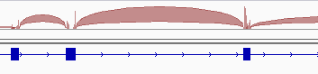
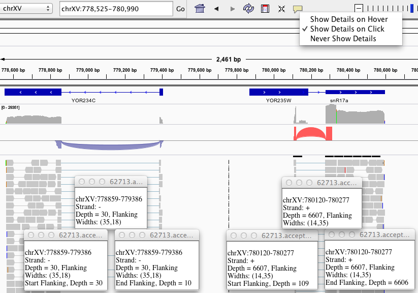
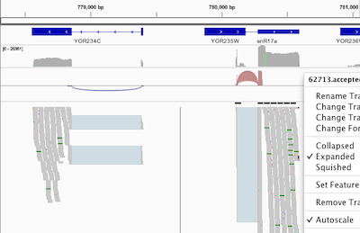

<!---
The page title should not go in the menu
-->

 RNA-seq data 

# Splice junction track

IGV supplements each alignment track with (1) a coverage track and (2) if selected in the [Alignment Preferences panel](Preferences#Alignments), a default splice junctions track. This page describes the default junctions track as well as independently loaded junctions data in the standard [.bed](BED) format. See [Sashimi Plot](http://www.broadinstitute.org/software/igv/Sashimi) for how to derive and manipulate interactive junction visualizations within IGV.

When enabled, IGV dynamically computes the junctions track from alignment data. The junctions track displays arcs connecting alignment blocks from a single read.  For RNA data these connections normally arise from splice junctions, thus the name _**Splice Junction Track**_.

Each splice junction is represented by an arc from the beginning to the end of the junction.

*   When available, IGV uses the "XS" tag provided by the alignment to determine strandedness. If missing, strandeness is inferred from the read strand. For paired-end data the strand of the alignment marked "first in pair" is used.
*   Junctions from the + strand are colored red and extend above the center line.
*   Junctions from the – strand are blue and extend below the center line.
*   The height of the arc, and its thickness, are proportional to the depth of read coverage up to 50 reads (first image).
    *   Display a more proportionate representation by selecting _Autoscale_ from the right-click menu (second image).

Hovering the mouse over or clicking on a junction will **display coverage information**. The first screenshot shows multiple coverage detail panels for each three components of two splice junctions on opposite strands.

*   Read depth for each end of the junction is displayed. For the red junction below, starting flank depth is 109 reads and ending flank depth is at 6606 reads.
*   Other details for a given junction's three hover elements are the same.

  

## Pop-up menu options 

Menu options are as detailed for the [Feature tracks menu](http://www.broadinstitute.org/software/igv/PopupMenus#FeatureTrack) with the following additions or differences.

| **Command** | **Description** |
| ------- | -------- |
| Collapsed   Expanded   Squished | Tracks are collapsed by default. The expanded mode breaks up the junctions track to multiple junctions tracks to minimize visual overlap. IGV does not interpret isoform information. |
| Autoscale | The height of the arc, and its thickness, are proportional to the depth of read coverage. <ul><li>By default, all junctions with more than 50 reads have the same thickness.</li><li>Select _Autoscale_ to display a more proportionate representation.</li></ul> |
| Sashimi Plot | Displays junctions information for regions within the current IGV view in a new panel with additional options. See [Sashimi Plot](http://www.broadinstitute.org/software/igv/Sashimi) for details. |
| Export Features | Download junctions track from IGV as a [.bed](BED) file. |

## Example 

This example demonstrates differential splicing

*   Start IGV and make sure _Show junction track_ is checked in the _Alignment Preferences panel_ and the _Visibility range threshold_ is set to 500.
*   Load the _Human hg19_ genome.
*   Select _File_ > _Load from Server_. In the popup window, select _Tutorials_ > _RNA-Seq (Body Map)_ > _Heart_ and _Liver_.
*   Enter _SLC25A3_ in the search bar to see an instance where the third exon is differentially spliced for the two tissues (**Screenshot** 2015.4.15).
    *   Here we have colored alignments by XS tag. The library was unstranded, and XS tag values were assigned to reads crossing junctions (in pink) using a predefined transcriptome index.

## Junctions view for BED files

The splice junction view  can also be loaded indpendent of alignments by using a modified bed format,  derived from the "junctions.bed" file produced by the [TopHat](http://tophat.cbcb.umd.edu/) program. Display details are as described in the section above.

*   This view is enabled by including a track line that specifies either _name=junctions_ or _graphType=junctions_.
*   TopHat's "junctions.bed" file includes a track line specifying _name=junctions_ by default, so no action is required for these files.

Junction files should be in the standard [.bed](<?php echo base_path(); ?>BED) format.  The _score_ field is used to indicate depth of coverage.

# Sashimi plots

Sashimi plots visualize splice junctions from aligned RNA-seq data and a gene annotation track. IGV displays the Sashimi plot in a separate window and allows for more manipulations of the plots than the [junctions track](http://www.broadinstitute.org/software/igv/splice_junctions).

1.  To view a Sashimi plot of your alignment data, first zoom out the view to contain the entire region of interest as scrolling and zooming in the Sashimi plot will be limited to this initial region.
2.  Right click on the alignment track to bring up the pop-up menu, and select _Sashimi Plot_.
3.  Select one feature track to serve as the annotation.
    1.  If there is only one possible feature track, e.g., the default RefSeq genes track loaded with the reference genome, then it is automatically loaded.
    2.  If you loaded additional feature tracks, IGV presents a dialog for you to select one for the new plot.
4.  IGV prompts you to select which alignment tracks you would like to view as Sashimi plots. Select any number and press OK.

The Sashimi plot is displayed in a separate window. The coverage for each alignment track is plotted as a bar graph. Arcs representing splice junctions connect exons. Arcs display the number of reads split across the junction (junction depth). Genomic coordinates and the gene annotation track are shown below the junction tracks.

*   Hovering the mouse over each of the exons in the feature annotation track displays additional information in a yellow tooltip.
*   Zoom in using the + button at top, and scroll by click-dragging the panel.
*   To view only those junctions which overlap a particular exon, select that exon by clicking on it.
    *   Multiple exons can be selected using ctrl + <click> and they will be highlighted as white boxes.
    *   To clear selections, click on a blank area of the annotations section of the panel.

Static images of Sashimi plots can also be generated outside IGV with sashimi\_plot, a Python tool which is part of the [MISO](http://hollywood.mit.edu/burgelab/miso/) package. Read more about sashimi\_plot [here](http://miso.readthedocs.io/en/fastmiso/sashimi.html).

## Popup menu options

| **Command**                                                                        | **Description**                                                                                                                                                                                                                                                                                                                                                                     |
|------------------------------------------------------------------------------------|-------------------------------------------------------------------------------------------------------------------------------------------------------------------------------------------------------------------------------------------------------------------------------------------------------------------------------------------------------------------------------------| 
| Set Exon Coverage Max                                                              | <ul><li>Set the minimum and maximum data range for the track to display. </li><li>Option to log scale. </li><li>Data range is shown in brackets in the top left of each track. </li><li>This option can be set on individual tracks.</li></ul>                                                                                                                                      |
| Set Junction Coverage Min                                                          | <ul><li>Set minimum junction depth to include in the display.</li><li>This option can be set on individual tracks.</li></ul>                                                                                                                                                                                                                                                        |
| Set Junction Coverage Max                                                          | <lu><li>The thickness of each junction line will be proportional to the coverage, up to this value.</li><li>This option can be set on individual tracks.                                                                                                                                                                                                                            |
| Set Color                                                                          | <ul><li>Change the color of the track.</li><li>This option can be set on individual tracks.</li></ul>                                                                                                                                                                                                                                                                               |
| Show Exon Coverage Data                                                            | <ul><li>Selected by default.</li><li>Deselect to remove exon coverage data and data track range labels.</li></ul>                                                                                                                                                                                                                                                                   |
| <ul><li>Text</li><li>Circle</li><li>None</li></ul>                                 | <ul><li>_Text_ is default and displays the junction depth in text number for each arc, as shown in the screenshot above.</li><li>_Circle_ replaces the text with a solid circle amenable to labeling.</li><li> _None_ removes all labels.</li></ul>                                                                                                                                 |
| <ul><li>Combine Strands </li><li> Forward Strand</li><li> Reverse Strand</li></ul> | A junction's strandedness is determined by the BAM file XS tag value for the split read. See the [Splice Junctions](../splice_junctions) page for more details. <ul><li> _Combine Strands_ is default and shows both + and – strand junctions. </li><li> _Forward Strand_ displays only + strand junctions. </li><li> _Reverse Strand_ displays only – strand junctions. </li></ul> |
| Save Image | Save the Sashimi plot to an image file. Specify the file format by setting the filename extension in the file save dialog to .png, .jpeg, .jpg, or .svg.                                                                                                                                                                                                                            |