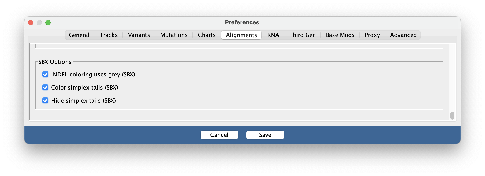
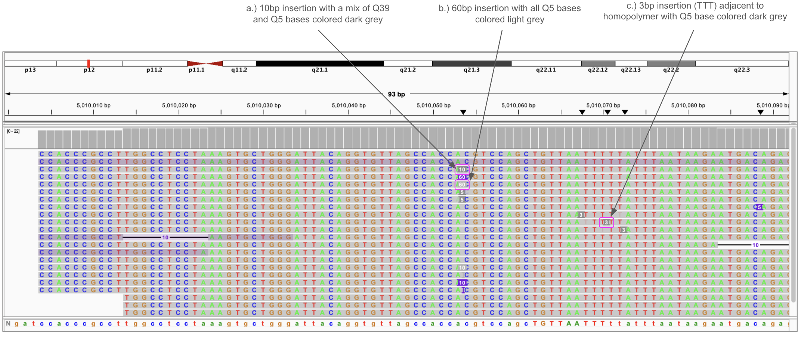
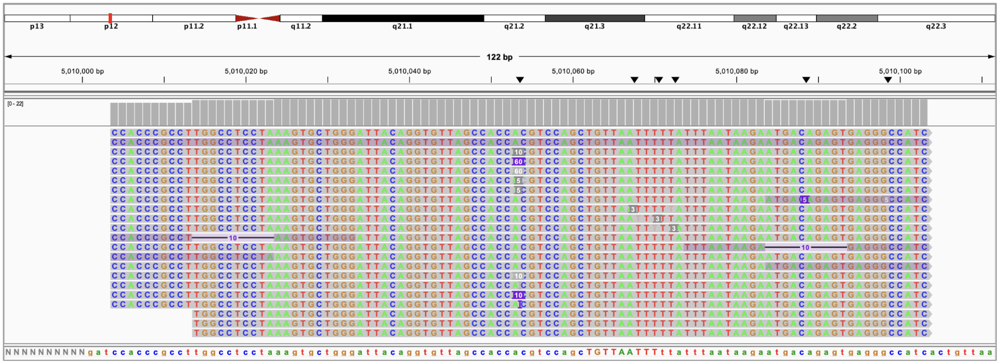
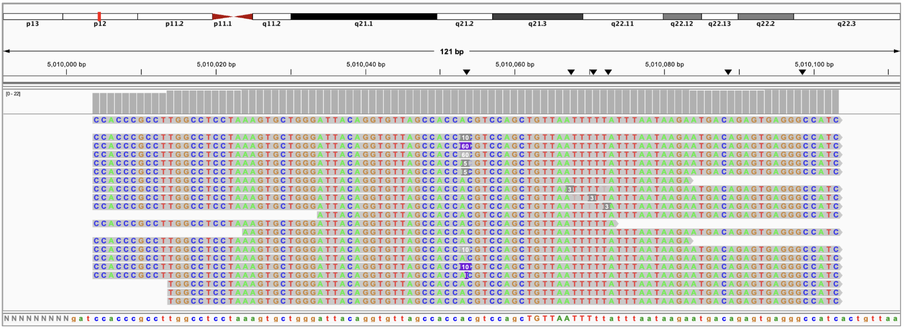

SBX alignments

This page describes additional options for viewing read alignments from Roche's Sequencing by expansion [(SBX)](https://sequencing.roche.com/us/en/article-listing/sequencing-platform-technologies.html).

## Enabling SBX options

SBX alignment options are enabled from the *Alignments* tab of the _View > Preferences_ window.  These options are applied
to alignment tracks with experiment type "SBX".

## Insertion recoloring

The _INDEL Coloring uses grey_ option enables insertions to be colored based on the base qualities of the inserted bases and the bases adjacent to them. By default, the color of insertions will be purple. However, there are two alternate colors which will be used if some or all of the relevant bases are discordant, meaning that the two sequencing reads of the hairpin duplex molecule disagreed on that base:

1. Light grey (#b4b4b4) is used if all inserted bases are discordant (denoted by having base quality less than or equal to 10).
2. Dark grey (#8c8c8c) is used if at least one inserted base is discordant, or if either of the following is true:
    - A base immediately adjacent to the insertion is discordant.
    - There is a homopolymer substring of the read which fully contains the insertion and which has at least one discordant base.

A few examples of this recoloring can be seen in the image below:  

## Coloring or hiding SBX simplex tails

Some SBX reads will have a simplex tail, where one read of the hairpin molecule extends past the other. This results in the entire end of the read being based on a single sequencing pass rather than the consensus of two passes. The bases in these tails have base qualities between those of concordant bases and discordant bases, and can be either highlighted or hidden with the SBX-specific IGV options of _Simplex tail coloring_ and _Hide simplex tails_. When these options are enabled, IGV detects tails on either end of reads which have base qualities in the range [10, 30], and can either highlight them in pink or hide them entirely.
  
Example of highlighting simplex tails: 

Example of hiding simplex tails: 

