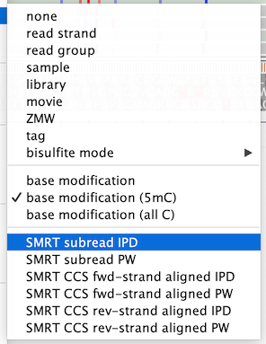
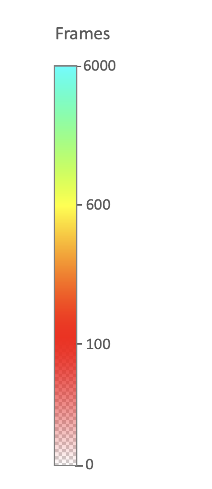

SMRT kinetics color options

This page describes  coloring options for PacBio SMRT kinetics.

## Enabling SMRT kinetics coloring

SMRT kinetics coloring is enabled from the *Third Gen* tab of the user preferences window.  When enabled, SMRT kinetics 
options appear in the *Color By* list of the alignment track menu

## SMRT kinetics color options

**SMRT subread IPD**

For subread or CLR sequences, color bases according to the IPD value found in the BAM record’s `ip` tag. No color is
applied to reads where this tag is not found.

**SMRT subread PW**

For subread or CLR sequences, color bases according to the PW value found in the BAM record’s `pw` tag. No color is
applied to reads where this tag is not found.

**SMRT CCS fwd-strand aligned IPD**

For CCS sequences, color bases according to the IPD value of the CCS strand aligned in the forward orientation. This
will display values from the BAM record’s `fi` tag or `ri` tag, for reads aligned in the forward or reverse orientation,
respectively. No color is applied to reads where the expected tag is not found.

**SMRT CCS fwd-strand aligned PW**

For CCS sequences, color bases according to the PW value of the CCS strand aligned in the forward orientation. This
will display values from the BAM record’s `fp` tag or `rp` tag, for reads aligned in the forward or reverse orientation,
respectively. No color is applied to reads where the expected tag is not found.

**SMRT CCS rev-strand aligned IPD**

For CCS sequences, color bases according to the IPD value of the CCS strand aligned in the reverse orientation.
This will display values from the BAM record’s `ri` tag or `fi` tag, for reads aligned in the forward or reverse
orientation, respectively. No color is applied to reads where the expected tag is not found.

**SMRT CCS rev-strand aligned PW**

For CCS sequences, color bases according to the PW value of the CCS strand aligned in the reverse orientation. This
will display values from the BAM record’s `rp` tag or `fp` tag, for reads aligned in the forward or reverse orientation,
respectively. No color is applied to reads where the expected tag is not found.

**SMRT kinetics color key**

All SMRT kinetics coloration options adjust the color to scale with the frame count. From 0 to 100 frames the color is
set to red and the alpha channel is adjusted from 0 to 255 (from transparent to opaque). From 100 to 600 frames,
the color is adjusted from red to yellow. From 600 to 6000 frames the color is adjusted from yellow to cyan.

{width=200}

## References

**SMRT kinetics terms**

- SMRT – single molecule real-time sequencing
- CCS – circular consensus sequencing
- IPD – interpulse duration – the number of camera frames between pulse signals
- PW – pulse width – the number of camera frames comprising a pulse signal

**Bam format documentation**

Description of SMRT kinetics tags in subread BAM files:
 
[https://pacbiofileformats.readthedocs.io/en/11.0/BAM.html#use-of-read-tags-for-per-read-base-information](https://pacbiofileformats.readthedocs.io/en/11.0/BAM.html#use-of-read-tags-for-per-read-base-information)

Description of SMRT kinetics tags in CCS BAM files:
 
[https://pacbiofileformats.readthedocs.io/en/11.0/BAM.html#use-of-read-tags-for-hifi-per-read-base-kinetic-information](https://pacbiofileformats.readthedocs.io/en/11.0/BAM.html#use-of-read-tags-for-hifi-per-read-base-kinetic-information)
