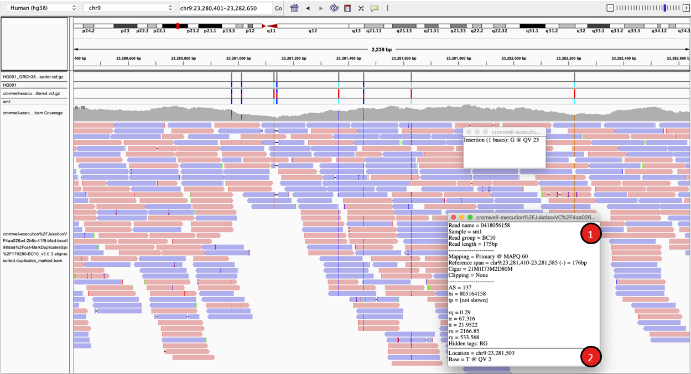
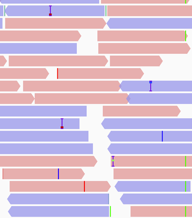
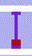
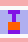
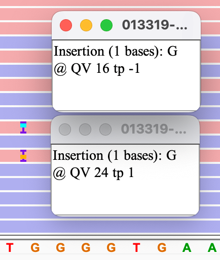
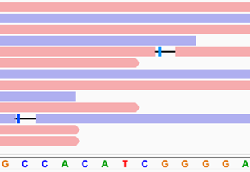
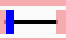
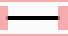
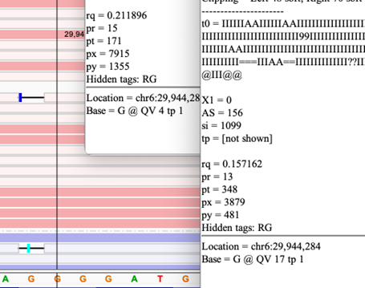

UG alignments

This page describes additional options for viewing read alignments from the Ultima Genomics (UG) platform.

In UG's flow sequencing, each base is representing a homopolymer with length > 0. Each homopolymer is assigned with quality that represents the probability of calculating the length correctly. For more information about flow sequencing, please see [this preprint](https://www.biorxiv.org/content/10.1101/2022.05.29.493900). 

The IGV view of variants in UG data includes additional graphical and information boxes. These graphical indications provide information about the quality of the base and variant. 

<!---
**Example:** 

**1.** Read information: Variant quality and location 

**2.** Feature description: Insertion or Deletion, count of bases in event, Quality, and direction
-->

## Exploring variants with enhanced flow features 

### Insertions 

Base insertions in UG data are marked with a bar drawn across IGV's vertical insertion mark, with bar color ranging from red to blue.

{width=320}.

Red bars -  - indicate high quality/probability for an insertion.
 
Blue bars -  - indicate low quality/probability for an insertion.

Clicking on the feature will open a pop-up window with extra information about the event: 

* Base count, 
* Base letter, 
* Variant quality (QV): The FASTQ Phred quality value. Ranges between 0 to 40.
* Direction value (TP): 
    * Positive: Probability for insertion of additional base(s), 
    * Negative: Probability for insertion of fewer bases. 
    * Zero: Very low probability for error.

**Examples:**

The following screenshot shows insertions with different probabilities and different directions.  The top example shows a lower quality single base call with probability for no insertion (no extra G, ‘-1’). The bottom examples shows a higher quality single base call with probability of insertion of additional base (Additional G, ‘1’)

{width=320}

### Deletions

Base deletions in UG data are marked with a bar drawn across IGV’s black horizontal deletion line.
Quality of deletions is represented by color and position of the bar.

.

Red bars -  - indicate high quality deletion.

Blue bars -  - indicate low quality deletion.

 no bar – non h-mer indel.

Exploration of the first or last base of the homopolymer next to the deletion reveals more information about the deletion. Click on the base to the right of the deletion to get the info pop-up. If the quality of the deletion is low, expect to see a base with a lower QV value and a TP value > 1 indicating probable extra homopolymer length next to the loci of the called deletion. 

For deletions:

* Direction value (TP): 
    * Positive: Probability for deletion of additional base(s).
    * Negative: Probability for deletion of fewer bases. 
    * Zero: Low probability for error. 

** Examples of deletions with different error directions and qualities **

