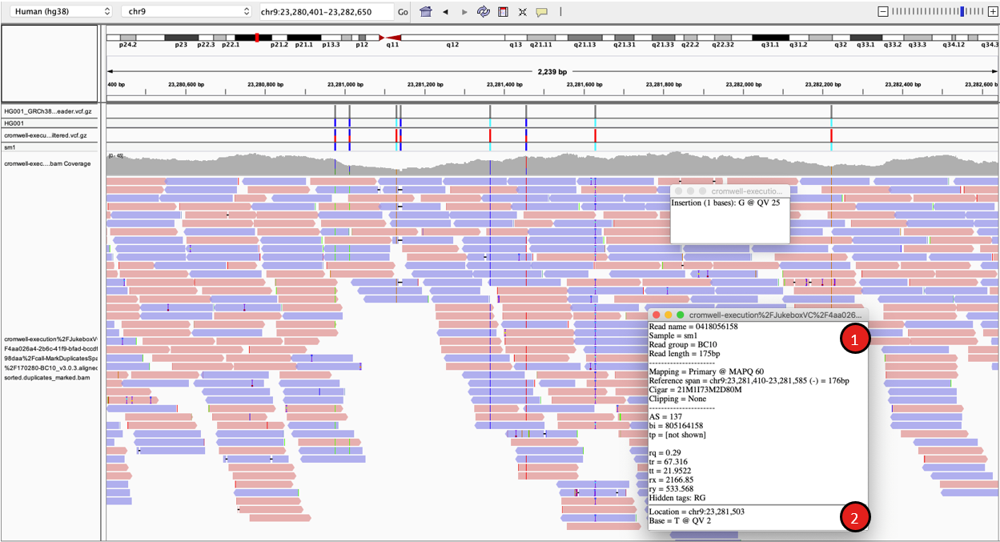
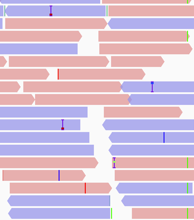
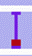
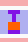
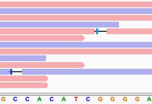
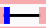
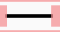
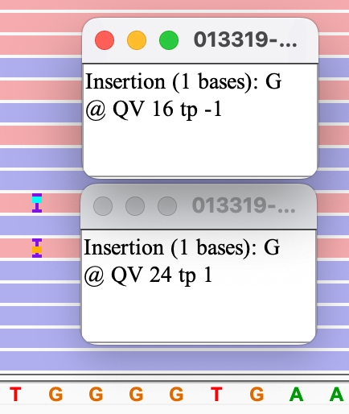
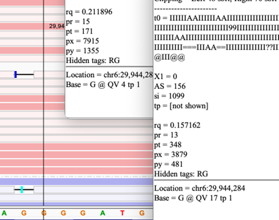

Ultima indel coloring

This page describes indel coloring of Ultima Genomics (UG) flow-based reads. 

In flow sequencing, each base is representing a homopolymer with length > 0. Each homopolymer is assigned with quality that represents the probability of calculating the length correctly. UG IGV view of variant calling includes additional graphical and information boxes on top of what is already available in IGV. These graphical indications provide information about the quality of the base and variant. 

For more information about flow sequencing, please see [this preprint](https://www.biorxiv.org/content/10.1101/2022.05.29.493900). 

**Example:** 
. 

1. Read information: Variant quality and location 
2. Feature description: Insertion or Deletion, count of bases in event, Quality, and direction  

## Insertion graphic features
{width=320}.

Base insertions are marked with a color range of red to blue boxes. 

Red -  - indicate high quality/probability for an insertion

Blue -  - indicate low quality/probability for an insertion

## Deletion graphic features

.

Base deletions are marked as horizontal bars, with a box color ranging between red to blue. 

Red -  - indicate high quality deletion 

Blue -  - indicate low quality deletion 

 no box – non h-mer indel. 

## Exploring data with enhanced flow features 

### Insertions 

Quality of insertions is represented by color and position of the bar across IGV’s vertical insertion mark. Ranging from Blue – low to Red – High. Bars represent the probability/quality of the call. Click on the feature will open a pop-up window with extra information about the event: Base count, Base letter, Variant quality and direction of error.  

Variant quality (QV) is the FASTQ phred quality values, ranges between 0 to 40. 

Direction value (TP) – Positive: Probability for insertion of additional base(s), Negative: Probability for insertion of fewer bases. Zero – Very low probability for error. 

**Example:** 

{width=320}

Insertions with different probabilities and different directions 

Top – Lower quality single base call with probability for no insertion (no extra G, ‘-1’) 

Bottom – Higher quality single base call with probability of insertion of additional base (Additional G, ‘1’) 

### Deletions

Quality of deletions is represented by color and position of the bar across IGV’s deletion mark 

Ranging from Blue – low to Red – High. Bars represent the quality of the call. 

Use: Exploration of the first or last base of the homopolymer next to the deletion reveals more information about the deletion. Right click on the base right to the deletion to get the info pop-up. If the quality of the deletion is low, expect to see a base with lower QV value and TP value > 1 indicating probable extra homopolymer length next to the loci of the called deletion. 

Direction value (TP) – Positive: Probability for deletion of additional base(s), Negative: Probability for deletion of fewer bases. Zero – low probability for error. 

** Examples of deletions with different error directions and qualities **

