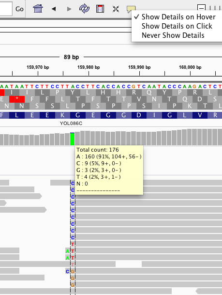
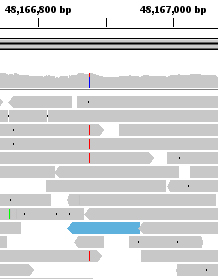
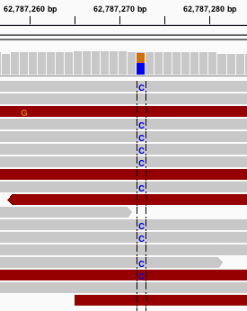
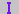
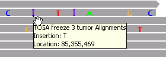

<!---
The page title should not go in the menu
-->

 Alignment track basics 

# File formats

Aligned reads from sequencing can be loaded into IGV in the [BAM](<?php echo base_path(); ?>BAM) format, [SAM](<?php echo base_path(); ?>SAM) format, or [CRAM](http://<?php echo base_path(); ?>CRAM) format.

IGV requires that BAM and CRAM files have an associated index file.

*   The main data file must include the _.bam_ or ._cram_ extension.
*   The index file should have the same filename but with the _.bai_ or ._crai_ extension. For example, the index file for _test-xyz.bam_ would be named _test-xyz.bam.bai_, or alternatively _test-xyz.bai_.
*   When loading by URL, the URL to both the data file and the index file should be specified.
*   When loading by file, IGV automatically searches for the index file within the same directory as the data file.

If you receive a .bam file from a sequencing facility, you will usually also get the corresponding index file. If you need to create the index yourself, there are multiple tools available for indexing BAM files, including [igvtools](../../tools/igvtools_ui.md), the [samtools](http://www.htslib.org) package, and the [Picard.SortSam](http://www.broadinstitute.org/cancer/software/genepattern/modules/docs/Picard.SortSam/4) module in [GenePattern](http://www.broadinstitute.org/cancer/software/genepattern/).

# Tracks

Loading an alignment file creates up to 3 associated tracks:

*   Coverage Track to view depth of coverage
*   Alignment Track to view individual aligned reads
*   Splice Junction Track which provides an alternative view of RNA-seq reads spanning splice junctions (see the section on [RNA-seq data](rna_seq.md)) 

By default the Alignment and Coverage tracks are initially displayed. This setting can be altered from the Alignments tab of the Preferences window.  Also, showing or hiding individual tracks can be controlled with track popup menus.

Note: If hiding the Alignment track by default you might also consider the setting to create all tracks in a single panel. This is in the General tab of the Preferences window.

# Coverage track

By default IGV dynamically calculates and displays the default coverage track for an alignment file. When IGV is zoomed to the alignment read visibility threshold (by default, 30 KB), the coverage track displays the depth of the reads displayed at each locus as a gray bar chart. If a nucleotide differs from the reference sequence in greater than 20% of quality weighted reads, IGV colors the bar in proportion to the read count of each base (A, C, G, T).

*   Override the default threshold for an individual coverage track by right-clicking the track and selecting_Set allele frequency threshold_. For example, set the value to .3 to change the threshold to 30%.
*   To change the default for all coverage tracks, set the value _Coverage allele-fraction threshold_in the_Alignments_ tab under _View > Preferences_. The preferences also include the option to disable quality weighting.

View **count details** by hovering the mouse over a coverage bar. Copy the count details to your computer's clipboard from the right-click menu.

## Pre-computed Coverage Data

The dynamically calculated coverage data can be augmented by loading pre-computed coverage data from a file. When this option is used the track displays coverage at all zoom levels including at the whole genome and chromosome view. To generate the extended coverage data file ending in [TDF](http://www.broadinstitute.org/software/igv/TDF) extension, use [igvtools](<?php echo base_path(); ?>igvtools). The resulting file can be associated with the alignment track by file naming convention or loaded independently from the track popup-menu.

*   To associate a coverage track using filename, the track must be named <alignment file name.extension>.tdf, and placed in the same directory as the alignment track.

    *   For example, the coverage track for test.bam would be named test.bam.tdf. IGV loads this coverage track automatically when test.bam is loaded.

*   To dynamically associate coverage data with a BAM track, right-click on the coverage track and choose _Load pre-computed coverage data_ from the pop-up menu.

# Alignment track

This section gives an overview of the alignment track. For options available from the alignment track menu, including grouping, sorting and coloring options, see the alignments section of the [pop-up menu](<?php echo base_path(); ?>PopupMenus#AlignmentTrack) page.

*   When zoomed in to the alignment read visibility threshold, by default 30 KB, IGV shows the reads. The default visibility range threshold can be changed in the [Alignment Preferences panel](<?php echo base_path(); ?>Preferences#Alignments).

 

*   When zoomed in sufficiently, IGV can display a **line at the center of the display.** At higher resolutions, the center line becomes two lines that frame the bases centered in the display, as shown in the figure above.
    *   The framed bases are the basis for _Sort by_ operations for alignment tracks (see details below).
    *   Enable the display of the center line by setting the _Show center line_ property in the [Alignment Preferences panel](<?php echo base_path(); ?>Preferences#Alignments).

### Color and Transparency for Individual bases

By default, read bases that match the reference are displayed in gray. Read bases that do not match are color coded, and insertions and deletions within reads relative to the reference are marked. Insertions are indicated by a purple _I_ () and deletions are indicated with a black dash (**–**). In addition, mismatched bases are assigned a transparency value proportional to the read quality known as the [phred](http://en.wikipedia.org/wiki/Phred_quality_score) score. This has the effect of de-emphasizing low quality reads.

*   To color code all bases, regardless of whether they are mismatched, right-click the track and select _Show All Bases_ from the [pop-up menu](<?php echo base_path(); ?>PopupMenus#AlignmentTrack).
*   To mark insertions greater than a specified size with a red _I_, select and specify the size cutoff for the _Flag insertions larger than_ parameter in the [Alignment Preferences panel](<?php echo base_path(); ?>Preferences#Alignments). This is a new feature starting with IGV v2.3.46, released March 2015.
*   Transparency shading of quality can be turned off temporarily from the [pop-up menu](<?php echo base_path(); ?>PopupMenus), or persistently from [Alignment Preferences panel](<?php echo base_path(); ?>Preferences#Alignments).
*   To change the default nucleotide coloring scheme for reads, see [Modify the prefs.properties file](http://www.broadinstitute.org/software/igv/prefs.properties).

### Transparency for Mapped Reads

Note that alignments that are displayed with light gray borders and transparent or white fill, as shown in the screenshot, have a mapping quality equal to zero. Interpretation of this mapping quality depends on the mapping aligner as some commonly used aligners use this convention to mark a read with multiple alignments. In such a case, the read also maps to another location with equally good placement. It is also possible the read could not be uniquely placed but the other placements do not necessarily give equally good quality hits.

### Insertions

In a gapped alignment, IGV indicates insertions with respect to the reference with a purple _I_ (; ?>sites/cancerinformatics.org.igv/files/images/icon_insertion.jpg)) or red _I_ for insertions greater than a user activated and specified cutoff. Hover over the insertion symbol to view the inserted bases.

### 

### Deletions

In a gapped read, IGV indicates deletions with respect to the reference with a black bar.

### Coloring and Sorting Alignments

Users can also specifiy color and also sort reads by various options, including start location, strand, nucleotide, mapping quality, sample tag, or read group tag. For a description of all user-specified color and sort options, see the alignment track [pop-up menu](<?php echo base_path(); ?>PopupMenus#AlignmentTrack).

For example, to sort alignments:

1.  Right-click a track for the pop-up menu.
2.  Select a _Sort_ option from the pop-up menu. IGV sorts the alignments that intersect the locus at the center of the track, no matter where the cursor was located for the right-click. To display a line down the center of the track, set the _Show center line_ property in the [Alignment Preferences panel](<?php echo base_path(); ?>Preferences#Alignments).

Sorting rearranges rows so that alignments that intersect the center of the display appear in the order specified. This can cause the alignment layout away from the center line to appear sparse.  To restore the layout to an optimally packed configuration, select _Re-pack alignments_ from the [pop-up menu](<?php echo base_path(); ?>PopupMenus#AlignmentTrack).

Repeat the most recent sort with hotkey _ctrl-s_.

# Visibility range threshold and downsampling

IGV reduces memory usage in the following two ways to improve performance of viewing alignments.

*   A **visibility range threshold** defines the size of the region in view at which alignments are loaded. If the region is view is larger than this threshold, no alignments are visible. Default: 30 kb  

*   In areas of deep read coverage, by default the **reads** **are downsampled**, i.e. not all the reads are displayed. The level of downsampling is controlled with the parameters:
    *   Max read count; default 100
    *   Per window size; default 50 bases

You can adjust the above settings in the [Alignment Preferences panel](https://software.broadinstitute.org/software/igv/Preferences#Alignments). For example, for lower coverage data, you can provide a larger visibility range threshold. Or for deep coverage, you might want to provide a smaller visibility range threshold and adjust the downsampling to show more reads.

Downsampled reads areas are marked with a black rectangle just under the coverage track. The coverage track represents coverage for _all_ the reads.

In the example shown, the downsampled regions are marked by seven black rectangles just under the coverage track.

