<!---
The page title should not go in the menu
-->

 Alignments basics 

# File formats

Aligned reads from sequencing can be loaded into IGV in the [BAM](<?php echo base_path(); ?>BAM) format, [SAM](<?php echo base_path(); ?>SAM) format, or [CRAM](http://<?php echo base_path(); ?>CRAM) format.

BAM and CRAM files are required to have an **associated index file**.

*   The main data file must include the _.bam_ or ._cram_ extension.
 
*   The index file should have the same filename but with the _.bai_ or ._crai_ extension. For example, the index file for _test-xyz.bam_ would be named _test-xyz.bam.bai_, or alternatively _test-xyz.bai_.

*   When loading by URL, the URL to both the data file and the index file should be specified.

*   When loading by file, IGV automatically searches for the index file within the same directory as the data file.

If you receive a .bam file from a sequencing facility, you will usually also get the corresponding index file. If you need to create the index yourself, there are multiple tools available for indexing BAM files, including [igvtools](../../tools/igvtools_ui.md), the [samtools](http://www.htslib.org) package, and the [Picard.SortSam](http://www.broadinstitute.org/cancer/software/genepattern/modules/docs/Picard.SortSam/4) module in [GenePattern](http://www.broadinstitute.org/cancer/software/genepattern/).
    
# Experiment type

When an alignment file is loaded, the details of the file are examined to determine the **experiment type**: 

* *RNA* (RNA sequencing)
* *3rd Gen* (third generation / long read sequencing, e.g. from PacBio and Oxford Nanopore Technologies)
* *Other* (e.g. Illumina short read DNA sequencing) 

The experiment type can also be set directly for a loaded file by right-clicking on the track and selecting one of the above values from the *Experiment Type* section of the pop-up menu. 

Some track defaults and available options in the track pop-up menu are determined by the experiment type. The *View > Preferences* window has three tabs of alignment preferences. The *Alignments* tab is for all general preferences and the *RNA* and *Third Gen* tabs are for attributes that are unique to those experiment types and general preferences that have different default values for those experiment types.

# Visibility window

A typical alignment file is too large to fit into the IGV application memory. Instead, alignments are loaded only for the region in view, as long as the region is not too large. A **visibility range threshold** defines the window size at which alignments are loaded and visible. If the region in view is larger than this threshold, no data is visible. The track will display a message indicating you need to zoom in to a smaller region to see the data.

The default value for the visibility range threshold depends on the *Experiment Type*:

* *RNA*: 300 kilobases
* *3rd Gen:* 1000 kilobases
* *Other*: 30 kilobases 

You can adjust the above settings in the *View > Preferences* window. Click on the *RNA* tab to set the default threshold for RNA-seq data; the *Third Gen* for long-read data; and *Alignments* for other sequening types. 

!!! tip " "
    If you have low coverage data, you can provide a larger visibility range threshold. Or for deep coverage, you might want to provide a smaller visibility range threshold.

# Track types

Loading an alignment file creates up to three associated tracks:

*   **Coverage Track** to view depth of coverage

*   **Alignment Track** to view individual aligned reads

* **Splice Junction Track** which provides an alternative view of **RNA-seq** reads spanning splice junctions (see the section on [RNA-seq data](rna_seq.md)) 

By default, the Alignment and Coverage tracks are initially displayed for experiment type *Other* and *3rd Gen*. For RNA-seq data, the *Splice Junction Track* is also displayed by default.

To **hide (or show) selected** tracks, right-click on the track to bring up the pop-up menu and uncheck (or check) *Show Alignment Track* / *Show Coverage Track* / *Show Splice Junction Track*.

To **change the default setting for all tracks**, select the *Alignments* tab (or the *RNA* tab for RNA-seq data tracks) of the *View > Preferences* window, and uncheck or check the boxes for *Show alignment track* / *Show coverage track* / *Show junction track*. 

# Coverage track

## Dynamic vs. pre-computed

By default, IGV **dynamically calculates** the coverage for an alignment file and displays the number of reads (depth) at each locus as a bar chart.

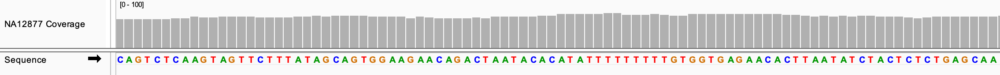

!!! note " "
    When the view is larger than the visibility window, the **dynamic coverage track is blank** because the alignments have not been loaded and therefore the coverage cannot be computed. 

Alternatively, you can provide a file containing **pre-computed coverage data**. When this option is used, the track displays coverage at **all zoom levels** including at the whole genome and chromosome view. To generate the extended coverage data file, use the [igvtools](../tools/igvtools_ui.md) **count** command on the alignment file to create a TDF file. The resulting file can be associated with the alignment track by one of the following:

* Right-click on the coverage track and choose _Load pre-computed coverage data..._ from the pop-up menu.

* To automatically load the pre-computed coverage when the corresponding alignment file is loaded, name the coverage file `<alignment file name.extension>.tdf`, and place it in the same directory as the alignment file. For example, the coverage file for *test.bam* would be named *test.bam.tdf*. 

## Data range

A coverage track's data range specifies the Y-axis for the coverage bar chart. The data range for the coverage track can be set in the same way as for [quantitative data tracks](../../quantitative_data/#data-range).

## Color scheme

If all the reads at a locus match the reference genome, the coverage bar is grey (or whatever the current setting is for the coverage track color). However, color is used to highlight mismatches to the reference. If a nucleotide differs from the reference sequence in greater than 20% of quality weighted reads, the bars are colored in proportion to the read count of each base.

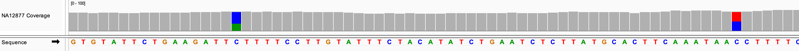

To **override the default threshold** of 20%, do one of the following:

*   To override the threshold for an **individual** coverage track, right-click on the track and select _Set allele frequency threshold..._. For example, set the value to 0.3 to change the threshold to 30%.

*   To change the default for **all** coverage tracks, set the value _Coverage allele-fraction threshold_ in the _Alignments_ tab of the _View > Preferences_ window. 

To **disable quality weighting**, uncheck the *Quality weight allele fraction* checbox in the *Alignments* tab of the *View > Preferences* window.

To **change the base color of the bar chart**, right-click on the coverage track and select *Change Track Color...* from the pop-up menu.

To **view the read count details** at a locus, click on a coverage bar (or hover over the bar if you have set the info popup text to display on hover rather than click). To **copy** the count details to your computer's clipboard, right-click on the bar and select *Copy Details to Clipboard*.

In the following example, you can see the details include the locus, the counts for each nucleotide, and the split between reads on the negative and positive strand.

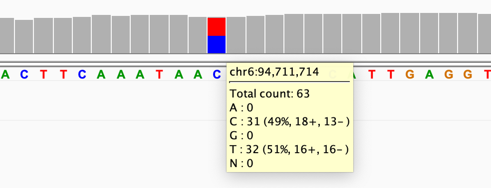{width=400}

# Alignment track

## Alignments

The alignments are loaded and displayed when the region in view is smaller than the [visibility window](#visibility-window) threshold. When the region in view is too large, the alignment track will be blank except for a message informing you to zoom in to a smaller region to see the alignments.

At the default threshold, the view can provide a good overview of the alignments but individual aligned reads are not easily discernable.
 
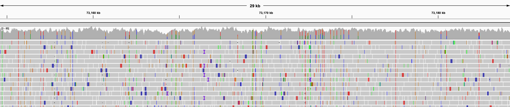

When zoomed further in, the alignments appear as horizontal bars with a point on one end to indicate the direction of the read.
 
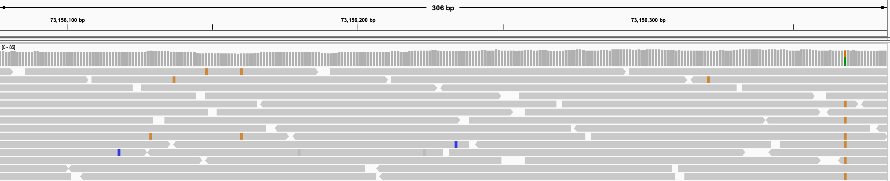

Alignment files include detailed information about each aligned read. To retrieve these details for an alignment:

* Click on an alignment to **see the details** in a pop-up window. 

    !!! tip " "
        You can change the behaviour of the detail pop-up window by clicking on the yellow balloon icon in the IGV toolbar.   {width=40}   For example, to quickly see the details for many alignments in succession, change the behavior from *Show Details on Click* (the default) to *Show Details on Hover*.  

* To **copy the details** to the computer's clipboard, right-click on the alignment and select *Copy read details to clipboard* from the pop-up menu.

* To **copy the read sequence** to the computer's clipboard, right-click on the alignment and select *Copy read sequence* from the pop-up menu.

The IGV display of the aligned reads uses **color, transparency, and symbols** to highlight some of the information details, as described in the sections below. You can also sort and group the alignments based on various attributes, which may help highlight patterns and anomalies in the data.
    
## Base mismatches

By default, read bases that match the reference sequence are displayed in gray (or whatever the current setting is for the alignment track color). Read bases that do not match the reference are displayed in **color**. By default, adenine (A) is green, cytosine (C) is blue, guanine (G) is yellow, and thymine (T) is red.

In addition, mismatched bases are assigned a **transparency** value that is inversely proportional to the base call's [phred](http://en.wikipedia.org/wiki/Phred_quality_score) quality score. This has the effect of de-emphasizing low quality mismatches to make the high quality mismatches stand out.

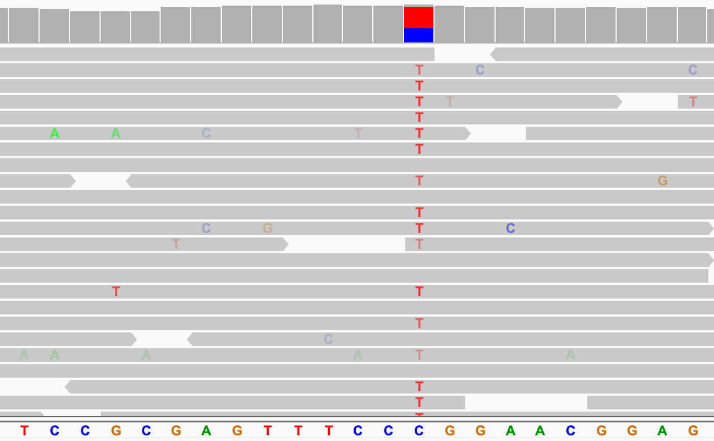{width=700}

All the values for the display of base mismatches are **user-settable**:

*   To **color code all bases** in a track, regardless of whether they are mismatched, right-click the track and select _Show all bases_ from the pop-up menu. To change it in all tracks, check the box with the same name in *View > Preferences > Alignments*.

* To **color code none of the bases** in a track, regardless of whether they are mismatched, right-click the track and click on _Show mismatched bases_ in the pop-up menu. To change it in all tracks, uncheck the box with the same name in *View > Preferences > Alignments*.

* To  **disable the transparency shading of quality** in a track, click on *Shade base by quality* in the track's pop-up menu. To disable it for all tracks, uncheck the box named *Shade mismatched bases by quality* in *View > Preferences > Alignments*. 

    The preferences window also allows you to control the **transparency range** via the parameters *Maximum transparency at base quality* (default is base quality = 5) and *No transparency above base quality* (default is base quality = 20).      

* To **change the base color of the alignments** from the default grey color, right-click in the alignment track and select *Change Track Color...* from the pop-up menu.
    
*   To change the **nucleotide coloring scheme** for reads, see the [User preferences](../../preferences.md) section.

## Indels

**Insertions** with respect to the reference genome are indicated with a purple `I`. When sufficiently zoomed in, insertions larger than one base are labeled with the size on a purple background. Hover over the insertion symbol to view the inserted bases.

In the following example, the upper screenshot shows five insertions at a zoom level where only the plain `I` can be shown. In the lower screenshot, the view has been zoomed in and we can see that each of the insertions is two bases long.

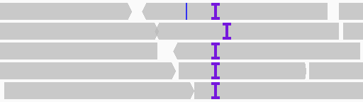{width=300}  
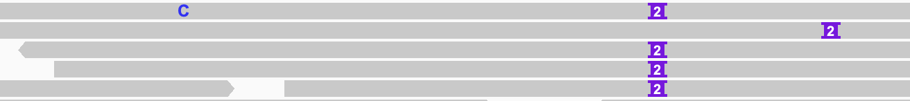{width=750}

To **disable labeling** the insertions with numbers, uncheck the box *Label indels > threshold* in the *Alignments* tab of the *View > Preferences* window.

Alternatively, you can **change the size threshold** above which insertions are labeled by setting the number in the *Label threshold (bases)* field. For example, in the above example, setting the value for *Label threshold (bases)* to 2 (or any number larger than 2) would have the effect of displaying all the insertions in the lower screenshot as the purple `I` without the number.

<!---
TBD insertion markers
-->

**Deletions** with respect to the reference genome are displayed with a black bar. The length of the bar indicates the size of the deletion. The following screenshot has three examples of single-base deletions.

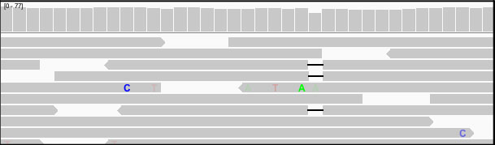

To suppress the display of **any small indel** (insertion or deletion) in a particular track, right-click on the track and select *Hide small indels*, and then select *Small indel threshold...* to specify the size threshold for "small". Any indels smaller than the threshold number are not displayed. For example to hide all the two-base insertions in the above example, the threshold must be set to 3 or more.  

## Read mapping quality

Alignments that are displayed with a transparent or white fill so they appear hollow, as shown in the screenshot below, have a **mapping quality equal to zero**. Interpretation of this mapping quality depends on the mapping aligner as some commonly used aligners use this convention to mark a read with multiple alignments. In such a case, the read also maps to another location with equally good placement. It is also possible the read could not be uniquely placed but the other placements do not necessarily give equally good quality hits.

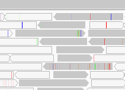

Alignments with a mapping quality greater than zero, can be **shaded based on their mapping quality**. In the track's pop-up menu click on *Shade alignments by* and then select *mapping quality high* (or *mapping quality low*) in the sub-menu to deemphasize alignments with low (or high) mapping quality by rendering them with increased transparency. To reset back to the default, select *Shade alignments by > none*. 

## Coloring alignments

Alignments can be assigned colors based on alignment attributes by clicking on *Color alignments by* in the track's right-click pop-up menu and selecting one of the options in the sub-menu. Options include attributes such as read strand, read group, and tag value. Not all options are applicable to all alignment tracks. For example, some options are specific to [paired-end alignments](paired_end_alignments.md).

The following example shows alignments colored by read strand. As can be seen in the details displayed when you click on a read (or hover over it if the pop-up text behavior has been changed), the positive strand is indicated by the pink color, and the negative strand by the purple color.

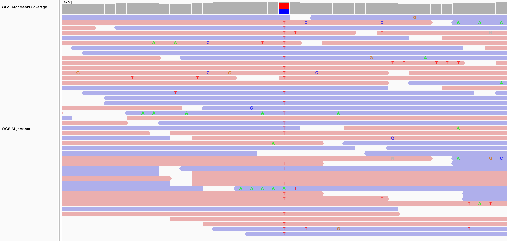

If the alignment color is set to `none`, all alignments are assigned the track color. Similarly, if the selected *Color alignments by* option is not applicable for a particular alignment, it is assigned the track color. The default alignment track color is grey. To change it, select *Change Track Color...* from the track's pop-up menu.

!!! note " "
    If the coverage track has not been assigned a specific track color, changing the alignment track color will also change the coverage track color to a darker shade of the new alignment track color.

## Grouping and sorting alignments

The horizontal placement of reads in the IGV view is determined by their aligned locus. By default, the vertical order in which the alignments are drawn has no significance; the alignments are packed into rows to minimize the screen space required to display them all. In order to see patterns and anomalies in the data, it may be helpful to group or sort the alignments by read attributes.

#### Grouping

To **group the alignments in a track**, click on *Group alignments by* in the track's pop-up menu and select one of the options in the sub-menu. Options include attributes such as read strand, read group, tag value. Not all options are applicable to all alignment tracks. For example, some options are specific to [paired-end alignments](paired_end_alignments.md).

In the following example, the alignments are both colored and grouped by read strand.

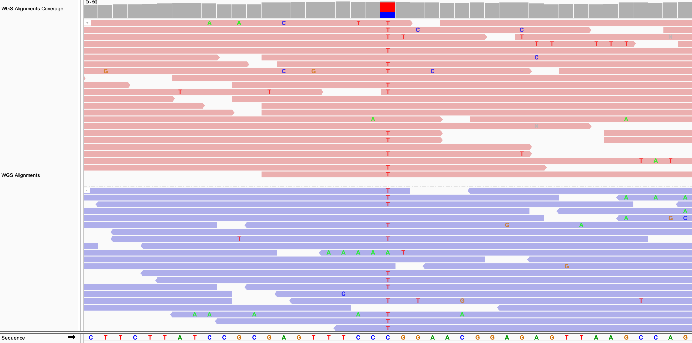

To **reverse the display of the groups**, click on *Group alignments by* and select *Reverse group order*. In the above example that would have the effect of moving the group of purple (negative strand) alignments to the top, and the group of pink (postive strand) alignments to the bottom.

To **undo a grouping** command, click on *Group alignments by* and select *none*.

A shortcut for applying the **same grouping to all alignment tracks** is provided via the *Group all tracks* option in the *Group alignments by* sub-menu. Selecting *Group all tracks* will affect all subsequent grouping commands, not any current groupings.

#### Sorting

To **sort the alignments in a track**, click on *Sort alignments by* in the track's pop-up menu and select one of the options in the sub-menu. Options include attributes such as start location, read strand, base, mapping quality. Not all options are applicable to all alignment tracks. For example, some options are specific to [paired-end alignments](paired_end_alignments.md).

The sort is performed based on the values of the selected attribute of the alignments that intersect the **locus at the center of the view**, no matter where the cursor was located for the right-click. To display a line down the center of the track, set the _Show center line_ property in *View > Preferences > Alignments*.

In the following example, the alignments are sorted by base. The putative SNP site was first centered in the view.

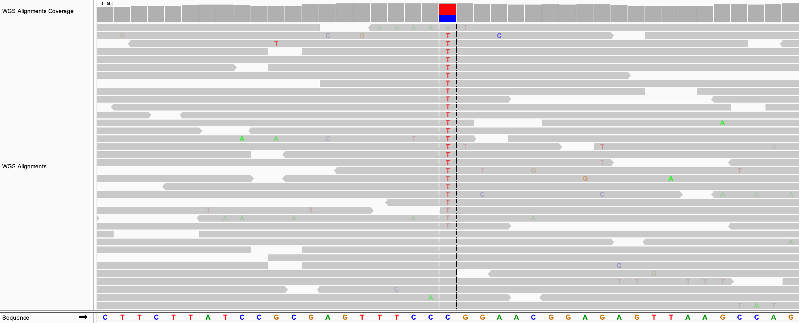

If the alignments are already grouped, the sort is applied to each group separately. In the following example, the alignments were grouped by read strand before applying the sort by base.

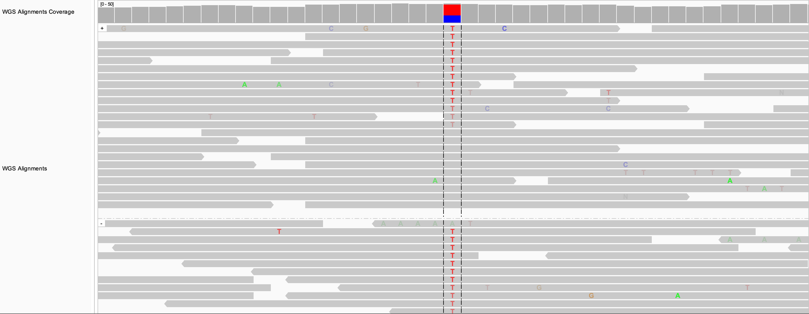

To **reverse the sort order**, click on *Sort alignments by* in the track's pop-up menu and select *reverse sorting* in the sub-menu.

!!! note " "
    The sort is an action that is **applied once** to the alignments at the center of the view. If you scroll the view or jump to a different locus, the sort is not perfomed again. Pressing `Ctrl-S` is a shortcut for performing the **same sort again** at a new locus.

To undo the sort and **restore the layout to an optimally packed configuration**, select _Re-pack alignments_ from the track's pop-up menu.

# Splice junction track

The splice junction track is described in the section on [RNA-seq data](rna_seq.md).

# Downsampling

In areas of deep read coverage, by default the **reads are downsampled**, i.e. not all the reads are displayed. This is done to reduce memory usage. The level of downsampling is controlled with the parameters:

*   Sampling window size; default 50 bases
*   Maximum number of reads per window; default 100

To change the defaults, set the values in the *Downsampling* section of the *Alignments* tab in the *View > Preferences* window. 

!!! tip " "
    If your file has deep coverage and you want to be able to see more of the reads, try decreasing the [visibilty window](#visibility-window) before you disable or decrease the downsampling. The narrower window will help keep the memory usage down.

Areas where the reads have been downsampled are marked with a black rectangle just under the coverage track, as shown in the example below. 

!!! tip " "
    The coverage track shows the coverage for **all** the reads, even when only a subset of the reads are displayed.

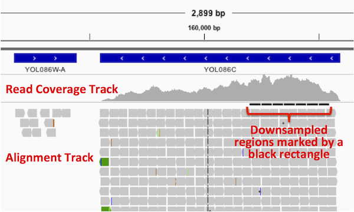{width=500}

