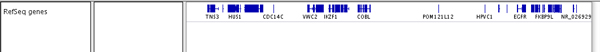
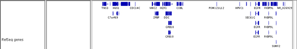
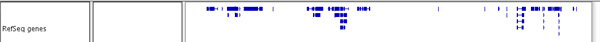
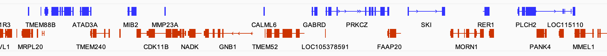

<!---
The page title should not go in the menu
-->
<p class="page-title"> Genome annotations </p>

<!---
TBD visibility window threshold; show/hide feature names (does it even work?); Set feature label field; exon jumping (does it even work? how to select one feature row?), ExtView (what is it??); maybe BLAT sequence.
-->

# File formats

File formats for genome annotations include: **bed**, **bigBed**, **gtf**, **gff**, **psl**, and the ENCODE file types **narrowPeak** and **broadPeak**. 


# Display options 

There are three different **display modes** for viewing genome annotation tracks. These allow you to display overlapping features, such as different transcripts of a gene, on one line or multiple lines.

To change the display mode, right-click on the track and select one of the options:

| Display Mode | Example |
|----------|----------|
| Collapsed |  |
| Expanded | ) |
| Squished|  |

To **group the features by negative/positive strand**:

* Select *Group by strand* in the track's right-click pop-up menu.

!!! tip " "
    When grouping by strand, it can be helpful to also provide a different color for the features on the negative strand via *Change Track Color (Negative Values or Strand)...*. 

In the following example, a gene track is grouped by strand, the track color is set to blue, the track color for the negative strand is set to red, and the display mode is set to `Collapsed`.


   

# Navigating between features

To **navigate between features** in a genome annotation track:

*  First select the track by clicking on either the track name or in the data panel. Then jump from feature to feature:

    *   Press ```Ctrl+f``` or just ```f``` to jump forward to the next feature.

    *   Press ```Ctrl+b``` or just ```b``` to jump backward to the previous feature.

By default, IGV positions the start of the next (or previous) feature at the center of the display and keeps the zoom level the same. Settings in _View > Preferences > General_ can be changed to instead center the view on the feature and zoom in/out to a level that exactly fits the feature plus some optional padding on either side.

<!---
Similarly, to **navigate between exons**:

* select a feature track and press `Shift-Ctrl-F` to center the next exon in your view,
or `Shift-Ctrl-B` to move back one exon.
DISPLAY MODE MUST BE EXPANDED AND A SINGLE FEATURE ROW IS SELECTED - HOW????
-->

# Save feature info

To **export all features currently in view** in a genome annotation track: 

* Right-click on the track and select *Export Features...* from the pop-up menu. All the features currently in view will be saved to a BED file.

To **extract information about a feature** (or exon), e.g. name, locus, etc:

* Right-click **on the feature** in the track and select *Copy Details to Clipboard*. Use your system's *Paste* command (e.g. `Command-V` on MacOS) to retrieve the information.

To **extract the reference genome sequence** of the locus of a feature (or exon):

* Right-click **on the feature** in the track and select *Copy Sequence*. Use your system's *Paste* command (e.g. `Command-V` on MacOS) to retrieve the information.