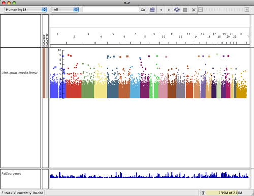
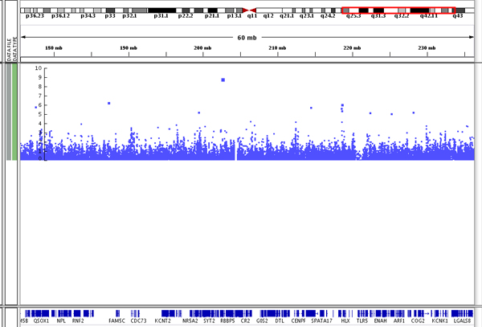
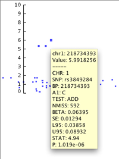
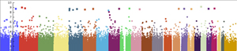
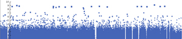
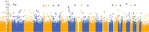

<!---
The page title should not go in the menu
-->

 GWAS 

IGV can display genome-wide association study (GWAS)  data as a *Manhattan plot*. Data
formats are described [here](../../../../FileFormats/DataTracks/#gwas).

## Manhattan plot

The GWAS Manhattan plot represents the significance of the association between a SNP or haplotype and the trait being measured. The Y-axis shows -log10 transformed *P* values, which represent the strength of association.

The size of a data point in the plot and its vertical position in the plot relate directly to its
significance: the larger the point and the higher the point on the Y-axis, the more significant the association with the trait. You can see the point size difference in the following screenshot of data on chromosome 1.

As in other parts of IGV, clicking on a data point (or hovering over it if you have set the info popup text to display on hover rather than click) allows you to see a pop-up containing the data specifically
associated with that point. You can see the pop-up for the topmost data point in this image. Note that the point's vertical position is associated with its _P_ value.

## Plot attributes

**Color scheme**

The points in the plot are colored by chromosome. Options for the color scheme include:

* Chromosome color: Each chromosome has a unique color (the default) 
    
* Single color: All chromosomes have the same color 
    
* Alternating color: Uses two colors that alternate through the chromosomes 
    

To change the **color scheme**:

* Right-click on the track and select the color scheme from the pop-up menu

To change the **colors** used by each scheme:

* Right-click on the track and select *Set primary color...* to pick the color for the single color scheme and for one of the two colors in the alternating color scheme.
* Right-click on the track and select *Set alternating color...* to pick the second color for the alternating color scheme.
* IGV has a predefined color palette for the chromosome color scheme and the colors cannot be changed.

**Point size**

The size of a data point in the plot relates directly to its significance. 

To change the size of the data points:

* Right-click on the track and select *Set minimum point size...* or *Set maximumum point size...*

**Data scale**

To define the scale of the plot's Y-axis:

* Right-click on the track and select *Set Data Range...* to set the minimum, baseline, and maximum values of the scale used for the GWAS data.

