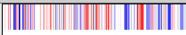
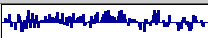
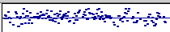
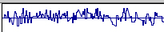
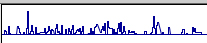
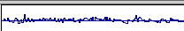
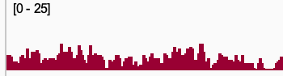
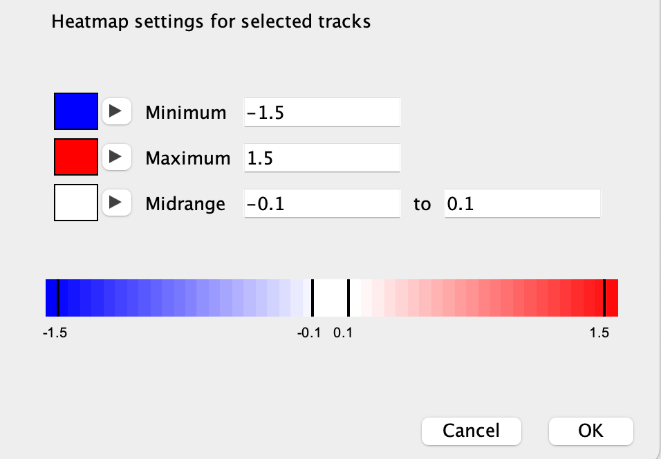
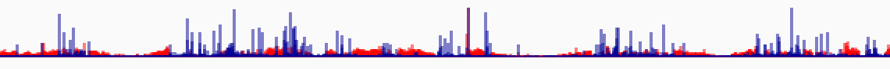

<!---
The page title should not go in the menu
-->

 Quantitative data 

# File formats

File formats for quantitative data include: **wig**, **bigWig**, **bedGraph**, **tdf**. 

# Graph type

Quantitative tracks are displayed using one of four graph types (the following example graphs show the same data):

| Graph type | Example |
|----------|----------|
| Heatmap |  |
| Bar chart |  |
| Points (Scatter plot)|  |
| Line plot |  |

To change the graph type of selected tracks:

*   Right-click a track and select a graph type from the pop-up menu.

# Data range

A track's **data range** specifies the Y-axis for the track. 

To **set a specific data range** for selected tracks:

* Select *Set Data Range...* from the pop-up menu and in the dialog window that pops up enter the minimum, baseline, and maximum values for the graph. 

The following examples show the same data in tracks with different data ranges.

| minimum, baseline, maximum | Result |
|----------------------------|--------|
| 0, 0, 3                    |  |
| -1.5, 0, 1.5 |  |
| -5, 0, 5     |  | 

To **dynamically change the data range** as you pan across the genome to maximize the display given the data currently in view and a track's height:

* Select *Autoscale* from the track's right-click pop-up menu. 
 
Similarly, to keep the data range of **multiple tracks** dynamically in sync: 

* Multi-select the tracks and then right-click on one of them and click on *Group Autoscale* in the pop-up menu.

By default, the data range uses a **linear scale**. To use a **logarithmic scale**, you can either:

* Click on the *Log Scale* checkbox in the dialog window when you set the data range values, or
* select *Log Scale* in the track's right-click pop-up menu.

By default, the minimum and maximum values of the data range are displayed on the left edge of the track. 

{width=200}

To **hide the data range values**:

* Deselect *Show Data Range* in the track's right-click pop-up menu; click in it again to re-show it. 

# Heatmap scale

To set the **heatmap colors and scale** for tracks displayed as a heatmap:

* Select *Set Heatmap Scale...* from the track right-click pop-up menu, and set the colors for the minimum data value, maximum data value, and the midrange. 

{width=380}

# Windowing function

When the view is zoomed out, each pixel on the screen may represent a genomic region that encompasses multiple numeric values in the data. The **windowing function** specifies which of the multiple values to display. To set the function, select one of the options in the *Windowing Function* section of the track right-click pop-up menu. The available options will depend on the file type, but most include: `Minimum`, `Mean`, `Maximum`, and `None`. By default, the function is set to `Mean`. The `None` option will display all the values, rather than combining them into one value, which can be useful for tracks displayed as **points**.

# Overlaying tracks

Quantitative data tracks can be combined so they are displayed together as overlaid charts in a single track. 

For example, the following two tracks:

{width=600}

can be displayed as the following single track by multi-selecting the two tracks and then selecting *Overlay Tracks* from the right-click pop-up menu.

{width=600}

!!! tip " "
    You may want to set the data ranges to be the same on the tracks before overlaying them.

Each chart is drawn with a default level of translucence so they don't completely obscure one another. Select *Adjust Transparency* from the combined track's pop-up menu to make the charts more or less opaque.

To separate the charts into the original tracks, select *Separate Tracks* from the combined track's pop-up menu.

!!! tip " "
    Quantitative data tracks can also be [combined using arithmetic operators](../tools/combine_tracks.md) via *Tools > Combine Data Tracks*.

