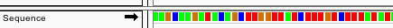
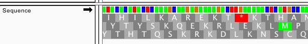

When zoomed in sufficiently, the reference genome _Sequence_ track appears at the top of the lower panel above the _
Genes_ track, if any, in the IGV display as shown in the **Screenshot** (2015.04.01). The sequence is represented by
colored bars or colored letters, depending on zoom level, with adenine in green, cytosine in blue, guanine in yellow,
and thymine in red (**A**, **C**, **G**, **T**). To change this default nucleotide coloring scheme see
the [Modify the prefs.properties file](http://www.broadinstitute.org/software/igv/prefs.properties) page.

IGV displays the sequence of bases as they appear in the FASTA file for the reference genome. In addtion to the upper
case letters A, C, G, and T, you may see lower case letters for these bases, and also N / n. Lower case letters often
mark repeated regions, and N/n may represent ambigous nucleotides. However, the convention for the use of case and N, is
not completely standardised, and depends on the creator of the genome sequence. A useful discussion about this can found
on Bioinformatics StackExchange (see for
example [response #11 on this thread](https://bioinformatics.stackexchange.com/a/231)).

Flipping the Strand
-------------------

You can change the strand that is displayed by clicking on the arrow in the title to the left of the track. Note that
the sequence and the arrow are only displayed when zoomed in to a sufficiently small region.

* Alternatively, right-click on _Sequence_ track to select _Flip strand_ from the pop-up menu.

The direction of the arrow indicates which strand is currently displayed. An arrow pointing left indicates that the
negative strand is showing. This strand will show the complement nucleotides and reverse complement translations.

Sequence Translation
--------------------

With the reference genome sequence track, you can optionally display a 3-band track that shows a 3-frame translation of
the amino acid sequence for the corresponding nucleotide sequence. The translation is shown for the strand indicated.

* Right-click on _Sequence_ track to select _Show translation_ from the pop-up menu and to select a _Translation Table_.
* Selecting _Save image_ from the right-click pop-up menu save the lower display panel containing the _Sequence_ track
  as an image. Specify the image file format by setting the filename extension in the file save dialog to .png, .jpeg,
  .jpg, or .svg.

Amino acids are displayed as blocks colored in alternating shades of gray. Methionines are colored green, and all stop
codons are colored red. When you zoom all the way in, the amino acid symbols will appear.

You can toggle the display of this translation track by clicking once, anywhere in the sequence or translation track, or
by toggling _Show Translation_ in the track popup menu.