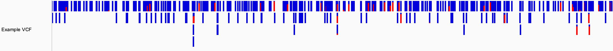
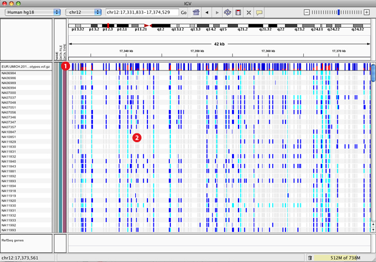
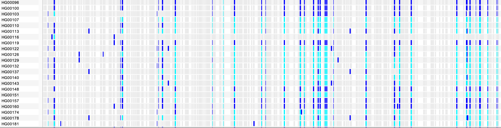
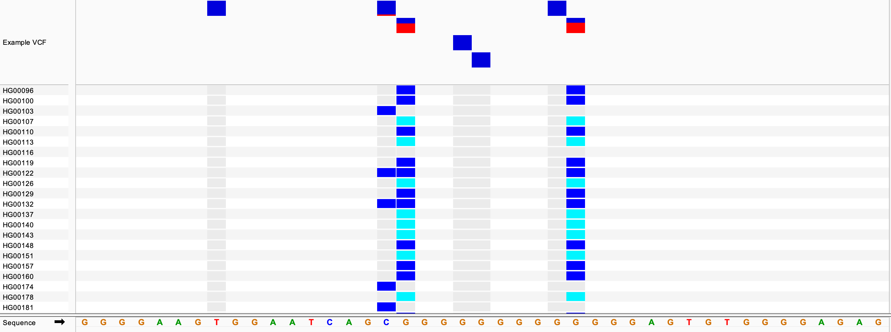
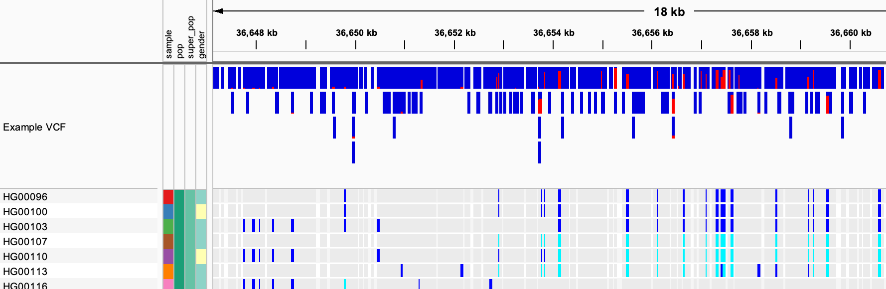
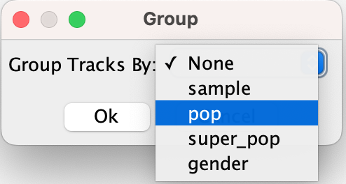
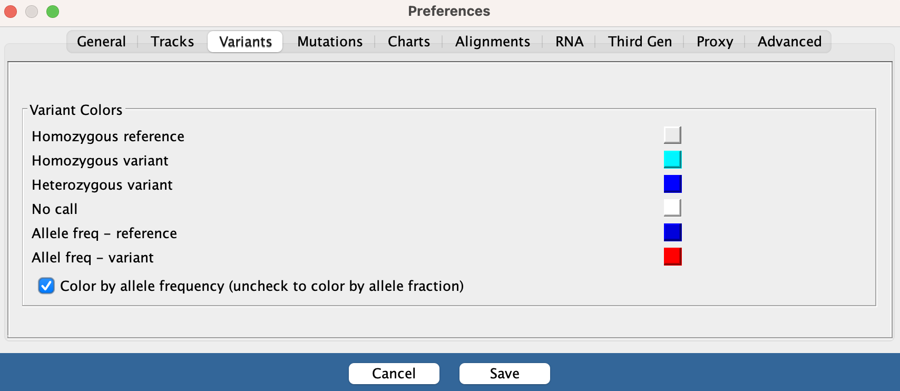

<!---
The page title should not go in the menu
-->

 Variants (VCF) 

VCF, which stands for Variant Call Format, is a standardized text file format used for representing SNP, indel, and structural variation calls. The full specification of the format can be found at [https://samtools.github.io/hts-specs](https://samtools.github.io/hts-specs).

# Variant calls and genotypes

Each **variant call** in the VCF file is displayed as a bar at the variant's locus. 

<!---

-->

In addition to variant calls, VCF files can optionally include **genotypes**. If they are included in the file, genotypes are displayed below the variant calls. Each row represents the genotypes of a singe sample, and the sample names are displayed in the name panel to the left of the data. 

Zooming in to basepair level gives a better view of individual variants. In the example below, we see the sites of several SNPs and below them some of the samples and their genotypes found in the VCF file. In this view, most of the samples are scrolled off the bottom of the data panel. The scrollbar is not visible in this screenshot.

# Sorting and grouping samples

Right-clicking **on a genotype column** will enable more entries in the pop-menu, allowing you to **sort the sample rows**:

* `Sort By Genotype` : Sorts the sample rows based on the genotype values at the variant locus of the mouse click.

* `Sort By Sample Name` : Sorts the sample rows in alphabetical order of the sample names.

* `Sort By Depth` : Sorts the sample rows based on the read depth at the variant locus. The read depth is an **optional field** and not included in all VCF files that contain samples.

* `Sort By Quality` : Sorts the sample rows based on the genotype quality. The genotype quality is an **optional field** and not included in all VCF files that contain samples.

Selecting the same sort option again will **reverse the sort order**.

Loading a [**sample attribute file**](../../FileFormats/SampleInfo.md) alongside the VCF file, provides further options to sort and group the sample rows:

* Clicking on an attribute name at the top of the attribute panel (displayed between the sample names and the data panel) will sort the sample rows by that attribute. For example, clicking on `pop` in the IGV view displayed below, will sort all the sample rows based on the *population* attribute.

    

* When a sample attribute file is loaded, the VCF track's pop-up menu includes a *Group By...* option. Clicking on it will bring up dialog window where you can select the attribute to group by in a dropdown menu.

    {width=280}

# Display mode

VCF tracks have three **display mode** options: . 

* `Collapsed` : All variant calls are displyed in one row and the genotypes are not displayed.

* `Expanded` : Uses multiple rows to display the variant calls in order to make tightly packed calls easier to distinguish and all the genotypes are displayed. The examples above are *Expanded*, which is the default.

* `Squished` : Similar to *Expanded* but each variant call row and sample row is rendered using a compressed height in order to fit more samples into the view. The height of the squished sample rows can be changed by selecting *Change Squished Row Height...* from the right-click pop-up menu.

To **change the display mode**, select a new option from the right-click pop-up menu.

To **hide the genotypes** in *Expanded* or *Squished* mode, unselect *Show Genotypes* in the track's right-click pop-up menu. To show them again, reselect *Show Genotypes* in the menu.

# Color schemes

The **variant calls** can be colored by `Allele Frequency` which is an annotation provided in the VCF file, or by `Allele Fraction` which is similar to allele frequency, but is based on the specific samples in the VCF file as opposed to an annotation. 

The variant call bars are rendered using two colors, one for the reference allele and one for the alternate allele, and the height of each section represents the frequency or fraction. By default, the variant call colors are red and blue:

* Blue = reference allele
* Red = alternate allele 

By default, variant calls are colored by `Allele Frequency`. To change the default, uncheck the box labeled *Color by allele frequency* in *View > Preferences > Variants*. To change the color mode in selected tracks only, use the right-click pop-up menu.

For the genotypes, the default colors are:

* Dark blue = heterozygous variant in the sample
* Cyan = homozygous variant in the sample
* Grey = sample matches the reference genome

To **change any of the colors**, select *View > Preferences > Variants* and click on a color swatch to bring up a color picker.

{width=600}

# Visibility window

If the VCF file is indexed, the data is only loaded when the viewing region is smaller than the current value for visibility window. If the region in view is larger than the window, the track will display: `Zoom in to see features`. The default value for the visibility window is proportional to the number of samples. To change the value, select _Set Feature Visibility Window..._ from the right-click pop-up menu and in the dialog window that pops up enter the new window size in kilobases.

