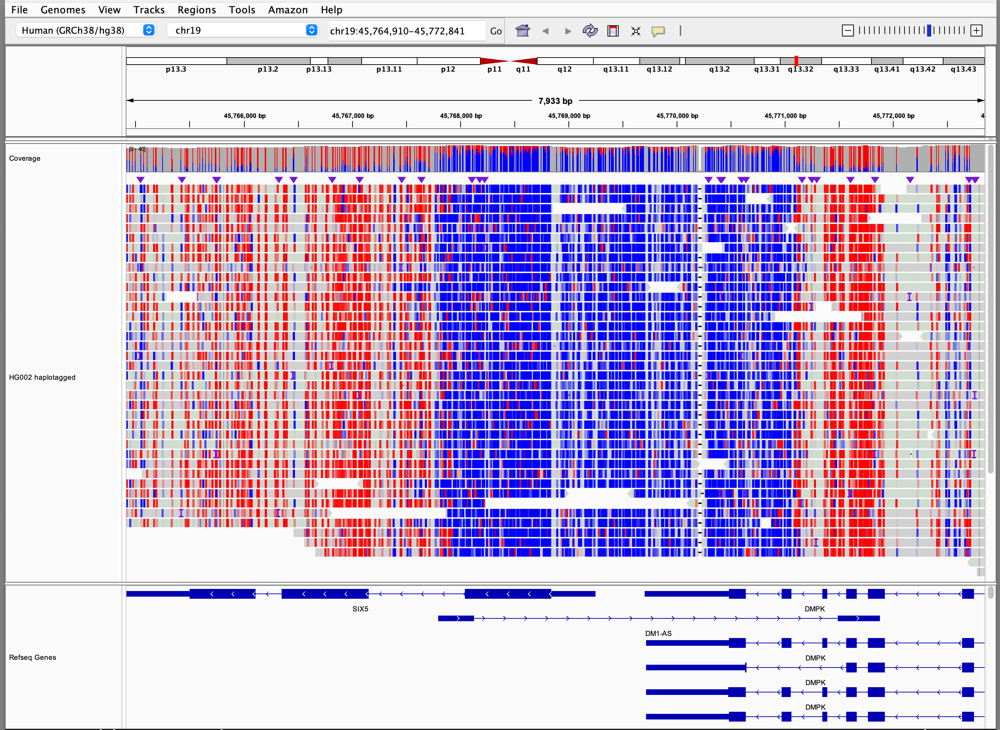

## New coloring option _**Color alignments by > base modification (5mC)**_

This alignment coloring scheme was designed to provide visualization of 5-Methylcytosine (5mC) modifications specified
with MM/ML tags that is consistent with visualization of methylation from bisulfite sequencing. In this scheme, color
for modified bases is assigned based on the probability of the modification. Specifically:

* Base modifications with probability < 50% are colored blue

* Base modifications with probability > 50% are colored red

* Alignments are colored to indicate strand

In both cases alpha transparency is applied, with the degree of transparency increasing as probability approaches 50%.
So base modifications with probability 0% are solid blue, base modifications with probability of 100% solid red.

### Example screenshots

Red bases indicate probability of 5-Methylcytosine (5mC) modification > 50%, blue indicate probability of 5mC
modification < 50%.

