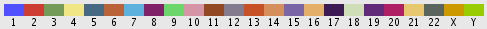
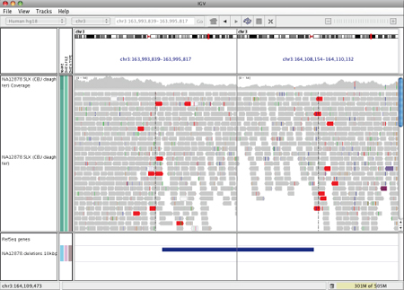
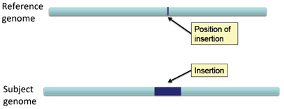
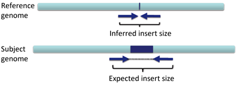
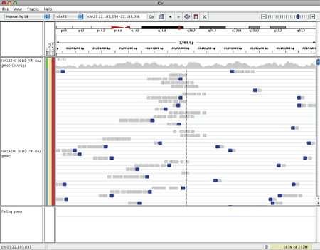
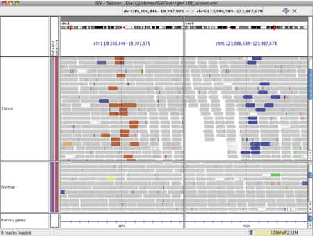

Coloring by insert size is for DNA alignments and is not designed to indicate RNA-Seq paired read mate distances. It is based on set base pair values or computed from the size distribution of a library against the reference genome as defined in the [Alignment Preferences Panel](http://www.broadinstitute.org/software/igv/Preferences#Alignments).

The inferred insert size can be used to detect structural variants, such as:

*   deletions
*   insertions
*   inter-chromosomal rearrangements

IGV uses color coding to flag anomalous insert sizes. When you select _Color alignments_\>_by insert size_ in the popup menu, the default coloring scheme is:

*    for an inferred insert size that is larger than expected (possible evidence of a deletion)
*    for an inferred insert size that is smaller than expected (possible evidence of an insertion)
*    for paired end reads that are coded by the chromosome on which their mates can be found

Deletions
---------

In a deletion a section of DNA is absent in the subject genome compared to the reference genome.

When pairs from a section of DNA spanning the deletion are aligned to the genome the inferred insert size will be larger than expected.  This is due to the deleted section of the genome, not present in the subject.  Schematically this can be visualized as follows:

So in the case of a deletion, the inferred insert size is GREATER THAN the expected insert size.   In IGV such an event might look like the following.

Reads that are colored red have larger than expected inferred sizes, and therefore indicate possible deletions.

Insertions
----------

In the case of an insertion, a section of DNA is present in the subject genome that is not represented in the reference genome.

The effect on distance between aligned pairs is opposite in the case of a deletion; the "inferred insert size" is smaller than expected.

The maximum size of an insertion detectable by insert size anomaly is limited by the size of the fragments.  They must be long enough to span the insertion and include sequences on both ends that are mapped to the reference.  The maximum detectable size is approximately equal to:

fragment length - (2x read length)

Detection of this event is therefore more likely with larger fragment libraries, such as Illumina mate-pair (not paired-end) and SOLID.

In the example above reads that are colored blue have smaller than expected inferred sizes, and therefore indicate insertions.

Inter-chromosomal Rearrangement
-------------------------------

IGV codes inserts for inter-chromosomal rearrangements.  For instance, in this case, one end is on chromosome 1 and the other is on chromosome 6.

