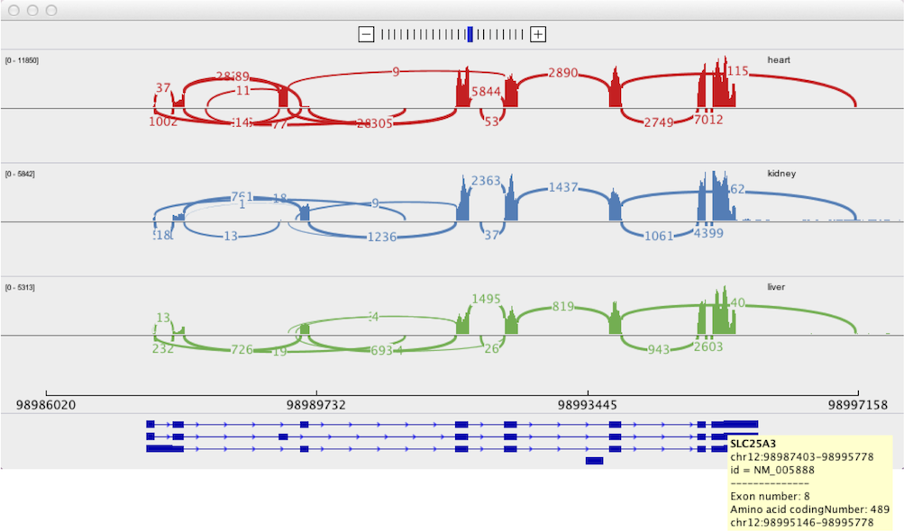

Sashimi plots visualize splice junctions from aligned RNA-seq data and a gene annotation track. IGV displays the Sashimi plot in a separate window and allows for more manipulations of the plots than the [junctions track](http://www.broadinstitute.org/software/igv/splice_junctions).

1.  To view a Sashimi plot of your alignment data, first zoom out the view to contain the entire region of interest as scrolling and zooming in the Sashimi plot will be limited to this initial region.
2.  Right click on the alignment track to bring up the pop-up menu, and select _Sashimi Plot_.
3.  Select one feature track to serve as the annotation.
    1.  If there is only one possible feature track, e.g., the default RefSeq genes track loaded with the reference genome, then it is automatically loaded.
    2.  If you loaded additional feature tracks, IGV presents a dialog for you to select one for the new plot.
4.  IGV prompts you to select which alignment tracks you would like to view as Sashimi plots. Select any number and press OK.

The Sashimi plot is displayed in a separate window. The coverage for each alignment track is plotted as a bar graph. Arcs representing splice junctions connect exons. Arcs display the number of reads split across the junction (junction depth). Genomic coordinates and the gene annotation track are shown below the junction tracks.

*   Hovering the mouse over each of the exons in the feature annotation track displays additional information in a yellow tooltip.
*   Zoom in using the + button at top, and scroll by click-dragging the panel.
*   To view only those junctions which overlap a particular exon, select that exon by clicking on it.
    *   Multiple exons can be selected using ctrl + <click> and they will be highlighted as white boxes.
    *   To clear selections, click on a blank area of the annotations section of the panel.

Static images of Sashimi plots can also be generated outside IGV with sashimi\_plot, a Python tool which is part of the [MISO](http://hollywood.mit.edu/burgelab/miso/) package. Read more about sashimi\_plot [here](http://miso.readthedocs.io/en/fastmiso/sashimi.html).

#### 

Popup Menu Options
------------------

| **Command**                                                                        | **Description**                                                                                                                                                                                                                                                                                                                                                                     |
|------------------------------------------------------------------------------------|-------------------------------------------------------------------------------------------------------------------------------------------------------------------------------------------------------------------------------------------------------------------------------------------------------------------------------------------------------------------------------------| 
| Set Exon Coverage Max                                                              | <ul><li>Set the minimum and maximum data range for the track to display. </li><li>Option to log scale. </li><li>Data range is shown in brackets in the top left of each track. </li><li>This option can be set on individual tracks.</li></ul>                                                                                                                                      |
| Set Junction Coverage Min                                                          | <ul><li>Set minimum junction depth to include in the display.</li><li>This option can be set on individual tracks.</li></ul>                                                                                                                                                                                                                                                        |
| Set Junction Coverage Max                                                          | <lu><li>The thickness of each junction line will be proportional to the coverage, up to this value.</li><li>This option can be set on individual tracks.                                                                                                                                                                                                                            |
| Set Color                                                                          | <ul><li>Change the color of the track.</li><li>This option can be set on individual tracks.</li></ul>                                                                                                                                                                                                                                                                               |
| Show Exon Coverage Data                                                            | <ul><li>Selected by default.</li><li>Deselect to remove exon coverage data and data track range labels.</li></ul>                                                                                                                                                                                                                                                                   |
| <ul><li>Text</li><li>Circle</li><li>None</li></ul>                                 | <ul><li>_Text_ is default and displays the junction depth in text number for each arc, as shown in the screenshot above.</li><li>_Circle_ replaces the text with a solid circle amenable to labeling.</li><li> _None_ removes all labels.</li></ul>                                                                                                                                 |
| <ul><li>Combine Strands </li><li> Forward Strand</li><li> Reverse Strand</li></ul> | A junction's strandedness is determined by the BAM file XS tag value for the split read. See the [Splice Junctions](../splice_junctions) page for more details. <ul><li> _Combine Strands_ is default and shows both + and – strand junctions. </li><li> _Forward Strand_ displays only + strand junctions. </li><li> _Reverse Strand_ displays only – strand junctions. </li></ul> |
| Save Image | Save the Sashimi plot to an image file. Specify the file format by setting the filename extension in the file save dialog to .png, .jpeg, .jpg, or .svg.                                                                                                                                                                                                                            |