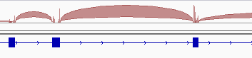
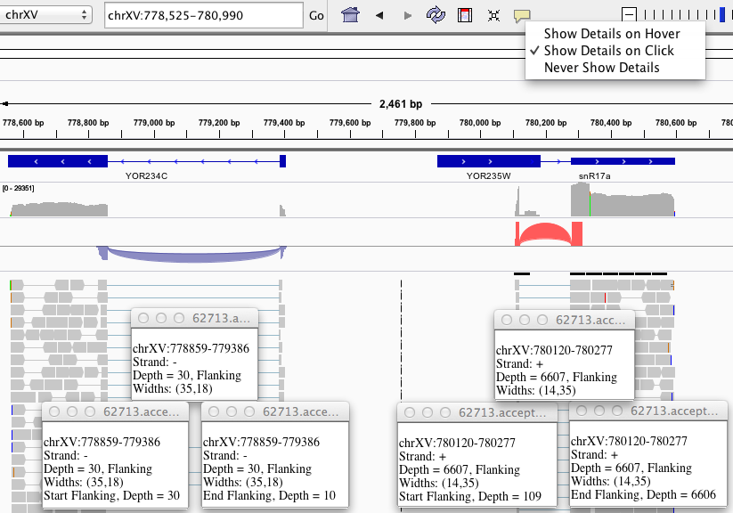
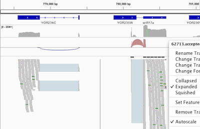

IGV supplements each alignment track with (1) a coverage track and (2) if selected in the [Alignment Preferences panel](Preferences#Alignments), a default splice junctions track. This page describes the default junctions track as well as independently loaded junctions data in the standard [.bed](BED) format. See [Sashimi Plot](http://www.broadinstitute.org/software/igv/Sashimi) for how to derive and manipulate interactive junction visualizations within IGV.

When enabled, IGV dynamically computes the junctions track from alignment data. The junctions track displays arcs connecting alignment blocks from a single read.  For RNA data these connections normally arise from splice junctions, thus the name _**Splice Junction Track**_.

Each splice junction is represented by an arc from the beginning to the end of the junction.

*   When available, IGV uses the "XS" tag provided by the alignment to determine strandedness. If missing, strandeness is inferred from the read strand. For paired-end data the strand of the alignment marked "first in pair" is used.
*   Junctions from the + strand are colored red and extend above the center line.
*   Junctions from the – strand are blue and extend below the center line.
*   The height of the arc, and its thickness, are proportional to the depth of read coverage up to 50 reads (first image).
    *   Display a more proportionate representation by selecting _Autoscale_ from the right-click menu (second image).

Hovering the mouse over or clicking on a junction will **display coverage information**. The first screenshot shows multiple coverage detail panels for each three components of two splice junctions on opposite strands.

*   Read depth for each end of the junction is displayed. For the red junction below, starting flank depth is 109 reads and ending flank depth is at 6606 reads.
*   Other details for a given junction's three hover elements are the same.

  

#### Right-click pop-up menu options for Junction tracks

Menu options are as detailed for the [Feature tracks menu](http://www.broadinstitute.org/software/igv/PopupMenus#FeatureTrack) with the following additions or differences.

| **Command** | **Description** |
| ------- | -------- |
| Collapsed   Expanded   Squished | Tracks are collapsed by default. The expanded mode breaks up the junctions track to multiple junctions tracks to minimize visual overlap. IGV does not interpret isoform information. |
| Autoscale | The height of the arc, and its thickness, are proportional to the depth of read coverage. <ul><li>By default, all junctions with more than 50 reads have the same thickness.</li><li>Select _Autoscale_ to display a more proportionate representation.</li></ul> |
| Sashimi Plot | Displays junctions information for regions within the current IGV view in a new panel with additional options. See [Sashimi Plot](http://www.broadinstitute.org/software/igv/Sashimi) for details. |
| Export Features | Download junctions track from IGV as a [.bed](BED) file. |

#### Example showing differential splicing

*   Start IGV and make sure _Show junction track_ is checked in the _Alignment Preferences panel_ and the _Visibility range threshold_ is set to 500.
*   Load the _Human hg19_ genome.
*   Select _File_ > _Load from Server_. Select _Body Map 2.0_ > _Alignments > Merged 50bp and 75bp_ > _Heart_ and _Liver_.
*   Enter _SLC25A3_ in the search bar to see an instance where the third exon is differentially spliced for the two tissues (**Screenshot** 2015.4.15).
    *   Here we have colored alignments by XS tag. The library was unstranded, and XS tag values were assigned to reads crossing junctions (in pink) using a predefined transcriptome index.

Enable junctions view for .bed files
------------------------------------

The splice junction view  can also be loaded indpendent of alignments by using a modified bed format,  derived from the "junctions.bed" file produced by the [TopHat](http://tophat.cbcb.umd.edu/) program. Display details are as described in the section above.

*   This view is enabled by including a track line that specifies either _name=junctions_ or _graphType=junctions_.
*   TopHat's "junctions.bed" file includes a track line specifying _name=junctions_ by default, so no action is required for these files.

Junction files should be in the standard [.bed](<?php echo base_path(); ?>BED) format.  The _score_ field is used to indicate depth of coverage.