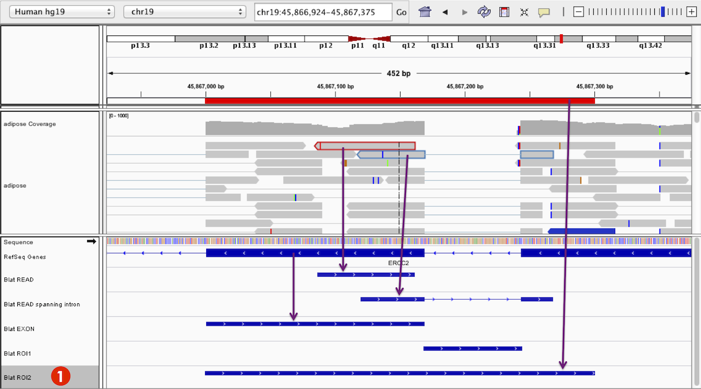
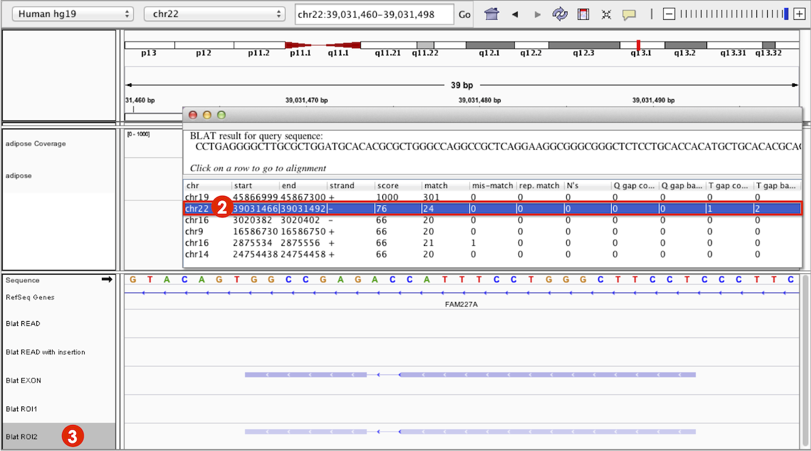

You can do a [BLAT](http://en.wikipedia.org/wiki/BLAT_%28bioinformatics%29) (BLAST-like Alignment Tool) search from a _
user-specified sequence,_ _feature_, _alignment_, or _region of interest,_ of a sequence up to 8 kb in length.

* **User-specified sequence:** Select _BLAT_ from the _Tools_ menu in the main menubar, and enter the sequence.
* **Features:** Right-click on the feature in the track and select _Blat sequence_ from the pop-up menu. The BLAT input
  sequence is the section of the reference genome defined by the feature start and end bounds.
* **Alignments:** Right-click on the aligned read and select _Blat read sequence_ from the pop-up menu. Note that in
  this case, the BLAT input sequence is the read sequence. It is _not_ the sequence of the reference genome where the
  read was aligned.
* **Regions of Interest (ROI):**
  After [creating a region of interest](http://www.broadinstitute.org/software/igv/regionsofinterest), click on the
  region's red bar and select _Blat sequence_ from the pop-up menu. The BLAT input sequence is the sequence of the
  reference genome defined by the region bounds.

The default search engine is the BLAT server hosted at
the [UCSC Genome Browser](https://genome.ucsc.edu/cgi-bin/hgBlat?command=start). UCSC's BLAT search supports most UCSC
derived genomes including human and mouse genomes. Change to use a different BLAT server
in [Advanced Preferences](http://software.broadinstitute.org/software/igv/Preferences#Advanced).

#### BLAT Feature Track

Each query sequence appears as a new _Blat_ feature track in the lower panel of IGV's display. The **Screenshot** (
2015.04.01) shows five different _Blat_ feature tracks for the following sequences:

1. Red highlighted read
2. Blue highlighted RNA-Seq read spanning an intron
3. An exon feature
4. An ROI covering an intronic region
5. An ROI spanning a region covering examples a–d.

Manipulate this track just like other feature tracks as outlined in
the [Feature Tracks section of the Pop-up Menus](http://www.broadinstitute.org/software/igv/PopupMenus#FeatureTrack)
page.

* Each search item adds a new _Blat_ feature track.
* _Blat_ features display aligned regions as rectangles and gaps in alignments with lines.
* The _Blat_ features change opacity depending on alignment score from dark blue to light blue.
* The _Blat_ feature marks directionality relative to the original search sequence as displayed by IGV, from left to
  right, with arrowheads.
* _Expanded_ or _Collapsed_ views of the _Blat_ feature track labels the search feature _YourSeq_. You cannot alter this
  label but can rename the feature track.

#### BLAT Results Panel

Results are presented in a new window that displays the query sequence, location of hits, match score, and other metrics
as shown in the **Screenshot** (2015.04.01). Hits are listed in descending order of alignment score.

For the example hit highlighted in the **Screenshot** above, the original search sequence is returned as the top hit.
The read used in the search was an aligned RNA-Seq read spanning an intron (**example b**), which the BLAT results show
is a singly gapped alignment as indicated by the _1_ under the column _T gap count_.

* Each BLAT search gives a separate results panel.
* Once a results window is closed, you cannot reopen it.
* Click on a row in the results panel to navigate to the selected result locus. IGV centers the _Blat_ feature on the
  display.

For example, for ROI2 (**marked 1** above), clicking on the second hit in the results panel (**marked 2** in **
Screenshot** below) navigates the view away from chromosome 19 to the hit locus on chromosome 22 (**marked 3**). This
same region contains a hit for **example c**, a BLAT search done with an exon feature. Because the exon feature has a
higher alignment score than ROI2, its _Blat_ feature is shaded darker.

