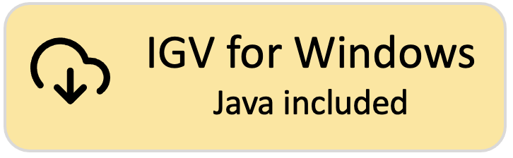
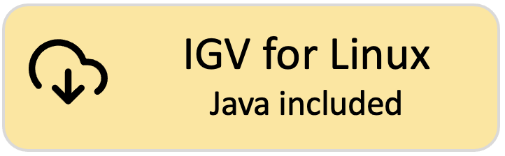

!!! note " "
    Did you know that there is also an **IGV web application** that runs only in a web browser, does not use Java, and requires no downloads? See **[https://igv.org/app](https://igv.org/app)**. Click on the Help link in the app for more information about using IGV-Web.

# Latest version of IGV Desktop: 2.16.0
!!! tip "M1 Mac Users:" 
    Apple's Rosetta software is required to run the IGV MacOS App that includes Java. If you run IGV with your own Java installation, Rosetta may not be required if your version of Java runs natively on M1.

!!! tip "Linux users:" 
    The 'IGV for Linux' download includes AdoptOpenJDK (now Eclipse Temurin) version 11 for x64 Linux. See their list of supported platforms.  If this does not work on your version of Linux, download the 'Command line IGV for all platforms' and use it with your own Java installation.

!!! tip "About log4j:" 
    IGV versions 2.4.1 - 2.11.6 used log4j2 code that is subject to the log4jShell vulnerability. We recommend using version 2.11.9 (or later), which removed all dependencies on log4j.

[{height=100}](https://data.broadinstitute.org/igv/projects/downloads/2.16/IGV_MacApp_2.16.0_WithJava.zip) [{height=100}](https://data.broadinstitute.org/igv/projects/downloads/2.16/IGV_MacApp_2.16.0.zip) 

[{height=100}](https://data.broadinstitute.org/igv/projects/downloads/2.16/IGV_Win_2.16.0-WithJava-installer.exe) [{height=100}](https://data.broadinstitute.org/igv/projects/downloads/2.16/IGV_Win_2.16.0-installer.exe) 

[{height=100}](https://data.broadinstitute.org/igv/projects/downloads/2.16/IGV_Linux_2.16.0_WithJava.zip)

[{height=100}](https://data.broadinstitute.org/igv/projects/downloads/2.16/IGV_2.16.0.zip)

# Other versions of IGV Desktop

**[Development Snapshot Build.](https://software.broadinstitute.org/software/igv/download_snapshot)** Latest development snapshot; built at least nightly
 
**[Archived Versions.](https://data.broadinstitute.org/igv/projects/downloads/)** Old releases going back to IGV 2.0

# Other versions of IGV

This Downloads page is for the IGV desktop version. See also:

- If you are looking for the IGV-Web application, see https://igv.org/app 
- If you are a developer looking for information about the embeddable igv.js component, see https://github.com/igvteam/igv.js
- If you are developer wanting to use igv.js in a notebook (Jupyter or Colab), see https://github.com/igvteam/igv-notebook
- To generate self-contained HTML reports that consist of a table of genomic sites and associated IGV views, see https://github.com/igvteam/igv-reports
