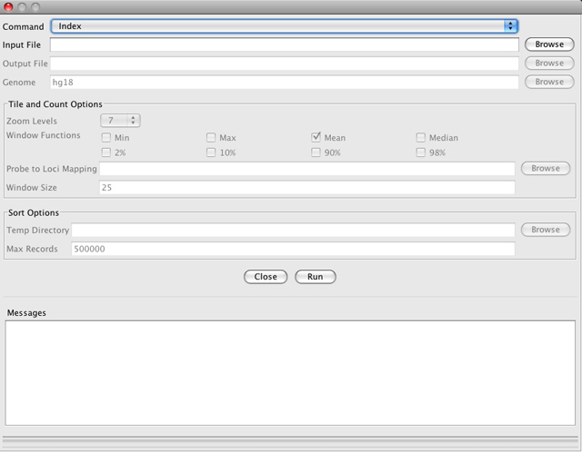

Select _Tools>Run igvtools_ to open the igvtools window. This window allows you to run the _toTDF, Count, Sort,_ and _
Index_ tools:

1. Select the tool that you want from the _Command_ drop-down list. The _toTDF_ tool is selected by default.
2. Specify the necessary files and/or genome.
3. Select any of the alternative options you want.
4. Click _Run_.

Information about the run will appear in the _Messages_ box. Note that if you exit the IGV application, any tool that is
in progress will be terminated.

toTDF
-----

The _toTDF_ tool converts a sorted data input file to a binary tiled data (.tdf) file. Use this tool to pre-process
large datasets for improved IGV performance.

Select:

* the _Input File_ (supported formats are .wig, .cn, .snp, .igv, and .gct)
* the _Output File_ (must end in .tdf)
* the _Genome_ (default is whatever genome is selected in IGV)

Options you can change include:

* _Zoom Levels_: specifies the maximum zoom level to precompute. The default is 7; this is sufficient for most files.
  This value can be reduced to reduce file size, though it will impair IGV performance.
* _Window Functions_: allows user to select the window functions to use when reducing data to precomputed tiles.  _Mean_
  is the default, but you can also select _Min_, _Max_, or _Median_, as well as percentiles of the data.
* _Probe to Loci Mapping_: specifies a .bed file to be used to map probe identifiers to locations. This is useful when
  preprocessing .gct files. The .bed file should contain 4 columns: chr start end name (where name is the probe name in
  the .gct file).

Count
-----

_Count_ computes average feature density over a specified window size across the genome. Common usages include computing
coverage for alignment files and counting hits in Chip-seq experiments. By default, the resulting file will be displayed
as a bar chart when loaded into IGV. To display feature intensity in IGV, the density must be computed with this option,
and the resulting file must be named _<feature track filename>.tdf_.

Select:

* the _Input File_, which must be sorted by start position (see the _Sort_ tool, below). Supported file formats are
  .sam, .bam, .aligned, .psl, .pslx, and .bed.
* the _Output File_ (must end in .tdf or .wig)
* the _Genome_ (default is whatever genome is selected in IGV)

Options you can change include:

* _Zoom Levels_: specifies the maximum zoom level to precompute. The default is 7; this is sufficient for most files.
  This value can be reduced to reduce file size, though it will impair IGV performance.
* _Window Functions_: allows user to select the window functions to use when reducing data to precomputed tiles.  _Mean_
  is the default, but you can also select _Min_, _Max_, or _Median_, as well as percentiles of the data.
* _Window Size:_ specifies the window size over which coverage is averaged, in base pairs; default is 25 bp

Index
-----

This command creates an index for an alignment file or a feature file. Index files are required for loading alignment
files into IGV, and can significantly improve performance for large feature files. Note that you do not directly load
the index file into IGV. Rather, IGV looks for a corresponding index file when the alignment or feature file is loaded.
This command does not take an output file argument. Instead, the filename is generated by appending ".sai" (for
alignments) or ".idx" (for features) to the input filename as IGV relies on this naming convention to find the index .
The input file must be sorted by start position (see the _Sort_ tool, below).

Select the _Input File_. Supported file formats are .sam, .bam, .aligned, .vcf, .psl, and .bed.

Sort
----

_Sort_ sorts the input file by start position.

Select:

* the _Input File_. Supported file formats: .cn, .igv, .sam, .bam, .aligned, .psl, .bed, and .vcf.
* the _Output File_

Options you can change include:

* _Temp Directory_**:** specifies a temporary working directory. For large input files, this directory will be used to
  store intermediate results of the sort. The default is the user's Temp directory.
* _Max Records_: specifies the maximum number of records to keep in memory during the sort. The default value is 500000.
  Increase this number if you receive "too many open files" errors. Decrease it if you experience "out of memory"
  errors.