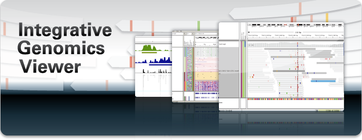

* About IGV with some general info about IGV and its history
* Overview of the doc on this site
* Contact
* How to cite

Overview
--------

The **Integrative Genomics Viewer (IGV)** is a high-performance, easy-to-use, interactive tool for the visual
exploration of genomic data. It supports flexible integration of all the common types of genomic data and metadata,
investigator-generated or publicly available, loaded from local or cloud sources.

IGV is available in multiple forms, including:

* the original **IGV** - a Java desktop application,
* **IGV-Web** \- a web application,
* **igv.js** \- a JavaScript component that can be embedded in web pages _(for_ _developers)_

This site is focused on the IGV desktop application. See **[https://igv.org](https://igv.org )** for links to all forms
of IGV.

Download IGV
------------

Download the IGV desktop application and igvtools.

Note that the IGV-Web application at [https://igv.org/app](https://igv.org/app) runs in a web browser and requires no
downloads. Click on the Help link in the app for more information.

Citing IGV
----------

To cite your use of IGV in your publication, please reference one or more of:

James T. Robinson, Helga Thorvaldsdóttir, Wendy Winckler, Mitchell Guttman, Eric S. Lander, Gad Getz, Jill P.
Mesirov. [**Integrative Genomics
Viewer**. Nature Biotechnology 29, 24–26 (2011)](http://www.nature.com/nbt/journal/v29/n1/abs/nbt.1754.html). (Free PMC
article [here](https://www.ncbi.nlm.nih.gov/pmc/articles/PMC3346182/)).

Helga Thorvaldsdóttir, James T. Robinson, Jill P. Mesirov**.**    
[**Integrative Genomics Viewer (IGV): high-performance genomics data visualization and
exploration**. Briefings in Bioinformatics 14, 178-192 (2013)](https://academic.oup.com/bib/article/14/2/178/208453/Integrative-Genomics-Viewer-IGV-high-performance?searchresult=1)
.

James T. Robinson, Helga Thorvaldsdóttir, Aaron M. Wenger, Ahmet Zehir, Jill P. Mesirov. [**Variant Review with the
Integrative Genomics Viewer (IGV)
.** Cancer Research 77(21) 31-34 (2017)](http://cancerres.aacrjournals.org/content/77/21/e31.long).

James T. Robinson, Helga Thorvaldsdóttir, Douglass Turner, Jill P. Mesirov. [**igv.js: an embeddable JavaScript
implementation of the Integrative Genomics Viewer (
IGV)**. bioRxiv 2020.05.03075499](https://www.biorxiv.org/content/10.1101/2020.05.03.075499v1).

Funding
-------

Development of IGV has been supported by funding from the [National Cancer Institute (NCI)](http://cancer.gov) of
the [National Institutes of Health](https://www.nih.gov),
the [Informatics Technology for Cancer Reserarch (ITCR)](https://itcr.nci.nih.gov) of the NCI, and
the [Starr Cancer Consortium](http://www.starrcancer.org/starr/html/83159.cfm).

​
    

 Documentation built with <a href="http://www.mkdocs.org/">MkDocs</a> using a modified version of the <a href="https://github.com/gristlabs/mkdocs-windmill">Windmill</a> theme by Grist Labs. 
