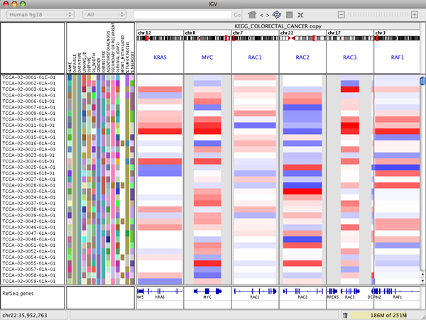
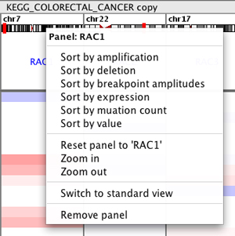
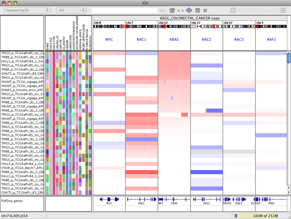
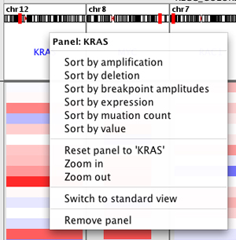
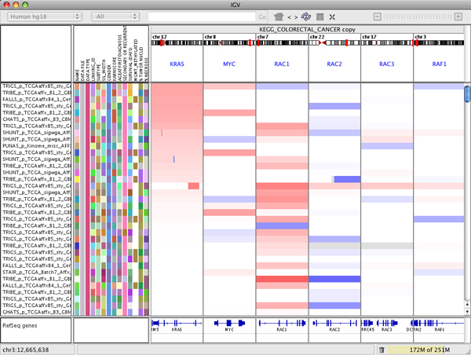
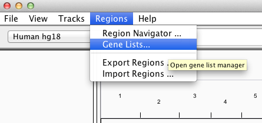
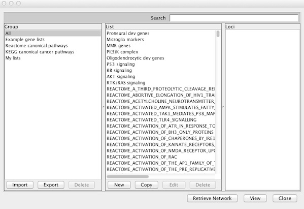
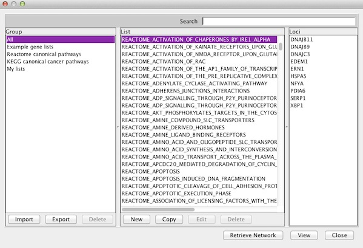
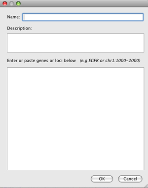

By default, IGV displays one contigous genomic region, but multiple loci can also be displayed side-by-side in split panes. There is no set limit on the number of loci, but if the IGV window is split into too many panes, each one will be too small to be useful. Enter multi-locus view by:

*   Using the search box in the toolbar to enter multiple loci separated by spaces. You can enter genomic coordinates, feature names, or a combination of both.

or

*   Selecting and viewing multiple _regions of interest_ in the [Region Navigator](http://software.broadinstitute.org/software/igv/regionsofinterest).

or

*   Right-clicking on a paired alignment of a BAM track and selecting _View mate in split screen_

or

*   Selecting a named [Gene List as described below.](#GeneLists)

To change the size of the flanking region around the gene displayed, before loading data go to _View_\>[_Preferences_](http://www.broadinstitute.org/software/igv/Preferences)\>_General_\>_Feature flanking region_ and enter the base pairs or percent to display on either side of each locus.

The following screenshot shows a multi-locus view of segmented copy number data. The IGV data panel has been split into 6 separate vertical panels displaying the regions containing the genes KRAS, MYC, RAC1, RAC2, RAC3, and RAF1. All the panels display the same set of data tracks.

Removing or Rearranging Panels

To remove a panel, right-click on the panel header and select _Remove panel_.

Panels can be rearranged by drag and drop.  Click on the white header bar at the top of the panel and drag it to its new position.  For example, in the figure below KRAS has been dropped between RAC1 and RAC2.

### Changing the View in a Panel

The zoom slider in the toolbar is disabled in multi-locus view. However, you can double-click in a panel to zoom in the view in that panel (or alt-click to zoom out). Click-dragging will also pan the view in the panel.

To return to the original view of the locus specified, right-click the name header at the top of the panel you want to reset and select _Reset panel to '\[gene name or locus\]'_.

To return to the normal single-locus view, double-click the name header at the top of any of the panels, or right-click in a header and select _Switch to standard view_.

### Sorting Tracks by Panel

Right-click in the panel header to bring up the sort menu. This menu will vary depending on data type.

The following image illustrates what happens if you select _Sort by amplification_ in the KRAS panel.

Gene Lists
----------

To view a gene list or define a new one, select _Regions >Gene Lists..._.

This opens a window for selecting an existing list or creating a new list.

To view an existing gene list in multi-locus view, select a name in the _List_ column of any _Group_ and click _View_. IGV informs you of items that cannot be mapped to the current reference genome and continues on to display loci with matches.

### My Gene Lists

You can click _Import_ to upload a text file containing your own gene list. Load lists of genes or loci in [GMT](http://www.broadinstitute.org/cancer/software/genepattern/file-formats-guide#GMT), [GRP](http://www.broadinstitute.org/cancer/software/genepattern/file-formats-guide#GRP) and [BED](http://www.broadinstitute.org/software/igv/BED) format. For example, find and download GMT files from the [Molecular Signatures Database](http://www.broadinstitute.org/gsea/msigdb/index.jsp).

You can also click _New_ to create a new gene list. This opens a dialog in which you can enter a name, description, and your list of genes or regions.

*   Entries in a gene list can be a gene symbol or other feature names that correspond to annotation tracks, or a locus defined as  <chr>:<start>-<end>.
*   Alternatively, paste a BED format file contents.

New and imported lists will appear under the _My lists_ group and are saved for continued future access in the _lists_ subfolder in the _igv_ folder installed in your home directory.