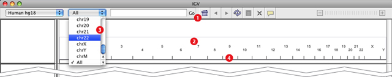

Zooming
-------

A number of different controls are provided to zoom the view to larger or smaller regions of the genome, from a whole-genome view that lays out all the chromosomes side by side, to a single whole chromosome, and all the way to base-pair resolution.

|                  |               |
|-----------------|------------------|
|  | Click the "home" icon to zoom out to the whole-genome view. |
|  | From the whole-genome view, zoom to a chromosome by clicking its label. |
|  | Select a chromosome from the drop-down menu to zoom to it; or select "All" to zoom out to the whole genome view |

To zoom in and out on a chromosome:

| Zoom in  | Zoom out |
|----------|----------|
| +        |   -      |
| Double-click or shift-click the track data | Alt-click (Mac: option-click) the track data |
| Click a zoom level on the zoom slider | Click a zoom level on the zoom slider |
| Click the plus (+) icon on the zoom slider | Click the minus (-) icon on the zoom slider |
| Click and drag on the genome ruler to select an area to which to zoom |

Scrolling and Panning
---------------------

| Vertical scroll of data tracks |  Horizontal pan across the genome \* |
| ----------------------- | ------------|
| Scroll bar in the IGV window | Click and drag the track data |
| Click and drag the track data | Click the chromosome ideogram to scroll to that location |
| Page Up and Page Down keys | Click the ruler to center that location |
| Up and down arrow keys | Left and right arrow keys |
| | Home and End keys (scroll by screen width)|

* You cannot pan horizontally across the genome when IGV is displaying the whole genome or a whole chromosome; you must be zoomed further in.

Searching
---------

Use the search box to find and go to a genomic locus:

*   A locus in genome coordinates (for example, chr5:90,339,000-90,349,000)
*   A gene symbol or other feature identifier (e.g., DPYD or NM\_10000000) in the default reference genome annotation track.
    *   When searching features, IGV will accept partial matches. An auto-complete menu will show the possible matches when a partial string is entered; if there are multiple matches IGV will show a dialog asking for clarification
*   A genome symbol or other identifier in a _non-indexed_ feature track loaded into IGV (e.g., BED, GFF, etc). If the file is indexed, IGV does not keep the whole file in memory, and therefore cannot search through it for the identifier.
*   A mutation in a feature. IGV accepts 2 mutation formats:
    *   Amino acid mutation notation of this form:

        KRAS:G12C

        The above would look for a mutation in KRAS on the 12th amino acid, from Glycine to Cystine.

        \* is stop codon

    *   Nucleotide mutation of this form:

        KRAS:123A>T

        The above would look for a mutation in KRAS from adenine to thymine at the 123rd base.

A track name cannot be searched for in the search box. To find specific tracks, use menu item [_Tracks_\>_Filter Tracks_.](http://www.broadinstitute.org/software/igv/SortGroupFilter#filter)

Jumping
-------

If you have a feature track loaded (e.g., Gene track, BED, or GFF file), you can jump from one feature to the next.

1.  Click on the track name to select the track that contains the features that you want to find.
2.  Jump from feature to feature:

    *   Press Ctrl+f to jump forward to the next feature.
    *   Press Ctrl+b to jump backward to the previous feature.

    IGV positions the start of the next (or previous) feature at the center of the display.

You can also jump from one exon to the next. To exon-jump, select a feature track and press Shift+Ctrl+f to center the next exon in your view, Shift+Ctrl+b to move back one exon.

