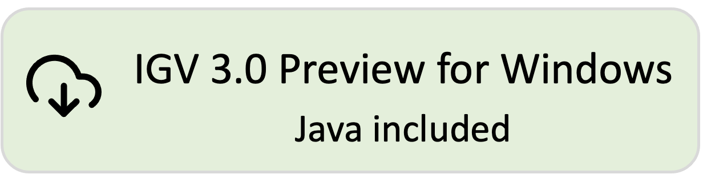
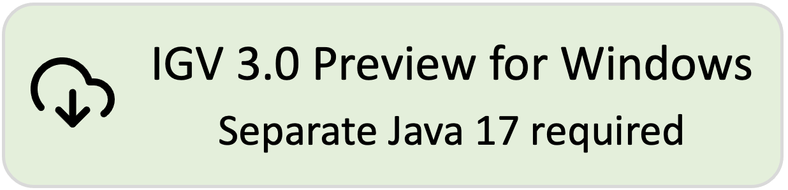

<!---
The page title should not go in the menu
-->

 IGV 3.0 Preview 

IGV 3.0 Preview is work in progress! Some features are still under development and testing has not been completed. 

We appreciate your feedback before we release. Please post bug reports and other feedback on GitHub at [https://github.com/igvteam/igv/issues](https://github.com/igvteam/igv/issues) and include *IGV 3.0 Preview* in the title.

# Download IGV 3.0 Preview

[{width=300}](https://data.broadinstitute.org/igv/projects/downloads/snapshot/IGV_Win_snapshot-WithJava-installer.exe) 
[{width=300}](https://data.broadinstitute.org/igv/projects/downloads/snapshot/IGV_Win_snapshot-installer.exe) 
 
[{width=300}](https://data.broadinstitute.org/igv/projects/downloads/snapshot/IGV_Linux_snapshot_WithJava.zip)
 
[{height=80}](https://data.broadinstitute.org/igv/projects/downloads/snapshot/IGV_snapshot.zip)

!!! Note "For Mac users:"
Mac apps are not provided for the IGV 3.0 Preview build. To **run the IGV 3.0 Preview on a Mac**: 

1. Click on the *command line* version above and unzip the downloaded distribution file to a directory of your choice. You will see that several launcher scripts are provided in the distribution. The Mac version is named *igv.sh*.

2. Open a *Terminal* window and enter `<Full path to the IGV 3.0 Preview directory>/igv.sh`. For example, if the IGV 3.0 Preview files are in */Users/jane/IGV-3.0-Preview*, enter `/Users/jane/IGV-3.0-Preview/igv.sh`. Alternatively, enter `cd /Users/jane/IGV-3.0-Preview` to go to that directory, and then `./igv.sh`.

# What's in IGV 3.0 Preview

