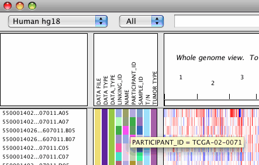

Attributes can be associated with tracks and used for filtering, sorting, and grouping data. By default all tracks have 
at least 3 attributes: Data File, Data Type, and Name. To display additional attributes, [load a sample attribute file](../sample_info). 
IGV displays attribute names and values in the attributes panel.

Color-Coded Attribute Values
----------------------------

IGV uses color-coded blocks to represent the attribute values.

* Hover over a colored block to display the attribute value.
* Click a colored block to select all tracks with that attribute value. IGV indicates a selected track by highlighting 
* the track name.  **Tip**: Keep in mind that clicking an attribute may select tracks that are not visible in the data 
* panel. Scroll down the data panel to view all the selected tracks.
* Click an attribute name at the top of the panel to sort tracks based on that attribute value.

Showing and Hiding Attributes
-----------------------------

To show or hide selected attributes:

1.  Click _View>Select Attributes to Show_. IGV displays a list of attributes.
2.  Select (or clear) an attribute’s check box to show (or hide) the attribute.
3.  Click _OK_. IGV updates the display to show only the selected attributes.

To show or hide all attributes:

*   Click _View>Show Attribute Display_ to toggle the setting. A check mark next to the menu item indicates that the attribute panel is displayed. No check mark indicates that it is hidden. The attribute panel is hiddent by default.  
    **Tip:** This is a persistent setting. Toggling the menu item also toggles the corresponding setting on the General tab of the [Preferences window](<?php echo base_path(); ?>Preferences) and vice versa.